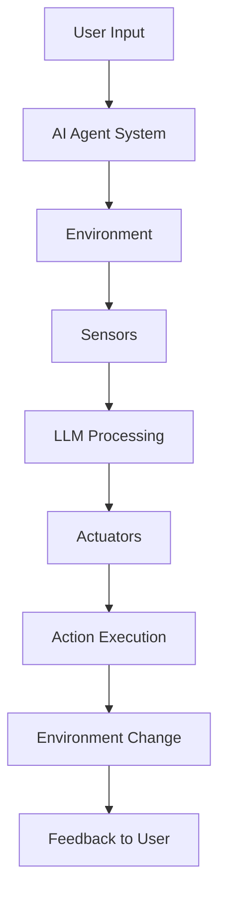

# Lesson 1: Introduction to AI Agents and Agent Use Cases

## 🎯 Learning Objectives

After completing this lesson, you will be able to:

- Understand AI Agent concepts and how they differ from other AI solutions
- Apply AI Agents most efficiently in real-world scenarios
- Design Agentic solutions productively for both users and customers
- Build a functional AI Agent using Semantic Kernel
- Enhance agents with memory, advanced tools, and specialized instructions

## 📚 Theoretical Foundation

### What are AI Agents?

AI Agents are **systems** that enable **Large Language Models (LLMs)** to **perform actions** by extending their capabilities with **access to tools** and **knowledge**.

#### Core Components

AI Agents operate as complete systems with three essential components:

1. **Environment** - The defined space where the AI Agent operates
   - Example: Travel booking system, customer database, API endpoints
2. **Sensors** - Mechanisms to gather and interpret environmental information
   - Example: Hotel availability data, flight prices, user preferences
3. **Actuators** - Components that execute actions to change the environment
   - Example: Booking confirmations, email notifications, database updates



### Types of AI Agents

| **Agent Type**          | **Description**                  | **Travel Agent Example**                    |
| ----------------------- | -------------------------------- | ------------------------------------------- |
| **Simple Reflex**       | Rule-based immediate actions     | Forward complaints to customer service      |
| **Model-Based Reflex**  | Actions based on world model     | Prioritize routes with price changes        |
| **Goal-Based**          | Plan creation for specific goals | Book complete journey (car→flight→hotel)    |
| **Utility-Based**       | Preference weighing & tradeoffs  | Balance convenience vs. cost                |
| **Learning**            | Improvement through feedback     | Use survey feedback for future bookings     |
| **Hierarchical**        | Multi-tiered task delegation     | Break trip cancellation into subtasks       |
| **Multi-Agent Systems** | Cooperative/competitive agents   | Multiple agents handling different services |

### When to Use AI Agents

AI Agents excel in three key scenarios:

#### 🔓 Open-Ended Problems

- Tasks that can't be pre-programmed into fixed workflows
- Require dynamic decision-making based on context
- Example: "Plan the perfect vacation for my family"

#### 🔄 Multi-Step Processes

- Complex workflows requiring multiple tools and iterations
- Information gathering across multiple sources
- Example: Research destination → Check availability → Compare prices → Book → Confirm

#### 📈 Improvement Over Time

- Systems that benefit from learning and feedback
- Personalization based on user history
- Example: Learning user preferences to make better recommendations

## 💻 Practical Implementation Fundamentals

### Basic Agent Architecture

AI Agents follow a structured approach with three core elements:

```python
# 1. Service Configuration - Connect to LLM
chat_completion_service = OpenAIChatCompletion(ai_model_id="gpt-4o-mini")

# 2. Plugin Definition - Define available tools
class DestinationsPlugin:
    @kernel_function(description="Provides a random vacation destination.")
    def get_random_destination(self) -> str:
        return random.choice(self.destinations)

# 3. Agent Assembly - Combine service, tools, and instructions
agent = ChatCompletionAgent(
    service=chat_completion_service,
    plugins=[DestinationsPlugin()],
    name="TravelAgent",
    instructions="You are a helpful AI Agent that can help plan vacations..."
)
```

### Key Implementation Patterns

1. **Plugin Architecture** - Tools are modular, reusable components that extend agent capabilities
2. **Function Descriptions** - LLMs use descriptions to understand when and how to call tools
3. **Instruction-Based Behavior** - Natural language defines agent personality and workflows
4. **Streaming Responses** - Real-time interaction through async streaming
5. **Thread Management** - Conversation context preserved across multiple turns

## 🚀 Advanced Concepts

### Enhanced Tool Design

Moving from simple to sophisticated tool capabilities:

```python
# Basic Tool - Simple random selection
def get_random_destination(self) -> str:
    return random.choice(self.destinations)

# Enhanced Tool - Context-aware with rich data
@kernel_function(description="Find destinations suitable for specific weather preferences.")
def find_destinations_by_weather(self, preference: str) -> str:
    matching = []
    for dest, info in self.destinations.items():
        if preference.lower() in info['climate'].lower():
            matching.append(f"{dest} - {info['climate']} ({info['avg_temp']})")
    return f"Destinations matching '{preference}':\n" + "\n".join(matching)
```

**Key Principles:**

- **Structured Data**: Return rich, formatted information instead of simple strings
- **Multiple Functions**: Specialized tools for different use cases
- **Context Awareness**: Tools that understand user preferences and history

### Instruction Engineering Impact

Agent instructions serve as behavioral DNA. Compare these approaches:

```python
# Generic Instructions (Basic Behavior)
instructions = "You are a helpful AI Agent that can help plan vacations."

# Specific Instructions (Professional Behavior)
instructions = """
You are a professional travel consultant with 10 years of experience.
Always ask about budget before recommendations.
Provide detailed itineraries with accommodation, activities, and dining.
End responses by asking if they need clarification.
"""

# Specialized Instructions (Domain Expert)
instructions = """
You are a luxury eco-tourism specialist focusing on sustainable travel.
Only recommend eco-certified destinations.
Budget range: $3000+ per person for week-long trips.
Always mention environmental impact of travel choices.
"""
```

**Behavioral Impact:**

- **Generic**: Basic responses, limited context gathering
- **Specific**: Structured workflows, consistent professional approach
- **Specialized**: Domain expertise, filtered recommendations, assumed knowledge

### Memory Integration Fundamentals

Transform agents from stateless to learning systems:

```python
# Memory Structure
user_memory = {
    "preferences": {
        "budget_range": "$1000-2000",
        "preferred_climate": "tropical",
        "travel_style": "adventure"
    },
    "history": [
        {"destination": "Bali", "satisfaction": "high", "notes": "loved beaches"}
    ],
    "conversation_context": []
}

# Memory-Enabled Functions
@kernel_function(description="Store user preferences for personalized recommendations.")
def store_preference(self, preference_type: str, value: str) -> str:
    self.memory["preferences"][preference_type] = value
    return f"✅ Remembered: {preference_type} = {value}"

@kernel_function(description="Get personalized recommendations based on stored preferences.")
def get_personalized_recommendations(self) -> str:
    prefs = self.memory["preferences"]
    # Use stored preferences to filter and rank recommendations
    return personalized_results
```

**Memory Types:**

- **User Preferences**: Budget, climate, activities, dietary restrictions
- **Trip History**: Past destinations, satisfaction ratings, feedback
- **Conversation Context**: Previous interactions, patterns, evolution
- **Learning Data**: What works, what doesn't, improvement areas

## 🎓 Core Learning Principles

### System Thinking

- **Holistic View**: Agents are complete systems with environment, sensors, and actuators
- **Component Integration**: Service + Tools + Instructions + Memory = Complete Agent
- **Lifecycle Management**: Setup → Interaction → Learning → Improvement

### Tool Design Excellence

- **Clear Descriptions**: Help LLMs understand tool purpose and usage
- **Structured Returns**: Provide rich, formatted data for better decision-making
- **Modular Architecture**: Design reusable, composable tool components

### Instruction Engineering

- **Behavioral Blueprint**: Instructions define personality, workflow, and constraints
- **Specificity Matters**: Detailed instructions lead to predictable, valuable interactions
- **Context Awareness**: Instructions should consider user type, domain, and use case

### Memory-Driven Personalization

- **Persistence Enables Relationships**: Transform one-shot interactions into ongoing partnerships
- **Learning Compounds Value**: Each interaction improves future recommendations
- **Privacy by Design**: Consider data management and user control from the start

## 🧠 Critical Understanding Points

### Agent vs. Traditional AI Systems

| **Traditional AI**           | **AI Agents**                            |
| ---------------------------- | ---------------------------------------- |
| Single input → Single output | Multi-turn interactions with environment |
| Stateless operations         | Persistent memory and learning           |
| Fixed functionality          | Dynamic tool usage                       |
| Human-driven workflows       | Autonomous decision-making               |

### Architecture Decision Points

When designing AI Agents, consider these fundamental choices:

1. **Tool Selection**: What capabilities does your agent need?

   - Information retrieval vs. action execution
   - Real-time data vs. static knowledge
   - Single domain vs. multi-domain expertise

2. **Memory Strategy**: How much context should persist?

   - Session-only vs. long-term storage
   - User preferences vs. behavioral patterns
   - Privacy vs. personalization balance

3. **Instruction Depth**: How specific should agent behavior be?
   - Flexible creativity vs. predictable consistency
   - Domain specialization vs. general capability
   - User adaptation vs. fixed personality

### Common Implementation Patterns

```python
# Pattern 1: Simple Reflex Agent
if user_input.contains("book flight"):
    return flight_booking_tool(user_input)

# Pattern 2: Goal-Based Agent
goal = extract_goal(user_input)
plan = create_plan(goal, available_tools)
return execute_plan(plan)

# Pattern 3: Learning Agent
user_feedback = get_feedback(last_response)
update_preferences(user_id, user_feedback)
return improved_response(user_input, learned_preferences)
```

## 🔍 Deep Dive: Agent Design Decisions

### When to Use Each Agent Type

- **Simple Reflex**: Customer service routing, basic FAQ responses
- **Goal-Based**: Trip planning, project management, complex workflows
- **Learning**: Personal assistants, recommendation systems, adaptive interfaces
- **Multi-Agent**: Large-scale coordination, specialized team workflows

### Tool Design Philosophy

**Principle**: Tools should be **atomic**, **composable**, and **self-documenting**

```python
# ❌ Poor Tool Design - Too broad, unclear purpose
def handle_travel_request(self, request: str) -> str:
    # Does everything, hard to predict behavior
    pass

# ✅ Good Tool Design - Specific, clear, composable
def search_flights(self, origin: str, destination: str, date: str) -> str:
def check_weather(self, location: str, date: str) -> str:
def find_hotels(self, location: str, budget: str) -> str:
```

### Memory Architecture Considerations

**Trade-offs to Consider:**

- **Storage**: Local files vs. databases vs. cloud storage
- **Privacy**: User control vs. system optimization
- **Performance**: Real-time access vs. batch processing
- **Scope**: Individual users vs. shared learning

## 📚 Conceptual Framework Summary

### The Agent Equation

```
AI Agent = LLM + Tools + Instructions + Memory + Environment
```

Where:

- **LLM**: Reasoning and language understanding engine
- **Tools**: Capabilities to interact with the world
- **Instructions**: Behavioral guidelines and personality
- **Memory**: Learning and personalization data
- **Environment**: Context and operational space

### Success Metrics for AI Agents

1. **Task Completion Rate**: How often does the agent achieve user goals?
2. **User Satisfaction**: Are interactions helpful and pleasant?
3. **Learning Efficiency**: Does the agent improve over time?
4. **Tool Utilization**: Are tools used appropriately and effectively?
5. **Conversation Quality**: Are interactions natural and contextual?

## 🔗 Further Learning

### Recommended Reading Order

1. **Foundation**: Complete this lesson's concepts
2. **Frameworks**: Explore Semantic Kernel, AutoGen, LangChain
3. **Patterns**: Study agentic design patterns (tool use, planning, reflection)
4. **Production**: Learn deployment, monitoring, and scaling considerations

### Key Resources

- [Microsoft AI Agents for Beginners](https://github.com/microsoft/ai-agents-for-beginners) - Comprehensive course material
- [Semantic Kernel Documentation](https://learn.microsoft.com/semantic-kernel/) - Production-ready agent framework
- [AutoGen Framework](https://github.com/microsoft/autogen) - Multi-agent conversation framework

## 🎯 Next Learning Path

**Immediate Next Steps:**

1. Understand the theoretical foundations thoroughly
2. Study the code patterns and architectural decisions
3. Consider how agents fit into your specific use cases
4. Prepare for hands-on implementation in your projects

**Ready for Lesson 2?** Move to [Exploring Agentic Frameworks](../lesson-2-frameworks/README.md) to learn about different implementation approaches and their trade-offs.
