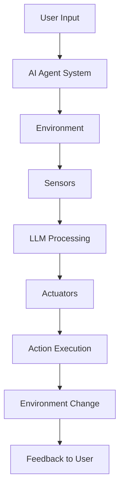

# Lesson 1: Introduction to AI Agents and Agent Use Cases

## 🎯 Learning Objectives

After completing this lesson, you will be able to:

- Understand AI Agent concepts and how they differ from other AI solutions
- Identify when AI Agents are most effective in real-world scenarios
- Recognize different types of agents and their characteristics
- Understand the theoretical foundations of agent architecture
- Analyze the components that make agents intelligent and autonomous

## 📚 Theoretical Foundation

### What are AI Agents?

AI Agents are **systems** that enable **Large Language Models (LLMs)** to **perform actions** by extending their capabilities with **access to tools** and **knowledge**.

#### Core Components

AI Agents operate as complete systems with three essential components:

1. **Environment** - The defined space where the AI Agent operates
   - Example: Travel booking system, customer database, API endpoints
2. **Sensors** - Mechanisms to gather and interpret environmental information
   - Example: Hotel availability data, flight prices, user preferences
3. **Actuators** - Components that execute actions to change the environment
   - Example: Booking confirmations, email notifications, database updates



### Types of AI Agents

| **Agent Type**          | **Description**                  | **Travel Agent Example**                    |
| ----------------------- | -------------------------------- | ------------------------------------------- |
| **Simple Reflex**       | Rule-based immediate actions     | Forward complaints to customer service      |
| **Model-Based Reflex**  | Actions based on world model     | Prioritize routes with price changes        |
| **Goal-Based**          | Plan creation for specific goals | Book complete journey (car→flight→hotel)    |
| **Utility-Based**       | Preference weighing & tradeoffs  | Balance convenience vs. cost                |
| **Learning**            | Improvement through feedback     | Use survey feedback for future bookings     |
| **Hierarchical**        | Multi-tiered task delegation     | Break trip cancellation into subtasks       |
| **Multi-Agent Systems** | Cooperative/competitive agents   | Multiple agents handling different services |

### When to Use AI Agents

AI Agents excel in three key scenarios:

#### 🔓 Open-Ended Problems

- Tasks that can't be pre-programmed into fixed workflows
- Require dynamic decision-making based on context
- Example: "Plan the perfect vacation for my family"

#### 🔄 Multi-Step Processes

- Complex workflows requiring multiple tools and iterations
- Information gathering across multiple sources
- Example: Research destination → Check availability → Compare prices → Book → Confirm

#### 📈 Improvement Over Time

- Systems that benefit from learning and feedback
- Personalization based on user history
- Example: Learning user preferences to make better recommendations

## 🏗️ Agent Architecture Theory

### Fundamental Agent Structure

AI Agents operate on a theoretical framework with three interconnected layers:

1. **Perception Layer** - How agents gather information from their environment

   - Input processing and interpretation
   - Context understanding and pattern recognition
   - Environmental state assessment

2. **Reasoning Layer** - How agents process information and make decisions

   - Goal formulation and planning
   - Knowledge representation and inference
   - Decision-making under uncertainty

3. **Action Layer** - How agents interact with and modify their environment
   - Tool selection and execution strategies
   - Output generation and formatting
   - Environmental state modification

### Core Architectural Principles

1. **Modularity** - Components are independent, interchangeable units
2. **Abstraction** - Complex operations are simplified through clear interfaces
3. **Autonomy** - Agents operate independently within defined parameters
4. **Adaptability** - Systems can adjust behavior based on feedback
5. **Persistence** - State and context are maintained across interactions

## 🧠 Advanced Theoretical Concepts

### Tool Design Philosophy

Agents utilize tools through a hierarchical capability model:

**Tool Classification Hierarchy:**

1. **Reactive Tools** - Simple stimulus-response mechanisms

   - Direct mapping between input and output
   - No internal state or memory
   - Predictable, deterministic behavior

2. **Adaptive Tools** - Context-sensitive capabilities

   - Consider environmental factors
   - Utilize historical information
   - Dynamic behavior based on conditions

3. **Intelligent Tools** - Reasoning-enabled capabilities
   - Internal decision-making processes
   - Goal-oriented behavior
   - Learning and improvement mechanisms

**Theoretical Principles:**

- **Composability**: Tools can be combined to create more complex capabilities
- **Abstraction Layers**: Complex operations are hidden behind simple interfaces
- **Semantic Understanding**: Tools are selected based on meaning, not just syntax

### Behavioral Programming Theory

Agent behavior is governed by instruction-based programming paradigms:

**Instruction Hierarchy Levels:**

1. **System-Level Instructions** - Core operational parameters

   - Define agent identity and primary function
   - Establish fundamental constraints and boundaries
   - Set basic interaction protocols

2. **Domain-Level Instructions** - Specialized knowledge application

   - Incorporate field-specific expertise and terminology
   - Define domain-specific workflows and decision criteria
   - Establish professional standards and best practices

3. **Context-Level Instructions** - Situational adaptation parameters
   - Dynamic behavior modification based on user type
   - Environmental condition responses
   - Personalization and preference integration

**Behavioral Programming Principles:**

- **Instruction Specificity**: More detailed instructions lead to more predictable behavior
- **Behavioral Consistency**: Similar inputs should produce similar behavioral responses
- **Adaptive Flexibility**: Instructions should allow for contextual adaptation

### Memory System Theory

Agent memory systems enable the transition from stateless to stateful intelligent behavior:

**Memory Architecture Classifications:**

1. **Working Memory** - Temporary information storage

   - Current conversation context and immediate state
   - Short-term goals and active task information
   - Temporary variable storage and intermediate results

2. **Episodic Memory** - Experience-based information storage

   - Historical interaction records and outcomes
   - User behavior patterns and preference evolution
   - Success and failure case studies

3. **Semantic Memory** - Knowledge-based information storage

   - Domain expertise and factual knowledge
   - Learned rules and decision-making heuristics
   - Conceptual relationships and associations

4. **Procedural Memory** - Skill-based information storage
   - Learned workflows and process optimizations
   - Tool usage patterns and efficiency improvements
   - Behavioral adaptations and response strategies

**Memory System Principles:**

- **Persistence**: Information survives beyond individual interactions
- **Retrieval**: Relevant information is accessible when needed
- **Learning**: Memory content evolves based on experience
- **Forgetting**: Irrelevant or outdated information is pruned

## 🎓 Theoretical Learning Principles

### Systems Theory Application

- **Holistic Perspective**: Agents are emergent systems where the whole exceeds the sum of parts
- **Component Interdependence**: Environment, perception, reasoning, and action layers are interconnected
- **Feedback Loops**: System outputs influence future inputs, creating learning cycles

### Cognitive Architecture Theory

- **Symbolic Processing**: Rule-based reasoning and logical inference mechanisms
- **Connectionist Processing**: Pattern recognition and neural network-like associations
- **Hybrid Processing**: Integration of symbolic and connectionist approaches for robust intelligence

### Behavioral Design Theory

- **Deterministic Behavior**: Predictable responses based on clear instruction sets
- **Probabilistic Behavior**: Weighted decision-making under uncertainty
- **Adaptive Behavior**: Dynamic modification based on environmental feedback

### Information Processing Theory

- **Encoding**: How environmental information is converted into internal representations
- **Storage**: How information is organized and maintained in memory systems
- **Retrieval**: How relevant information is accessed during decision-making
- **Processing**: How information is transformed and combined to generate responses

## 🧠 Critical Understanding Points

### Agent vs. Traditional AI Systems

| **Traditional AI**           | **AI Agents**                            |
| ---------------------------- | ---------------------------------------- |
| Single input → Single output | Multi-turn interactions with environment |
| Stateless operations         | Persistent memory and learning           |
| Fixed functionality          | Dynamic tool usage                       |
| Human-driven workflows       | Autonomous decision-making               |

### Architecture Decision Points

When designing AI Agents, consider these fundamental choices:

1. **Tool Selection**: What capabilities does your agent need?

   - Information retrieval vs. action execution
   - Real-time data vs. static knowledge
   - Single domain vs. multi-domain expertise

2. **Memory Strategy**: How much context should persist?

   - Session-only vs. long-term storage
   - User preferences vs. behavioral patterns
   - Privacy vs. personalization balance

3. **Instruction Depth**: How specific should agent behavior be?
   - Flexible creativity vs. predictable consistency
   - Domain specialization vs. general capability
   - User adaptation vs. fixed personality

### Common Theoretical Patterns

**Agent Behavior Models:**

1. **Reactive Pattern** - Direct stimulus-response mapping

   - Environmental input triggers immediate action
   - No internal state or planning required
   - Suitable for simple, predictable tasks

2. **Deliberative Pattern** - Goal-oriented planning and execution

   - Goal extraction from environmental input
   - Plan generation using available capabilities
   - Sequential plan execution with monitoring

3. **Hybrid Pattern** - Combination of reactive and deliberative approaches
   - Reactive responses for immediate needs
   - Deliberative planning for complex goals
   - Dynamic switching based on task complexity

## 🔍 Deep Dive: Agent Design Decisions

### When to Use Each Agent Type

- **Simple Reflex**: Customer service routing, basic FAQ responses
- **Goal-Based**: Trip planning, project management, complex workflows
- **Learning**: Personal assistants, recommendation systems, adaptive interfaces
- **Multi-Agent**: Large-scale coordination, specialized team workflows

### Tool Design Philosophy

**Theoretical Principles for Tool Architecture:**

1. **Atomic Principle**: Each tool performs a single, well-defined function

   - Clear input-output relationships
   - Minimal side effects and dependencies
   - Predictable behavior patterns

2. **Composability Principle**: Tools can be combined to create complex behaviors

   - Standard interfaces enable tool chaining
   - Output of one tool can serve as input to another
   - Emergent capabilities arise from tool combinations

3. **Self-Documentation Principle**: Tools are inherently understandable
   - Function names clearly indicate purpose
   - Parameter names are semantically meaningful
   - Return values follow consistent patterns

### Memory Architecture Considerations

**Theoretical Trade-offs in Memory Design:**

- **Capacity vs. Performance**: Larger memory stores vs. faster retrieval times
- **Persistence vs. Privacy**: Long-term learning vs. user data protection
- **Specificity vs. Generalization**: Detailed context vs. broad applicability
- **Individual vs. Collective**: Personal learning vs. shared knowledge systems

## 📚 Theoretical Framework Summary

### The Agent Theory Equation

```
Intelligent Agent = Perception + Reasoning + Action + Memory + Environment
```

**Component Definitions:**

- **Perception**: Information gathering and environmental awareness mechanisms
- **Reasoning**: Decision-making and planning cognitive processes
- **Action**: Environmental interaction and modification capabilities
- **Memory**: Learning, adaptation, and context preservation systems
- **Environment**: Operational context and interaction space

### Theoretical Success Metrics

**Cognitive Performance Indicators:**

1. **Goal Achievement Efficiency**: How effectively does the agent reach intended objectives?
2. **Reasoning Quality**: How sound are the agent's logical processes and decisions?
3. **Adaptability Index**: How well does the agent adjust to new situations?
4. **Knowledge Integration**: How effectively does the agent combine different information sources?
5. **Behavioral Consistency**: How predictable and reliable is agent behavior?

**System Performance Indicators:**

1. **Environmental Awareness**: How accurately does the agent perceive its context?
2. **Tool Selection Accuracy**: How appropriately does the agent choose capabilities?
3. **Memory Utilization**: How effectively does the agent use stored information?
4. **Learning Rate**: How quickly does the agent improve from experience?
5. **Generalization Ability**: How well do learned patterns apply to new situations?

## 🔗 Theoretical Foundations

### Conceptual Prerequisites

**Before proceeding to practical implementation, ensure understanding of:**

1. **Cognitive Science Basics**: How intelligence emerges from information processing
2. **Systems Theory**: How components interact to create emergent behaviors
3. **Information Theory**: How data becomes knowledge and knowledge becomes action
4. **Decision Theory**: How agents make choices under uncertainty

### Academic Foundations

**Key Theoretical Areas:**

- **Artificial Intelligence**: Search algorithms, knowledge representation, reasoning
- **Cognitive Psychology**: Memory models, decision-making, learning theories
- **Computer Science**: Distributed systems, software architecture, algorithms
- **Philosophy of Mind**: Consciousness, intentionality, agency concepts

## 🎯 Conceptual Mastery Checkpoint

**Before moving to frameworks, verify your understanding:**

**Core Concepts:**

- [ ] Can explain what makes an agent different from traditional AI
- [ ] Understand the five components of intelligent agents
- [ ] Recognize different agent types and their appropriate use cases
- [ ] Grasp the theoretical principles of tool design and memory systems

**Advanced Concepts:**

- [ ] Understand cognitive architecture theory
- [ ] Can analyze behavioral programming principles
- [ ] Recognize information processing patterns
- [ ] Understand system-level design trade-offs

**Ready for Lesson 2?** Move to [Exploring Agentic Frameworks](../lesson-2-frameworks/README.md) to understand the tools and platforms that implement these theoretical concepts.
