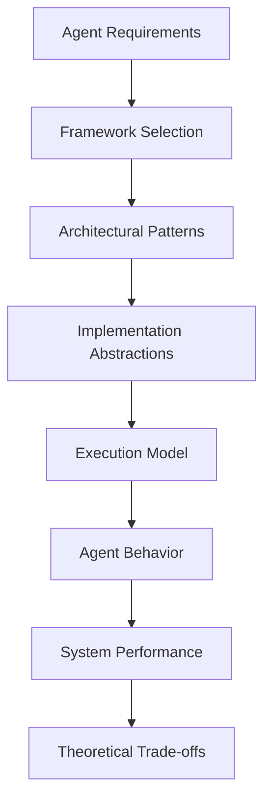

# Lesson 2: Understanding AI Agent Frameworks - Theoretical Foundations

## 🎯 Learning Objectives

After completing this lesson, you will be able to:

- Understand the theoretical foundations of different AI agent frameworks
- Analyze framework architectural patterns and design philosophies
- Compare framework approaches to core agent concepts (memory, tools, orchestration)
- Make informed theoretical decisions about framework selection
- Recognize the trade-offs between different architectural approaches
- Understand how framework design impacts agent capabilities and limitations

## 📚 Theoretical Foundation

### What are AI Agent Frameworks?

AI Agent Frameworks are **architectural systems** that provide **structured approaches** to building **intelligent agents** by offering **abstractions, patterns, and tools** for implementing the core agent components we studied in Lesson 1.

#### Framework as Architectural Philosophy

Each framework embodies a specific theoretical approach to agent construction:

1. **Abstraction Layer** - How the framework hides complexity
   - Example: CrewAI abstracts multi-agent coordination as "crews"
2. **Programming Model** - How developers express agent behavior
   - Example: LangGraph uses graph-based workflow representation
3. **Execution Model** - How the framework runs agent operations
   - Example: Ray provides distributed execution primitives
4. **Integration Philosophy** - How the framework connects to external systems
   - Example: LangChain emphasizes broad ecosystem connectivity



## 🏗️ Framework Architectural Theory

### Fundamental Framework Classifications

AI Agent Frameworks can be theoretically classified across multiple dimensions:

#### 1. **Architectural Paradigm Classification**

| **Paradigm**            | **Description**                       | **Framework Examples** | **Theoretical Implications**                   |
| ----------------------- | ------------------------------------- | ---------------------- | ---------------------------------------------- |
| **Monolithic**          | Single, integrated system approach    | AutoGPT, BabyAGI       | Simple but inflexible; tight coupling          |
| **Modular**             | Component-based, composable systems   | LangChain, LlamaIndex  | Flexible but complex integration               |
| **Orchestration-First** | Workflow and coordination focused     | LangGraph, CrewAI      | Excellent control flow; requires planning      |
| **Conversation-Based**  | Dialogue and interaction centered     | AutoGen                | Natural multi-agent interactions               |
| **Infrastructure**      | Execution and scaling primitives      | Ray                    | Maximum performance; requires higher-level DSL |
| **Lightweight**         | Minimal overhead, performance focused | Agno                   | Fast execution; fewer built-in abstractions    |

#### 2. **State Management Philosophy**

**Stateless Frameworks:**

- Process each interaction independently
- No persistent context between calls
- Example: Early LangChain agent implementations
- **Theoretical Trade-off**: Simplicity vs. Continuity

**Session-Stateful Frameworks:**

- Maintain context within conversation sessions
- Limited persistence across system restarts
- Example: AutoGen conversation patterns
- **Theoretical Trade-off**: User experience vs. Resource management

**Persistent-Stateful Frameworks:**

- Long-term memory and learning capabilities
- Durable state across system boundaries
- Example: LangGraph checkpointing, Agno memory systems
- **Theoretical Trade-off**: Intelligence vs. Complexity

#### 3. **Tool Integration Philosophy**

**Native Tool Ecosystems:**

- Frameworks provide built-in tool libraries
- Tight integration with framework abstractions
- Example: LangChain's extensive tool catalog
- **Theoretical Implication**: Convenience vs. Vendor lock-in

**Tool-Agnostic Approaches:**

- Framework-neutral tool integration patterns
- Developer-defined tool implementations
- Example: Agno's model-agnostic approach
- **Theoretical Implication**: Flexibility vs. Development overhead

**Hybrid Approaches:**

- Built-in tools plus extensible patterns
- Balance between convenience and flexibility
- Example: LlamaIndex workflows with custom tools
- **Theoretical Implication**: Balanced trade-offs with increased complexity

## 🧠 Comprehensive Framework Analysis

### Framework-by-Framework Theoretical Deep Dive

#### **Agno Framework**

**Architectural Philosophy:**

- **Minimalism**: Reduce overhead while maximizing capability
- **Performance-First**: Microsecond instantiation, minimal memory footprint
- **Model Agnosticism**: Abstract away model-specific implementations

**Theoretical Strengths:**

- **Efficiency Theory**: Optimal resource utilization through lean architecture
- **Abstraction Theory**: Clean separation between agent logic and model implementation
- **Composability Theory**: Simple building blocks combine into complex behaviors

**Theoretical Limitations:**

- **Ecosystem Maturity**: Smaller community means fewer pre-built patterns
- **Enterprise Features**: Limited built-in guardrails and governance tools
- **Documentation Depth**: Newer framework with evolving best practices

**Best Theoretical Fit:**

- High-performance production systems requiring minimal overhead
- Model-agnostic deployments across different LLM providers
- Teams prioritizing execution speed over ecosystem breadth

#### **AutoGen Framework**

**Architectural Philosophy:**

- **Conversation-Centric**: Multi-agent interactions as natural dialogues
- **Human-in-the-Loop**: Seamless integration of human oversight
- **Role-Based Design**: Agents defined by conversational roles and capabilities

**Theoretical Strengths:**

- **Interaction Theory**: Natural modeling of multi-party conversations
- **Supervision Theory**: Built-in patterns for human oversight and control
- **Specialization Theory**: Clear role separation enables focused agent capabilities

**Theoretical Limitations:**

- **Orchestration Complexity**: Complex workflows require careful conversation design
- **State Management**: Limited persistence beyond conversation sessions
- **Performance Overhead**: Conversation protocols add computational cost

**Best Theoretical Fit:**

- Research and prototyping environments requiring human oversight
- Multi-agent scenarios with natural conversational patterns
- Teams with Microsoft ecosystem alignment

#### **LangGraph Framework**

**Architectural Philosophy:**

- **Graph-Based Orchestration**: Workflows as directed graphs with conditional logic
- **State-First Design**: Persistent state and checkpointing as core features
- **Production Orientation**: Built for durable, long-running agent systems

**Theoretical Strengths:**

- **Control Flow Theory**: Explicit graph representation of agent decision paths
- **Persistence Theory**: Durable state enables complex, resumable workflows
- **Scalability Theory**: Production-ready patterns for enterprise deployment

**Theoretical Limitations:**

- **Complexity Overhead**: Graph modeling requires upfront workflow design
- **Learning Curve**: Graph abstractions may be unfamiliar to developers
- **Ecosystem Dependency**: Tight coupling with LangChain ecosystem

**Best Theoretical Fit:**

- Production systems requiring complex, stateful workflows
- Long-running processes that must survive system interruptions
- Teams migrating from LangChain seeking better orchestration

#### **LangChain Framework**

**Architectural Philosophy:**

- **Ecosystem-First**: Maximum connectivity to external tools and services
- **Chain Abstraction**: Sequential processing patterns as building blocks
- **Rapid Prototyping**: Quick iteration and experimentation support

**Theoretical Strengths:**

- **Integration Theory**: Vast ecosystem reduces development time
- **Abstraction Theory**: High-level chains hide implementation complexity
- **Community Theory**: Large ecosystem provides extensive examples and patterns

**Theoretical Limitations:**

- **Performance Overhead**: Heavy abstractions impact execution speed
- **State Management**: Limited support for persistent, stateful agents
- **Complexity Growth**: Large codebase can become difficult to navigate

**Best Theoretical Fit:**

- Proof-of-concept and early-stage development
- Projects requiring extensive third-party integrations
- Teams prioritizing rapid prototyping over production optimization

#### **LlamaIndex Framework**

**Architectural Philosophy:**

- **Data-Centric**: Documents and structured data as first-class citizens
- **RAG-Optimized**: Retrieval-augmented generation as core capability
- **Query-Response Pattern**: Information retrieval and reasoning workflows

**Theoretical Strengths:**

- **Information Theory**: Optimized patterns for knowledge retrieval and reasoning
- **Data Integration**: Native support for diverse data sources and formats
- **Reasoning Theory**: Built-in patterns for multi-step reasoning over data

**Theoretical Limitations:**

- **Domain Specificity**: Optimized for data-heavy use cases
- **Orchestration**: Limited support for complex multi-agent workflows
- **Action Capability**: Focused on information rather than environmental modification

**Best Theoretical Fit:**

- Knowledge-intensive applications requiring sophisticated RAG
- Document analysis and question-answering systems
- Teams building data-driven intelligent assistants

#### **CrewAI Framework**

**Architectural Philosophy:**

- **Production-First**: Built-in observability, monitoring, and deployment features
- **Team Metaphor**: Multi-agent systems as collaborative crews
- **Lean Implementation**: Minimal glue code, maximum functionality

**Theoretical Strengths:**

- **Orchestration Theory**: Native multi-agent coordination and delegation
- **Observability Theory**: Built-in monitoring and debugging capabilities
- **Efficiency Theory**: Optimized execution paths reduce overhead

**Theoretical Limitations:**

- **Ecosystem Maturity**: Newer framework with smaller community
- **Flexibility Trade-offs**: Opinionated design may limit customization
- **Documentation**: Evolving best practices and usage patterns

**Best Theoretical Fit:**

- Production multi-agent systems requiring built-in observability
- Teams prioritizing execution speed and monitoring capabilities
- Startups and scale-ups building agent-powered products

#### **BabyAGI / AutoGPT Family**

**Architectural Philosophy:**

- **Autonomous Loops**: Self-directed task generation and execution
- **Goal-Oriented**: High-level objectives drive agent behavior
- **Experimental**: Pushing boundaries of agent autonomy

**Theoretical Strengths:**

- **Autonomy Theory**: Maximum agent independence and self-direction
- **Goal Decomposition**: Automatic breakdown of complex objectives
- **Innovation**: Experimental approaches to agent architecture

**Theoretical Limitations:**

- **Reliability**: Autonomous loops can become unstable or inefficient
- **Control**: Limited mechanisms for constraining agent behavior
- **Production Readiness**: Experimental nature limits enterprise adoption

**Best Theoretical Fit:**

- Research and experimentation with autonomous agent behavior
- Prototyping self-directed agent capabilities
- Educational exploration of agent autonomy concepts

#### **Ray Framework**

**Architectural Philosophy:**

- **Infrastructure-First**: Distributed computing primitives for agent execution
- **Performance-Oriented**: Maximum throughput and parallel processing
- **Framework-Agnostic**: Execution layer for any agent framework

**Theoretical Strengths:**

- **Scalability Theory**: Horizontal scaling and distributed processing
- **Performance Theory**: Optimized execution for compute-intensive tasks
- **Flexibility Theory**: Works with any higher-level agent framework

**Theoretical Limitations:**

- **Abstraction Level**: Low-level primitives require additional framework layers
- **Complexity**: Distributed systems complexity for simple use cases
- **Development Overhead**: Requires infrastructure expertise

**Best Theoretical Fit:**

- Large-scale agent deployments requiring distributed execution
- High-throughput agent processing with parallel task execution
- Teams with distributed systems expertise building scalable platforms

## 🧠 Advanced Theoretical Concepts

### Framework Selection Theory

#### **The Framework Fit Matrix**

Framework selection involves analyzing the alignment between:

1. **Problem Characteristics** vs. **Framework Strengths**
2. **Team Capabilities** vs. **Framework Complexity**
3. **Performance Requirements** vs. **Framework Overhead**
4. **Ecosystem Needs** vs. **Framework Integrations**

#### **Theoretical Decision Framework**

**Step 1: Problem Classification**

- **Complexity Level**: Simple task automation vs. Complex multi-agent orchestration
- **State Requirements**: Stateless operations vs. Persistent, learning systems
- **Performance Needs**: Rapid prototyping vs. Production-grade performance
- **Integration Scope**: Standalone systems vs. Ecosystem-heavy implementations

**Step 2: Constraint Analysis**

- **Technical Constraints**: Performance, scalability, reliability requirements
- **Organizational Constraints**: Team expertise, timeline, maintenance capacity
- **Business Constraints**: Cost, vendor relationships, compliance requirements

**Step 3: Framework Alignment Scoring**

- **Capability Match**: How well does framework support required features?
- **Complexity Appropriateness**: Does framework complexity match problem complexity?
- **Ecosystem Alignment**: Do framework integrations match system requirements?
- **Future Evolution**: How well will framework evolve with changing needs?

### Framework Evolution Theory

#### **Maturity Lifecycle Patterns**

**Experimental Phase:**

- High innovation, low stability
- Rapid feature development, breaking changes
- Example: Early AutoGPT implementations

**Growth Phase:**

- Stabilizing APIs, growing community
- Feature expansion, ecosystem development
- Example: Current Agno, CrewAI development

**Maturity Phase:**

- Stable APIs, extensive documentation
- Large ecosystem, proven production use
- Example: LangChain, established Ray deployments

**Specialization Phase:**

- Domain-specific optimizations
- Enterprise features, governance tools
- Example: LlamaIndex for RAG, LangGraph for orchestration

#### **Architectural Evolution Patterns**

**Monolith → Modular:**

- Single-purpose tools evolve into composable systems
- Example: Simple LLM wrappers → Full agent frameworks

**Modular → Orchestrated:**

- Component systems add workflow orchestration
- Example: LangChain → LangGraph evolution

**Specialized → Generalized:**

- Domain-specific tools expand to broader use cases
- Example: LlamaIndex expanding beyond RAG

**Infrastructure → Platform:**

- Low-level tools add higher-level abstractions
- Example: Ray adding agent-specific patterns

## 🔍 Deep Dive: Framework Design Patterns

### Common Architectural Patterns

#### **1. Chain of Responsibility Pattern**

- **Theory**: Sequential processing with conditional branching
- **Implementation**: LangChain chains, LlamaIndex query engines
- **Trade-offs**: Simple to understand vs. Limited parallel processing

#### **2. Observer Pattern**

- **Theory**: Event-driven updates and monitoring
- **Implementation**: CrewAI observability, AutoGen conversation tracking
- **Trade-offs**: Loose coupling vs. Debugging complexity

#### **3. Strategy Pattern**

- **Theory**: Interchangeable algorithm implementations
- **Implementation**: Agno model-agnostic design, tool selection patterns
- **Trade-offs**: Flexibility vs. Performance optimization

#### **4. State Machine Pattern**

- **Theory**: Explicit state transitions and workflow control
- **Implementation**: LangGraph state management, conversation flows
- **Trade-offs**: Predictable behavior vs. Implementation complexity

#### **5. Actor Model Pattern**

- **Theory**: Concurrent, message-passing entities
- **Implementation**: Ray distributed agents, AutoGen conversation agents
- **Trade-offs**: Scalability vs. Coordination complexity

### Framework Integration Patterns

#### **Horizontal Integration**

- Multiple frameworks working together at the same abstraction level
- Example: LangChain tools with Ray execution backend
- **Theory**: Best-of-breed approach with integration overhead

#### **Vertical Integration**

- Frameworks providing full-stack solutions
- Example: LangGraph platform with built-in deployment
- **Theory**: Simplified development with potential vendor lock-in

#### **Hybrid Integration**

- Selective use of framework components based on requirements
- Example: Agno agents with LangChain tools and Ray scaling
- **Theory**: Optimal performance with increased complexity

## 📊 Comprehensive Framework Comparison Matrix

### Core Capability Analysis

| Framework      | **Agent Types**               | **Memory Systems**          | **Tool Integration**   | **Multi-Agent**         | **State Management**  | **Production Features**  |
| -------------- | ----------------------------- | --------------------------- | ---------------------- | ----------------------- | --------------------- | ------------------------ |
| **Agno**       | Goal-based, Learning          | Working, Episodic, Semantic | Model-agnostic, Native | Teams, Workflows        | Persistent, Efficient | Monitoring, Performance  |
| **AutoGen**    | Conversational, Collaborative | Session-based               | Python SDK             | Strong dialogue support | Conversation state    | Human-in-loop, Studio UI |
| **LangGraph**  | Workflow-based, Stateful      | Checkpointing, Persistent   | LangChain ecosystem    | Orchestrated flows      | Durable, Resumable    | Production platform      |
| **LangChain**  | Chain-based, Reactive         | Limited persistence         | Vast ecosystem         | Basic coordination      | Session-limited       | Extensive connectors     |
| **LlamaIndex** | Query-based, RAG-focused      | Document-centric            | Data source native     | Workflow support        | Query session         | Cloud deployment         |
| **CrewAI**     | Role-based, Collaborative     | Team memory                 | Lean integration       | Built-in orchestration  | Delegation state      | Observability OOTB       |
| **BabyAGI**    | Autonomous, Goal-driven       | Task-based                  | Minimal                | Task loops              | Limited               | Experimental             |
| **Ray**        | Infrastructure-agnostic       | Distributed state           | Framework-neutral      | Parallel/distributed    | Cluster-wide          | Production-proven        |

### Performance and Scalability Analysis

| Framework      | **Startup Time** | **Memory Footprint** | **Throughput** | **Scalability** | **Resource Efficiency** |
| -------------- | ---------------- | -------------------- | -------------- | --------------- | ----------------------- |
| **Agno**       | ⚡ Microseconds  | 🟢 Minimal           | 🟢 High        | 🟡 Good         | 🟢 Excellent            |
| **AutoGen**    | 🟡 Moderate      | 🟡 Medium            | 🟡 Medium      | 🟡 Good         | 🟡 Good                 |
| **LangGraph**  | 🟡 Moderate      | 🟡 Medium            | 🟢 High        | 🟢 Excellent    | 🟢 Good                 |
| **LangChain**  | 🔴 Slow          | 🔴 Heavy             | 🟡 Medium      | 🟡 Limited      | 🔴 Poor                 |
| **LlamaIndex** | 🟡 Moderate      | 🟡 Medium            | 🟢 High (RAG)  | 🟡 Good         | 🟡 Good                 |
| **CrewAI**     | 🟢 Fast          | 🟢 Light             | 🟢 High        | 🟡 Good         | 🟢 Excellent            |
| **BabyAGI**    | 🟡 Variable      | 🟡 Variable          | 🔴 Poor        | 🔴 Limited      | 🔴 Poor                 |
| **Ray**        | 🟡 Cluster setup | 🟡 Distributed       | 🟢 Excellent   | 🟢 Excellent    | 🟢 Excellent            |

### Enterprise and Production Analysis

| Framework      | **Maturity**    | **Community**   | **Documentation** | **Enterprise Features** | **Vendor Support** |
| -------------- | --------------- | --------------- | ----------------- | ----------------------- | ------------------ |
| **Agno**       | 🟡 Growing      | 🟡 Active OSS   | 🟡 Developing     | 🟡 Basic                | 🟡 Community       |
| **AutoGen**    | 🟢 Mature       | 🟢 Large + MS   | 🟢 Comprehensive  | 🟢 Good                 | 🟢 Microsoft       |
| **LangGraph**  | 🟡 Active       | 🟢 Growing fast | 🟢 Good           | 🟢 Production-ready     | 🟢 LangChain Inc   |
| **LangChain**  | 🟢 Very mature  | 🟢 Huge         | 🟢 Extensive      | 🟡 Basic                | 🟢 LangChain Inc   |
| **LlamaIndex** | 🟢 Mature       | 🟢 Large        | 🟢 Good           | 🟢 LlamaCloud           | 🟢 Commercial      |
| **CrewAI**     | 🟡 Newer        | 🟡 Growing      | 🟡 Good           | 🟢 Built-in             | 🟡 Community       |
| **BabyAGI**    | 🔴 Experimental | 🟡 Fragmented   | 🔴 Limited        | 🔴 None                 | 🔴 None            |
| **Ray**        | 🟢 Very mature  | 🟢 Large ML     | 🟢 Excellent      | 🟢 Enterprise           | 🟢 Anyscale        |

## 🎓 Theoretical Selection Guidelines

### Framework Selection Decision Tree

#### **For High-Performance Production Systems:**

1. **Primary Choice**: Agno (lightweight, fast)
2. **Alternative**: CrewAI (production-first design)
3. **Infrastructure**: Ray (if distributed scaling needed)

#### **For Multi-Agent Research & Prototyping:**

1. **Primary Choice**: AutoGen (conversation-centric)
2. **Alternative**: CrewAI (team-based approach)
3. **Experimental**: BabyAGI family (autonomous exploration)

#### **For Complex Workflow Orchestration:**

1. **Primary Choice**: LangGraph (graph-based workflows)
2. **Alternative**: CrewAI (built-in orchestration)
3. **Infrastructure**: Ray (distributed execution)

#### **For Rapid Prototyping & Integration:**

1. **Primary Choice**: LangChain (vast ecosystem)
2. **Alternative**: LlamaIndex (data-focused prototyping)
3. **Evolution Path**: Migrate to LangGraph for production

#### **For Knowledge-Intensive Applications:**

1. **Primary Choice**: LlamaIndex (RAG-optimized)
2. **Alternative**: LangChain (broad data connectors)
3. **Enhancement**: Agno (for performance-critical components)

#### **For Distributed & Scalable Systems:**

1. **Primary Choice**: Ray (infrastructure layer)
2. **Agent Layer**: Agno or LangGraph
3. **Integration**: Framework-neutral tool ecosystem

### Theoretical Trade-off Analysis

#### **Performance vs. Features**

- **High Performance**: Agno, Ray → Minimal features, maximum speed
- **Balanced**: CrewAI, LangGraph → Good performance, rich features
- **Feature-Rich**: LangChain, LlamaIndex → Many features, performance overhead

#### **Simplicity vs. Power**

- **Simple**: Agno, CrewAI → Easy to start, may hit limitations
- **Balanced**: AutoGen, LangGraph → Moderate complexity, good power
- **Powerful**: Ray, LangChain → High complexity, maximum flexibility

#### **Ecosystem vs. Performance**

- **Ecosystem-First**: LangChain → Many integrations, slower execution
- **Balanced**: LlamaIndex, LangGraph → Good ecosystem, decent performance
- **Performance-First**: Agno, Ray → Fewer integrations, faster execution

## 🧠 Critical Understanding Points

### Framework Philosophy Alignment

**Choose frameworks that align with your team's mental model:**

- **Code-First Teams**: Prefer Agno, Ray (direct programming models)
- **Workflow-First Teams**: Prefer LangGraph, CrewAI (orchestration abstractions)
- **Research Teams**: Prefer AutoGen, BabyAGI (experimental approaches)
- **Integration-Heavy Teams**: Prefer LangChain, LlamaIndex (ecosystem breadth)

### Evolutionary Considerations

**Framework evolution patterns suggest:**

- **Specialization Trend**: Frameworks are becoming more domain-specific
- **Production Focus**: Newer frameworks prioritize production features
- **Performance Optimization**: Growing emphasis on execution efficiency
- **Orchestration Importance**: Multi-agent coordination becoming standard

### Theoretical Success Patterns

**Successful framework adoption typically follows:**

1. **Problem-Framework Alignment**: Choose based on problem characteristics
2. **Team Capability Match**: Select complexity appropriate for team skills
3. **Gradual Migration**: Start simple, evolve toward complex as needed
4. **Hybrid Approaches**: Combine frameworks for optimal results

## 📚 Theoretical Framework Summary

### The Framework Selection Equation

```
Optimal Framework = Problem_Requirements × Team_Capabilities × Performance_Constraints × Ecosystem_Needs
```

**Component Definitions:**

- **Problem_Requirements**: Complexity, state needs, multi-agent requirements
- **Team_Capabilities**: Expertise level, development timeline, maintenance capacity
- **Performance_Constraints**: Speed, scalability, resource limitations
- **Ecosystem_Needs**: Integration requirements, tool dependencies, vendor preferences

### Framework Evolution Prediction

**Emerging Patterns:**

1. **Convergence**: Similar features appearing across frameworks
2. **Specialization**: Frameworks optimizing for specific use cases
3. **Platform Integration**: Frameworks becoming full development platforms
4. **Performance Focus**: Growing emphasis on production-grade performance

## 🔗 Theoretical Foundations

### Conceptual Prerequisites

**Framework selection requires understanding of:**

1. **System Architecture**: How components interact in distributed systems
2. **Performance Engineering**: Trade-offs between features and speed
3. **Software Evolution**: How frameworks mature and change over time
4. **Integration Patterns**: How different systems work together

### Academic Foundations

**Key Theoretical Areas:**

- **Software Architecture**: Component design, abstraction layers, integration patterns
- **Distributed Systems**: Scalability, fault tolerance, consistency models
- **Performance Engineering**: Optimization techniques, resource management
- **Human-Computer Interaction**: Developer experience, API design, usability

## 🎯 Conceptual Mastery Checkpoint

**Before moving to practical implementation, verify your understanding:**

**Core Framework Concepts:**

- [ ] Understand different framework architectural philosophies
- [ ] Can compare framework approaches to core agent components
- [ ] Recognize framework maturity and evolution patterns
- [ ] Understand performance and scalability trade-offs

**Advanced Framework Analysis:**

- [ ] Can analyze framework design patterns and their implications
- [ ] Understand framework selection criteria and decision frameworks
- [ ] Recognize integration patterns and hybrid approaches
- [ ] Can predict framework evolution and industry trends

**Practical Framework Selection:**

- [ ] Can match framework capabilities to problem requirements
- [ ] Understand team capability and framework complexity alignment
- [ ] Can design hybrid approaches using multiple frameworks
- [ ] Recognize when to migrate between frameworks

**Ready for Lesson 3?** Move to [Agentic Design Patterns](../../01-basic-agents/README.md) to begin implementing these theoretical concepts with practical agent construction.
