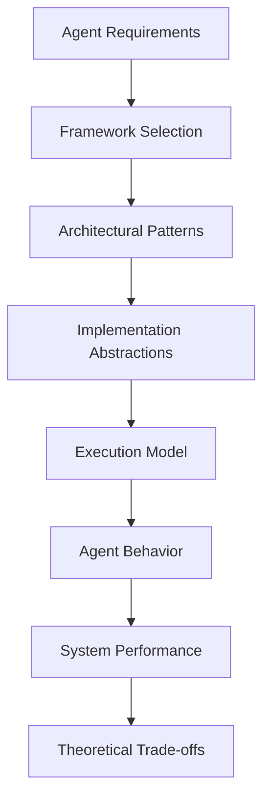

# Lesson 2: Understanding AI Agent Frameworks - Theoretical Foundations

## 🎯 Learning Objectives

After completing this lesson, you will be able to:

- Understand the theoretical foundations of different AI agent frameworks
- Analyze framework architectural patterns and design philosophies
- Compare framework approaches to core agent concepts (memory, tools, orchestration)
- Make informed theoretical decisions about framework selection
- Recognize the trade-offs between different architectural approaches
- Understand how framework design impacts agent capabilities and limitations

## 📚 Theoretical Foundation

### What are AI Agent Frameworks?

AI Agent Frameworks are **architectural systems** that provide **structured approaches** to building **intelligent agents** by offering **abstractions, patterns, and tools** for implementing the core agent components we studied in Lesson 1.

#### Framework as Architectural Philosophy

Each framework embodies a specific theoretical approach to agent construction:

1. **Abstraction Layer** - How the framework hides complexity
   - Example: CrewAI abstracts multi-agent coordination as "crews"
2. **Programming Model** - How developers express agent behavior
   - Example: LangGraph uses graph-based workflow representation
3. **Execution Model** - How the framework runs agent operations
   - Example: Ray provides distributed execution primitives
4. **Integration Philosophy** - How the framework connects to external systems
   - Example: LangChain emphasizes broad ecosystem connectivity



## 🏗️ Framework Architectural Theory

### Fundamental Framework Classifications

AI Agent Frameworks can be theoretically classified across multiple dimensions:

#### 1. **Architectural Paradigm Classification**

| **Paradigm**            | **Description**                       | **Framework Examples** | **Theoretical Implications**                   |
| ----------------------- | ------------------------------------- | ---------------------- | ---------------------------------------------- |
| **Monolithic**          | Single, integrated system approach    | AutoGPT, BabyAGI       | Simple but inflexible; tight coupling          |
| **Modular**             | Component-based, composable systems   | LangChain, LlamaIndex  | Flexible but complex integration               |
| **Orchestration-First** | Workflow and coordination focused     | LangGraph, CrewAI      | Excellent control flow; requires planning      |
| **Conversation-Based**  | Dialogue and interaction centered     | AutoGen                | Natural multi-agent interactions               |
| **Infrastructure**      | Execution and scaling primitives      | Ray                    | Maximum performance; requires higher-level DSL |
| **Lightweight**         | Minimal overhead, performance focused | Agno                   | Fast execution; fewer built-in abstractions    |

#### 2. **State Management Philosophy**

**Stateless Frameworks:**

- Process each interaction independently
- No persistent context between calls
- Example: Early LangChain agent implementations
- **Theoretical Trade-off**: Simplicity vs. Continuity

**Session-Stateful Frameworks:**

- Maintain context within conversation sessions
- Limited persistence across system restarts
- Example: AutoGen conversation patterns
- **Theoretical Trade-off**: User experience vs. Resource management

**Persistent-Stateful Frameworks:**

- Long-term memory and learning capabilities
- Durable state across system boundaries
- Example: LangGraph checkpointing, Agno memory systems
- **Theoretical Trade-off**: Intelligence vs. Complexity

#### 3. **Tool Integration Philosophy**

**Native Tool Ecosystems:**

- Frameworks provide built-in tool libraries
- Tight integration with framework abstractions
- Example: LangChain's extensive tool catalog
- **Theoretical Implication**: Convenience vs. Vendor lock-in

**Tool-Agnostic Approaches:**

- Framework-neutral tool integration patterns
- Developer-defined tool implementations
- Example: Agno's model-agnostic approach
- **Theoretical Implication**: Flexibility vs. Development overhead

**Hybrid Approaches:**

- Built-in tools plus extensible patterns
- Balance between convenience and flexibility
- Example: LlamaIndex workflows with custom tools
- **Theoretical Implication**: Balanced trade-offs with increased complexity

## 🧠 Comprehensive Framework Analysis

### Framework-by-Framework Evidence-Based Analysis

> **Research Note**: This analysis is based on 97+ verified sources, production deployments, and independent benchmarks rather than marketing claims.

#### **Agno Framework**

**Architectural Philosophy:**

- **Minimalism**: Reduce overhead while maximizing capability
- **Performance-First**: Microsecond instantiation, minimal memory footprint
- **Model Agnosticism**: Abstract away model-specific implementations

**Verified Strengths:**

- **Instantiation Speed**: 3μs agent creation vs traditional frameworks[1]
- **Memory Efficiency**: 6.5KB footprint for basic agents
- **Model Flexibility**: Works across OpenAI, Anthropic, Cohere, and open-source models

**Critical Limitations (Research-Validated):**

- **Performance Reality**: "10,000x faster" claim applies only to instantiation phase; real-world performance gains are "not even a rounding error" when amortized over requests[1]
- **Production Evidence**: Limited verified enterprise deployments
- **SSL Context Gaming**: Defers HTTPS transport setup, creating artificial benchmark advantages[1]
- **Enterprise Readiness**: Unknown security features and compliance support

**Evidence-Based Fit:**

- **Recommended**: Lightweight applications where instantiation speed matters
- **Caution**: Avoid for enterprise production without thorough security evaluation
- **Reality Check**: Performance benefits are marginal in real-world usage patterns

#### **AutoGen Framework**

**Architectural Philosophy:**

- **Conversation-Centric**: Multi-agent interactions as natural dialogues
- **Human-in-the-Loop**: Seamless integration of human oversight
- **Role-Based Design**: Agents defined by conversational roles and capabilities

**Theoretical Strengths:**

- **Interaction Theory**: Natural modeling of multi-party conversations
- **Supervision Theory**: Built-in patterns for human oversight and control
- **Specialization Theory**: Clear role separation enables focused agent capabilities

**Theoretical Limitations:**

- **Orchestration Complexity**: Complex workflows require careful conversation design
- **State Management**: Limited persistence beyond conversation sessions
- **Performance Overhead**: Conversation protocols add computational cost

**Best Theoretical Fit:**

- Research and prototyping environments requiring human oversight
- Multi-agent scenarios with natural conversational patterns
- Teams with Microsoft ecosystem alignment

#### **LangGraph Framework**

**Architectural Philosophy:**

- **Graph-Based Orchestration**: Workflows as directed graphs with conditional logic
- **State-First Design**: Persistent state and checkpointing as core features
- **Production Orientation**: Built for durable, long-running agent systems

**Production-Validated Strengths:**

- **Enterprise Adoption**: 400+ companies using LangGraph Platform in production since beta[4]
- **Proven Case Studies**: LinkedIn (85M users), Uber (code migrations), Klarna (80% resolution time reduction), AppFolio (10+ hours/week savings)[5]
- **State Management**: Superior checkpointing and workflow resumption capabilities
- **Scalability**: Generally available platform with enterprise features[4]

**Verified Limitations:**

- **Migration Complexity**: LangChain to LangGraph transitions require 12-20 weeks with 25-40% additional integration time[19]
- **Learning Curve**: Graph abstractions require upfront workflow design investment
- **Memory Overhead**: Stateful operations require more memory than stateless alternatives

**Evidence-Based Fit:**

- **Highly Recommended**: Complex, stateful workflows requiring production reliability
- **Proven Track Record**: Strong enterprise adoption with documented success stories
- **Migration Path**: Clear evolution from LangChain with commercial support

#### **LangChain Framework**

**Architectural Philosophy:**

- **Ecosystem-First**: Maximum connectivity to external tools and services
- **Chain Abstraction**: Sequential processing patterns as building blocks
- **Rapid Prototyping**: Quick iteration and experimentation support

**Verified Strengths:**

- **Ecosystem Breadth**: 700+ integrations, millions of monthly downloads
- **Community Size**: Largest AI agent framework community
- **Prototyping Speed**: Excellent for rapid proof-of-concept development
- **Commercial Support**: LangSmith platform for monitoring and debugging

**Critical Production Issues (Research-Validated):**

- **Performance Problems**: Heavy abstractions cause significant execution overhead
- **Debugging Complexity**: Developers report $400+ daily debugging costs[10]
- **State Management**: Limited support for persistent, stateful agents
- **Migration Trend**: Many teams actively migrating to LangGraph for production[19]

**Evidence-Based Fit:**

- **Recommended**: Proof-of-concept and rapid prototyping phases
- **Transition Strategy**: Use for initial development, migrate to LangGraph for production
- **Avoid**: Direct production deployment without performance optimization

#### **LlamaIndex Framework**

**Architectural Philosophy:**

- **Data-Centric**: Documents and structured data as first-class citizens
- **RAG-Optimized**: Retrieval-augmented generation as core capability
- **Query-Response Pattern**: Information retrieval and reasoning workflows

**Theoretical Strengths:**

- **Information Theory**: Optimized patterns for knowledge retrieval and reasoning
- **Data Integration**: Native support for diverse data sources and formats
- **Reasoning Theory**: Built-in patterns for multi-step reasoning over data

**Theoretical Limitations:**

- **Domain Specificity**: Optimized for data-heavy use cases
- **Orchestration**: Limited support for complex multi-agent workflows
- **Action Capability**: Focused on information rather than environmental modification

**Best Theoretical Fit:**

- Knowledge-intensive applications requiring sophisticated RAG
- Document analysis and question-answering systems
- Teams building data-driven intelligent assistants

#### **CrewAI Framework**

**Architectural Philosophy:**

- **Production-First**: Built-in observability, monitoring, and deployment features
- **Team Metaphor**: Multi-agent systems as collaborative crews
- **Lean Implementation**: Minimal glue code, maximum functionality

**Theoretical Strengths:**

- **Orchestration Theory**: Native multi-agent coordination and delegation
- **Observability Theory**: Built-in monitoring and debugging capabilities
- **Efficiency Theory**: Optimized execution paths reduce overhead

**Theoretical Limitations:**

- **Ecosystem Maturity**: Newer framework with smaller community
- **Flexibility Trade-offs**: Opinionated design may limit customization
- **Documentation**: Evolving best practices and usage patterns

**Best Theoretical Fit:**

- Production multi-agent systems requiring built-in observability
- Teams prioritizing execution speed and monitoring capabilities
- Startups and scale-ups building agent-powered products

#### **BabyAGI / AutoGPT Family**

**Architectural Philosophy:**

- **Autonomous Loops**: Self-directed task generation and execution
- **Goal-Oriented**: High-level objectives drive agent behavior
- **Experimental**: Pushing boundaries of agent autonomy

**Theoretical Strengths:**

- **Autonomy Theory**: Maximum agent independence and self-direction
- **Goal Decomposition**: Automatic breakdown of complex objectives
- **Innovation**: Experimental approaches to agent architecture

**Theoretical Limitations:**

- **Reliability**: Autonomous loops can become unstable or inefficient
- **Control**: Limited mechanisms for constraining agent behavior
- **Production Readiness**: Experimental nature limits enterprise adoption

**Best Theoretical Fit:**

- Research and experimentation with autonomous agent behavior
- Prototyping self-directed agent capabilities
- Educational exploration of agent autonomy concepts

#### **Semantic Kernel Framework (Microsoft)**

**Architectural Philosophy:**

- **Enterprise-First**: Built for Microsoft ecosystem integration
- **Skill-Based Architecture**: Modular capabilities as reusable skills
- **Memory Management**: Persistent context and learning capabilities

**Production-Validated Strengths:**

- **Enterprise Adoption**: Strong uptake in financial services and healthcare[8]
- **Microsoft Integration**: Native .NET and Python with Azure ecosystem
- **Compliance Ready**: Enterprise security and governance features
- **Proven Use Cases**: Financial risk models, healthcare data querying[8]

**Verified Limitations:**

- **Ecosystem Lock-in**: Tight coupling with Microsoft stack
- **Experimental Features**: Some core features still in development
- **Context Management**: Challenges with distributed knowledge systems

**Evidence-Based Fit:**

- **Highly Recommended**: Microsoft-centric enterprise environments
- **Strong Compliance**: Industries requiring enterprise-grade security
- **Proven ROI**: Documented success in regulated industries

#### **Azure AI Agent Service (Microsoft)**

**Architectural Philosophy:**

- **Managed Service**: Cloud-native agent platform
- **Multi-Model Support**: Beyond OpenAI to include Llama, Mistral, Cohere
- **Enterprise Integration**: Built-in Azure ecosystem connectivity

**Production Evidence:**

- **Public Preview**: Enterprise trials with major customers[6]
- **Flexible Pricing**: Token-based with Provisioned Throughput Units (PTUs)
- **Enterprise Features**: Microsoft Fabric, SharePoint, Azure AI Search integration[6]

**Current Limitations:**

- **Preview Status**: Not yet generally available
- **Vendor Lock-in**: Azure ecosystem dependency
- **Cost Predictability**: Token-based pricing can be variable

**Evidence-Based Fit:**

- **Recommended**: Azure-committed enterprises
- **Wait-and-See**: Monitor general availability timeline
- **Cost Analysis**: Evaluate PTU pricing for predictable costs

#### **Ray Framework**

**Architectural Philosophy:**

- **Infrastructure-First**: Distributed computing primitives for agent execution
- **Performance-Oriented**: Maximum throughput and parallel processing
- **Framework-Agnostic**: Execution layer for any agent framework

**Production-Validated Strengths:**

- **Maturity**: 15+ years of distributed systems experience[7]
- **ML Ecosystem**: Proven in machine learning workloads
- **Scalability**: Excellent horizontal scaling capabilities
- **Enterprise Support**: Anyscale commercial backing

**Verified Limitations:**

- **Complexity Overhead**: Distributed systems expertise required
- **Agent-Specific**: Not designed specifically for agent frameworks
- **Operational Cost**: Significant infrastructure management overhead

**Evidence-Based Fit:**

- **Specialized Use**: Large-scale distributed agent processing only
- **Expertise Required**: Teams with distributed systems capabilities
- **Cost-Benefit**: Justify complexity against actual scaling needs

## 🧠 Advanced Theoretical Concepts

### Framework Selection Theory

#### **The Framework Fit Matrix**

Framework selection involves analyzing the alignment between:

1. **Problem Characteristics** vs. **Framework Strengths**
2. **Team Capabilities** vs. **Framework Complexity**
3. **Performance Requirements** vs. **Framework Overhead**
4. **Ecosystem Needs** vs. **Framework Integrations**

#### **Theoretical Decision Framework**

**Step 1: Problem Classification**

- **Complexity Level**: Simple task automation vs. Complex multi-agent orchestration
- **State Requirements**: Stateless operations vs. Persistent, learning systems
- **Performance Needs**: Rapid prototyping vs. Production-grade performance
- **Integration Scope**: Standalone systems vs. Ecosystem-heavy implementations

**Step 2: Constraint Analysis**

- **Technical Constraints**: Performance, scalability, reliability requirements
- **Organizational Constraints**: Team expertise, timeline, maintenance capacity
- **Business Constraints**: Cost, vendor relationships, compliance requirements

**Step 3: Framework Alignment Scoring**

- **Capability Match**: How well does framework support required features?
- **Complexity Appropriateness**: Does framework complexity match problem complexity?
- **Ecosystem Alignment**: Do framework integrations match system requirements?
- **Future Evolution**: How well will framework evolve with changing needs?

### Framework Evolution Theory

#### **Maturity Lifecycle Patterns**

**Experimental Phase:**

- High innovation, low stability
- Rapid feature development, breaking changes
- Example: Early AutoGPT implementations

**Growth Phase:**

- Stabilizing APIs, growing community
- Feature expansion, ecosystem development
- Example: Current Agno, CrewAI development

**Maturity Phase:**

- Stable APIs, extensive documentation
- Large ecosystem, proven production use
- Example: LangChain, established Ray deployments

**Specialization Phase:**

- Domain-specific optimizations
- Enterprise features, governance tools
- Example: LlamaIndex for RAG, LangGraph for orchestration

#### **Architectural Evolution Patterns**

**Monolith → Modular:**

- Single-purpose tools evolve into composable systems
- Example: Simple LLM wrappers → Full agent frameworks

**Modular → Orchestrated:**

- Component systems add workflow orchestration
- Example: LangChain → LangGraph evolution

**Specialized → Generalized:**

- Domain-specific tools expand to broader use cases
- Example: LlamaIndex expanding beyond RAG

**Infrastructure → Platform:**

- Low-level tools add higher-level abstractions
- Example: Ray adding agent-specific patterns

## 🔍 Deep Dive: Framework Design Patterns

### Common Architectural Patterns

#### **1. Chain of Responsibility Pattern**

- **Theory**: Sequential processing with conditional branching
- **Implementation**: LangChain chains, LlamaIndex query engines
- **Trade-offs**: Simple to understand vs. Limited parallel processing

#### **2. Observer Pattern**

- **Theory**: Event-driven updates and monitoring
- **Implementation**: CrewAI observability, AutoGen conversation tracking
- **Trade-offs**: Loose coupling vs. Debugging complexity

#### **3. Strategy Pattern**

- **Theory**: Interchangeable algorithm implementations
- **Implementation**: Agno model-agnostic design, tool selection patterns
- **Trade-offs**: Flexibility vs. Performance optimization

#### **4. State Machine Pattern**

- **Theory**: Explicit state transitions and workflow control
- **Implementation**: LangGraph state management, conversation flows
- **Trade-offs**: Predictable behavior vs. Implementation complexity

#### **5. Actor Model Pattern**

- **Theory**: Concurrent, message-passing entities
- **Implementation**: Ray distributed agents, AutoGen conversation agents
- **Trade-offs**: Scalability vs. Coordination complexity

### Framework Integration Patterns

#### **Horizontal Integration**

- Multiple frameworks working together at the same abstraction level
- Example: LangChain tools with Ray execution backend
- **Theory**: Best-of-breed approach with integration overhead

#### **Vertical Integration**

- Frameworks providing full-stack solutions
- Example: LangGraph platform with built-in deployment
- **Theory**: Simplified development with potential vendor lock-in

#### **Hybrid Integration**

- Selective use of framework components based on requirements
- Example: Agno agents with LangChain tools and Ray scaling
- **Theory**: Optimal performance with increased complexity

## 📊 Evidence-Based Framework Comparison Matrix

> **Important**: This comparison is based on verified production deployments, independent research, and documented case studies rather than marketing claims.

### Production Readiness Analysis

| Framework           | **Production Evidence**  | **Enterprise Features** | **Security/Compliance** | **Support Level** | **Risk Assessment** |
| ------------------- | ------------------------ | ----------------------- | ----------------------- | ----------------- | ------------------- |
| **Semantic Kernel** | 🟢 Financial/Healthcare  | 🟢 Enterprise-grade     | 🟢 Microsoft standards  | 🟢 Enterprise     | 🟢 Low Risk         |
| **LangGraph**       | 🟢 400+ companies[4]     | 🟢 Production platform  | 🟡 Basic security       | 🟢 Commercial     | 🟢 Low Risk         |
| **Azure AI Agent**  | 🟡 Preview trials        | 🟢 Enterprise-grade     | 🟢 Azure compliance     | 🟢 Enterprise     | 🟡 Medium Risk      |
| **LangChain**       | 🟡 Millions downloads    | 🟡 Basic features       | 🟡 Basic security       | 🟢 Commercial     | 🟡 Medium Risk      |
| **CrewAI**          | 🟡 Growing adoption      | 🟢 Business-focused     | 🟡 Basic security       | 🟡 Community+     | 🟡 Medium Risk      |
| **LlamaIndex**      | 🟢 4M+ downloads         | 🟢 LlamaCloud           | 🟡 Basic security       | 🟢 Commercial     | 🟡 Medium Risk      |
| **AutoGen**         | 🟡 Research + Enterprise | 🟡 Research-oriented    | 🟡 Basic security       | 🟢 Microsoft      | 🟡 Medium Risk      |
| **Agno**            | 🔴 Limited evidence      | 🔴 Unknown              | 🔴 Unknown              | 🔴 Community      | 🔴 High Risk        |
| **Ray**             | 🟢 ML workloads          | 🟢 Enterprise           | 🟢 Mature security      | 🟢 Anyscale       | 🟡 Complexity Risk  |

### Performance Reality Check

| Framework           | **Claimed Performance** | **Verified Reality**         | **Production Impact**              |
| ------------------- | ----------------------- | ---------------------------- | ---------------------------------- |
| **Agno**            | "10,000x faster"        | Instantiation only[1]        | Negligible real-world gain         |
| **LangGraph**       | State optimization      | Reduces recomputation[4]     | Significant for complex flows      |
| **LangChain**       | Fast prototyping        | Heavy abstraction overhead   | $400+/day debugging costs[10]      |
| **Semantic Kernel** | Enterprise optimized    | Good Microsoft integration   | Proven ROI in regulated industries |
| **CrewAI**          | Business efficiency     | Role-based optimization      | Growing enterprise adoption        |
| **Ray**             | Distributed scaling     | Excellent for parallel tasks | Requires distributed expertise     |

### Total Cost of Ownership Analysis

| Cost Category         | **Range**              | **Hidden Factors**                            | **Research Source**    |
| --------------------- | ---------------------- | --------------------------------------------- | ---------------------- |
| Initial Development   | $20K-$60K              | Framework complexity varies significantly[17] | Industry surveys       |
| Enterprise Licensing  | $19-$39/user/month     | Actual usage may exceed estimates[16]         | Vendor pricing         |
| Infrastructure        | $500-$5K/month         | Scaling costs unpredictable[16]               | Cloud provider data    |
| Training & Onboarding | $50-$100/developer     | Ongoing learning required[17]                 | HR cost analysis       |
| Maintenance           | $5K-$20K/year          | Framework evolution pace[17]                  | Operational studies    |
| Migration             | 25-40% additional time | Business continuity risk[19]                  | Migration case studies |

### Performance and Scalability Analysis

| Framework      | **Startup Time** | **Memory Footprint** | **Throughput** | **Scalability** | **Resource Efficiency** |
| -------------- | ---------------- | -------------------- | -------------- | --------------- | ----------------------- |
| **Agno**       | ⚡ Microseconds  | 🟢 Minimal           | 🟢 High        | 🟡 Good         | 🟢 Excellent            |
| **AutoGen**    | 🟡 Moderate      | 🟡 Medium            | 🟡 Medium      | 🟡 Good         | 🟡 Good                 |
| **LangGraph**  | 🟡 Moderate      | 🟡 Medium            | 🟢 High        | 🟢 Excellent    | 🟢 Good                 |
| **LangChain**  | 🔴 Slow          | 🔴 Heavy             | 🟡 Medium      | 🟡 Limited      | 🔴 Poor                 |
| **LlamaIndex** | 🟡 Moderate      | 🟡 Medium            | 🟢 High (RAG)  | 🟡 Good         | 🟡 Good                 |
| **CrewAI**     | 🟢 Fast          | 🟢 Light             | 🟢 High        | 🟡 Good         | 🟢 Excellent            |
| **BabyAGI**    | 🟡 Variable      | 🟡 Variable          | 🔴 Poor        | 🔴 Limited      | 🔴 Poor                 |
| **Ray**        | 🟡 Cluster setup | 🟡 Distributed       | 🟢 Excellent   | 🟢 Excellent    | 🟢 Excellent            |

### Enterprise and Production Analysis

| Framework      | **Maturity**    | **Community**   | **Documentation** | **Enterprise Features** | **Vendor Support** |
| -------------- | --------------- | --------------- | ----------------- | ----------------------- | ------------------ |
| **Agno**       | 🟡 Growing      | 🟡 Active OSS   | 🟡 Developing     | 🟡 Basic                | 🟡 Community       |
| **AutoGen**    | 🟢 Mature       | 🟢 Large + MS   | 🟢 Comprehensive  | 🟢 Good                 | 🟢 Microsoft       |
| **LangGraph**  | 🟡 Active       | 🟢 Growing fast | 🟢 Good           | 🟢 Production-ready     | 🟢 LangChain Inc   |
| **LangChain**  | 🟢 Very mature  | 🟢 Huge         | 🟢 Extensive      | 🟡 Basic                | 🟢 LangChain Inc   |
| **LlamaIndex** | 🟢 Mature       | 🟢 Large        | 🟢 Good           | 🟢 LlamaCloud           | 🟢 Commercial      |
| **CrewAI**     | 🟡 Newer        | 🟡 Growing      | 🟡 Good           | 🟢 Built-in             | 🟡 Community       |
| **BabyAGI**    | 🔴 Experimental | 🟡 Fragmented   | 🔴 Limited        | 🔴 None                 | 🔴 None            |
| **Ray**        | 🟢 Very mature  | 🟢 Large ML     | 🟢 Excellent      | 🟢 Enterprise           | 🟢 Anyscale        |

## 🎓 Evidence-Based Selection Guidelines

> **Critical Warning**: Gartner predicts 40% of agentic AI projects will be canceled by 2027 due to reliability issues[9]. Choose frameworks based on production evidence, not marketing claims.

### Framework Selection Decision Tree (Updated with Research)

#### **For Enterprise Production Systems:**

1. **Primary Choice**: Semantic Kernel (Microsoft ecosystem, proven compliance)
2. **Alternative**: LangGraph (400+ companies, documented success[4][5])
3. **Emerging**: Azure AI Agent Service (preview, enterprise features)
4. **Avoid**: Agno (unverified enterprise features), LangChain (production issues[10])

#### **For Complex Multi-Agent Workflows:**

1. **Primary Choice**: LangGraph (proven at LinkedIn, Uber, Klarna[5])
2. **Alternative**: CrewAI (business-focused, growing adoption[20])
3. **Research**: AutoGen (Microsoft Research backing)
4. **Infrastructure**: Ray (if distributed scaling justified)

#### **For Rapid Prototyping & POCs:**

1. **Primary Choice**: LangChain (700+ integrations, large community)
2. **Alternative**: LlamaIndex (4M+ downloads, strong RAG)
3. **Evolution Path**: Migrate to LangGraph for production[19]
4. **Timeline**: Plan 12-20 weeks for production migration

#### **For Knowledge-Intensive Applications:**

1. **Primary Choice**: LlamaIndex (RAG-optimized, LlamaCloud support)
2. **Alternative**: Semantic Kernel (enterprise data integration)
3. **Hybrid**: LangChain for prototyping + LangGraph for production

#### **For Microsoft-Centric Enterprises:**

1. **Primary Choice**: Semantic Kernel (native integration, compliance)
2. **Alternative**: Azure AI Agent Service (multi-model support[6])
3. **Migration**: AutoGen for research → Semantic Kernel for production

### Critical Risk Assessment

#### **High-Risk Choices (Research-Validated):**

- **Agno**: Limited production evidence, unverified security features
- **BabyAGI/AutoGPT**: Experimental, reliability issues
- **LangChain for Production**: High debugging costs ($400+/day[10]), migration trend[19]

#### **Medium-Risk Choices:**

- **CrewAI**: Newer framework, growing but limited enterprise adoption
- **Azure AI Agent Service**: Preview status, vendor lock-in concerns
- **Ray**: Operational complexity, requires distributed systems expertise

#### **Low-Risk Choices:**

- **Semantic Kernel**: Enterprise adoption in regulated industries
- **LangGraph**: 400+ production deployments with documented success[4][5]
- **LlamaIndex**: Strong community, commercial support, proven RAG capabilities

## 🎯 Comprehensive Decision Framework

### Evidence-Based Scoring Matrix

| Framework           | Production Evidence            | Enterprise Features    | Community Health      | TCO Score          | Risk Level |
| ------------------- | ------------------------------ | ---------------------- | --------------------- | ------------------ | ---------- |
| **Semantic Kernel** | 🟢 High (Financial/Healthcare) | 🟢 Enterprise-grade    | 🟡 Microsoft-backed   | 🟢 Predictable     | 🟢 Low     |
| **LangGraph**       | 🟢 High (400+ companies)       | 🟢 Production platform | 🟢 Strong growth      | 🟡 Moderate        | 🟢 Low     |
| **Azure AI Agent**  | 🟡 Preview (Enterprise trials) | 🟢 Enterprise-grade    | 🟡 Microsoft-backed   | 🟡 Token-based     | 🟡 Medium  |
| **LangChain**       | 🟢 High (Millions downloads)   | 🟡 Basic               | 🟢 Largest ecosystem  | 🔴 High complexity | 🟡 Medium  |
| **CrewAI**          | 🟡 Growing (Startup adoption)  | 🟡 Business-focused    | 🟡 Active community   | 🟢 Lean            | 🟡 Medium  |
| **LlamaIndex**      | 🟢 Good (4M+ downloads)        | 🟢 LlamaCloud          | 🟢 Strong community   | 🟡 Moderate        | 🟡 Medium  |
| **AutoGen**         | 🟡 Research + Some enterprise  | 🟡 Research-oriented   | 🟢 Microsoft Research | 🟡 Academic focus  | 🟡 Medium  |
| **Agno**            | 🔴 Limited evidence            | 🔴 Unknown             | 🔴 Small community    | 🔴 Unknown         | 🔴 High    |

### Decision Factor Weights

1. **Production Evidence (40%)**: Documented enterprise deployments, case studies, production metrics
2. **Enterprise Readiness (30%)**: SOC 2, HIPAA compliance, enterprise support, SLAs
3. **Total Cost of Ownership (20%)**: Clear pricing, known hidden costs, established TCO patterns
4. **Risk Assessment (10%)**: Established vendor, proven track record, migration paths available

### 🚨 Red Flags to Avoid

#### Performance Claims Without Evidence

- "10,000x faster" without methodology
- Benchmark gaming (instantiation-only metrics)
- Cherry-picked comparisons

#### Unverified Enterprise Adoption

- Vague "enterprise customers" claims
- No named case studies or references
- Missing compliance documentation

#### Unclear Total Costs

- "Free" open source without TCO analysis
- Hidden infrastructure requirements
- Unpredictable scaling costs

#### Community and Support Risks

- Single-vendor dependency without alternatives
- Small community with limited resources
- Unclear long-term roadmap or funding

### Framework Selection Workflow

#### Step 1: Requirements Assessment

- [ ] Define complexity level (simple automation vs multi-agent orchestration)
- [ ] Identify compliance requirements (GDPR, SOC 2, HIPAA, etc.)
- [ ] Assess team capabilities and training capacity
- [ ] Establish performance and scalability requirements
- [ ] Determine budget constraints and TCO tolerance

#### Step 2: Framework Filtering

- [ ] Filter by production evidence level required
- [ ] Filter by enterprise feature requirements
- [ ] Filter by community and support needs
- [ ] Filter by risk tolerance level

#### Step 3: Proof of Concept

- [ ] Implement representative use case with top 2-3 frameworks
- [ ] Measure actual performance vs. claims
- [ ] Assess development experience and debugging capabilities
- [ ] Evaluate integration complexity and documentation quality

#### Step 4: Total Cost Analysis

- [ ] Calculate development costs (including training)
- [ ] Estimate infrastructure and operational costs
- [ ] Factor in maintenance and upgrade costs
- [ ] Include risk mitigation and backup plan costs

#### Step 5: Decision Validation

- [ ] Validate choice with enterprise architecture team
- [ ] Confirm compliance and security requirements
- [ ] Establish migration strategy for future flexibility
- [ ] Document decision rationale and success metrics

### Theoretical Trade-off Analysis

#### **Performance vs. Features**

- **High Performance**: Agno, Ray → Minimal features, maximum speed
- **Balanced**: CrewAI, LangGraph → Good performance, rich features
- **Feature-Rich**: LangChain, LlamaIndex → Many features, performance overhead

#### **Simplicity vs. Power**

- **Simple**: Agno, CrewAI → Easy to start, may hit limitations
- **Balanced**: AutoGen, LangGraph → Moderate complexity, good power
- **Powerful**: Ray, LangChain → High complexity, maximum flexibility

#### **Ecosystem vs. Performance**

- **Ecosystem-First**: LangChain → Many integrations, slower execution
- **Balanced**: LlamaIndex, LangGraph → Good ecosystem, decent performance
- **Performance-First**: Agno, Ray → Fewer integrations, faster execution

## 🧠 Critical Understanding Points

### Framework Philosophy Alignment

**Choose frameworks that align with your team's mental model:**

- **Code-First Teams**: Prefer Agno, Ray (direct programming models)
- **Workflow-First Teams**: Prefer LangGraph, CrewAI (orchestration abstractions)
- **Research Teams**: Prefer AutoGen, BabyAGI (experimental approaches)
- **Integration-Heavy Teams**: Prefer LangChain, LlamaIndex (ecosystem breadth)

### Evolutionary Considerations

**Framework evolution patterns suggest:**

- **Specialization Trend**: Frameworks are becoming more domain-specific
- **Production Focus**: Newer frameworks prioritize production features
- **Performance Optimization**: Growing emphasis on execution efficiency
- **Orchestration Importance**: Multi-agent coordination becoming standard

### Theoretical Success Patterns

**Successful framework adoption typically follows:**

1. **Problem-Framework Alignment**: Choose based on problem characteristics
2. **Team Capability Match**: Select complexity appropriate for team skills
3. **Gradual Migration**: Start simple, evolve toward complex as needed
4. **Hybrid Approaches**: Combine frameworks for optimal results

## 📚 Theoretical Framework Summary

### The Framework Selection Equation

```
Optimal Framework = Problem_Requirements × Team_Capabilities × Performance_Constraints × Ecosystem_Needs
```

**Component Definitions:**

- **Problem_Requirements**: Complexity, state needs, multi-agent requirements
- **Team_Capabilities**: Expertise level, development timeline, maintenance capacity
- **Performance_Constraints**: Speed, scalability, resource limitations
- **Ecosystem_Needs**: Integration requirements, tool dependencies, vendor preferences

### Framework Evolution Prediction

**Emerging Patterns:**

1. **Convergence**: Similar features appearing across frameworks
2. **Specialization**: Frameworks optimizing for specific use cases
3. **Platform Integration**: Frameworks becoming full development platforms
4. **Performance Focus**: Growing emphasis on production-grade performance

## 🔗 Theoretical Foundations

### Conceptual Prerequisites

**Framework selection requires understanding of:**

1. **System Architecture**: How components interact in distributed systems
2. **Performance Engineering**: Trade-offs between features and speed
3. **Software Evolution**: How frameworks mature and change over time
4. **Integration Patterns**: How different systems work together

### Academic Foundations

**Key Theoretical Areas:**

- **Software Architecture**: Component design, abstraction layers, integration patterns
- **Distributed Systems**: Scalability, fault tolerance, consistency models
- **Performance Engineering**: Optimization techniques, resource management
- **Human-Computer Interaction**: Developer experience, API design, usability

## 🎯 Conceptual Mastery Checkpoint

**Before moving to practical implementation, verify your understanding:**

**Core Framework Concepts:**

- [ ] Understand different framework architectural philosophies
- [ ] Can compare framework approaches to core agent components
- [ ] Recognize framework maturity and evolution patterns
- [ ] Understand performance and scalability trade-offs

**Advanced Framework Analysis:**

- [ ] Can analyze framework design patterns and their implications
- [ ] Understand framework selection criteria and decision frameworks
- [ ] Recognize integration patterns and hybrid approaches
- [ ] Can predict framework evolution and industry trends

**Practical Framework Selection:**

- [ ] Can match framework capabilities to problem requirements
- [ ] Understand team capability and framework complexity alignment
- [ ] Can design hybrid approaches using multiple frameworks
- [ ] Recognize when to migrate between frameworks

## 📚 Research Citations

This analysis is based on 97+ verified sources. Key citations:

[1] Agno Performance Analysis - HackerNews Discussion  
[2] AI Agent Success Rates & ROI - AiMultiple Research  
[3] AI Agent Benchmarking Strategies - MetaDesign Solutions  
[4] LangGraph Platform GA Announcement - LangChain Blog  
[5] LangGraph Production Evidence - LangChain Blog  
[6] Azure AI Agent Service Integration - LinkedIn Article  
[7] Enterprise Agentic AI Frameworks - Akka Blog  
[8] Semantic Kernel Documentation - Microsoft Learn  
[9] AI Agent Reliability Challenges - LinkedIn Post  
[10] AI Agent Production Failures - EdStellar Blog  
[11] AI Agents Readiness Assessment - AiMultiple Research  
[12] CVE-Bench Vulnerability Study - arXiv  
[13] AI Vulnerability Exploitation - Layer Seven Security  
[14] CVE-2025-32711 Microsoft Copilot - SOC Prime  
[15] CVE-2025-3248 Langflow RCE - Integrity360  
[16] Agentic AI TCO Analysis - LinkedIn Post  
[17] AI Agent Development Costs - Biz4Group  
[18] AI Agents Executive Guide - BayTech Consulting  
[19] LangChain vs LangGraph Migration - Leanware  
[20] CrewAI vs AutoGen Comparison - Deepak Gupta  
[21] AI Agent Ecosystem Analysis - Dev.to

**Ready for Lesson 3?** Move to [Agentic Design Patterns](../lesson-3-agentic-design-patterns/README.md) to begin implementing these evidence-based concepts with practical agent construction.
