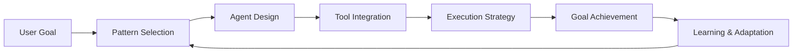

# Lesson 3: Agentic Design Patterns - Architectural Blueprints for Intelligent Systems

## 🎯 Learning Objectives

After completing this lesson, you will be able to:

- Understand the seven core agentic design patterns and their theoretical foundations
- Differentiate between patterns and know when to apply each one
- Recognize how patterns can be combined to solve complex problems
- Analyze the trade-offs and architectural implications of different patterns
- Design agent systems using appropriate patterns for specific use cases
- Understand orchestration strategies for multi-agent systems

## ⚡ Quick Start Guide

> **New to Agentic Design Patterns?** Start here for a quick overview!

### The 7 Patterns at a Glance

| Pattern             | One-Line Summary                                    | When to Use                    | Complexity      |
| ------------------- | --------------------------------------------------- | ------------------------------ | --------------- |
| 🔧 **Tool Use**     | Agents call external APIs/tools                     | Need real-time data or actions | 🟢 Beginner     |
| 🔄 **Reflection**   | Agents evaluate and improve their outputs           | Need quality refinement        | 🟢 Beginner     |
| 🤔 **ReAct**        | Think → Act → Observe loop                          | Multi-step research/reasoning  | 🟡 Intermediate |
| 📋 **Planning**     | Break goals into steps before executing             | Complex multi-stage tasks      | 🟡 Intermediate |
| 👥 **Multi-Agent**  | Multiple specialized agents collaborate             | Need domain expertise          | 🟡 Intermediate |
| 🧠 **Memory**       | Agents remember past interactions                   | Personalization & learning     | 🟡 Intermediate |
| 🏛️ **Hierarchical** | Layered agents (strategic → tactical → operational) | Large-scale coordination       | 🔴 Advanced     |

### Pattern Selection Quick Guide

```
Your Use Case                          →  Recommended Pattern(s)
─────────────────────────────────────────────────────────────
Need current weather data              →  Tool Use
Generate & refine code                 →  Reflection + Tool Use
Research complex questions             →  ReAct
Manage software project                →  Planning + Multi-Agent
Build personalized assistant           →  Memory + Tool Use
Coordinate enterprise workflows        →  Hierarchical + Planning
```

### How to Read This Guide

- 🟢 **First Time?** Start with Tool Use and Reflection patterns
- 🟡 **Ready for More?** Move to ReAct, Planning, and Multi-Agent
- 🔴 **Building at Scale?** Explore Hierarchical and combined patterns
- 💡 **Each pattern includes**: Definition → Examples → Use Cases → Design Tips

---

## 📚 Theoretical Foundation

### What are Agentic Design Patterns?

Agentic design patterns are **foundational blueprints** for building **autonomous AI systems** that go beyond simple question-answering to solve **complex, multi-step problems**. These patterns enable AI agents to think iteratively, evaluate results, adjust approaches, and work collaboratively toward defined goals.

#### The Paradigm Shift

The shift from traditional rule-based automation to agentic AI systems represents a fundamental change in artificial intelligence:

- **Traditional AI**: Single input → Single output, stateless operations
- **Agentic AI**: Iterative workflows, multiple LLM calls, continuous improvement

**Key Distinction:**

| Traditional Systems             | Agentic Systems                        |
| ------------------------------- | -------------------------------------- |
| Fixed, pre-programmed responses | Dynamic, context-aware decision-making |
| Single-step execution           | Multi-step, iterative processes        |
| No learning or adaptation       | Continuous improvement from feedback   |
| Isolated functionality          | Collaborative problem-solving          |

#### Degree of Agenticity

The term "agentic" encompasses a spectrum of autonomy:

1. **Limited Agency**: LLMs make structured decisions within fixed workflows
   - Example: Customer service bot following a decision tree
2. **Moderate Agency**: LLMs choose from available tools and adapt approaches
   - Example: Research assistant selecting appropriate data sources
3. **High Agency**: LLMs independently execute complex tasks with minimal oversight
   - Example: Autonomous project manager coordinating multiple sub-tasks



## 🏗️ The Seven Core Agentic Design Patterns

### 1. Tool Use Pattern

**Definition**: The tool use pattern enables AI agents to expand their capabilities beyond their training data by interacting with external tools and resources.

> 💡 **Real-World Analogy**: Like a chef using kitchen appliances (mixer, oven, thermometer) instead of just their hands, an agent uses tools (APIs, calculators, databases) to accomplish tasks it couldn't do alone.

**Simple Example:**

```
❌ Without Tool Use:
User: "What's the weather in Tokyo right now?"
Agent: "I was trained on data up to 2023, so I don't know current weather."

✅ With Tool Use:
User: "What's the weather in Tokyo right now?"
Agent: [calls weather_api("Tokyo")]
Agent: "It's currently 22°C and partly cloudy in Tokyo."
```

#### Theoretical Foundation

**Core Principle**: **Capability Extension Through Environmental Interaction**

Instead of relying solely on internal knowledge (parametric memory), agents access external systems to:

- Retrieve real-time information
- Execute computations
- Modify external state
- Interact with APIs and databases

#### Key Characteristics

- **Dynamic Interaction**: Real-time communication with external systems
- **API Integration**: RESTful services, GraphQL, gRPC connections
- **Code Execution**: Running scripts and programs in sandboxed environments
- **Database Operations**: Querying, updating, and managing data
- **Real-time Information**: Accessing current data beyond training cutoff

#### Architecture Components

```
┌─────────────┐
│   Agent     │
│   Core      │
└─────┬───────┘
      │
      ├─────► Tool 1: Weather API
      ├─────► Tool 2: Calculator
      ├─────► Tool 3: Database Query
      ├─────► Tool 4: Email Service
      └─────► Tool 5: Code Executor
```

#### Implementation Pattern

1. **Tool Registration**: Define available tools with clear interfaces

   ```
   Tool: get_weather(location: str) → WeatherData
   Tool: calculate(expression: str) → number
   Tool: query_database(sql: str) → ResultSet
   ```

2. **Tool Selection**: Agent determines which tool to use based on context

   - Natural language understanding of intent
   - Matching intent to tool capabilities
   - Parameter extraction from user input

3. **Tool Execution**: Call tool with appropriate parameters

   - Input validation and sanitization
   - Error handling and retry logic
   - Result processing and formatting

4. **Result Integration**: Incorporate tool outputs into response
   - Context maintenance across tool calls
   - Result synthesis and summarization
   - User-friendly presentation

#### Model Context Protocol (MCP)

**Standardization Layer for Tool Interactions**

MCP provides:

- **Abstraction**: Hides tool-specific implementation details
- **Portability**: Tools work across different agent frameworks
- **Maintainability**: Update tools without changing agent logic
- **Discoverability**: Automatic tool capability detection

#### Practical Example: Customer Support Agent

**Scenario**: User requests billing information

```
User: "Can you show me my invoice from last month?"

Agent Execution Flow:
┌──────────────────────────────────────┐
│ 1. Parse Request                     │
│    - Action: View invoice            │
│    - Time: Last month                │
│    - User: [authenticated user ID]   │
└──────────┬───────────────────────────┘
           │
┌──────────▼───────────────────────────┐
│ 2. Select Tool: billing_api          │
│    get_invoice(user_id, date_range)  │
└──────────┬───────────────────────────┘
           │
┌──────────▼───────────────────────────┐
│ 3. Execute API Call                  │
│    Response: Invoice data (JSON)     │
└──────────┬───────────────────────────┘
           │
┌──────────▼───────────────────────────┐
│ 4. Format Response                   │
│    "Your invoice from March 2025:    │
│     Total: $123.45                   │
│     Due Date: April 1, 2025"         │
└──────────────────────────────────────┘
```

#### Use Cases & Applications

**Enterprise Scenarios:**

- **Customer Support**: Access CRM, ticketing systems, knowledge bases
- **Data Analysis**: Query databases, generate reports, visualize trends
- **Content Creation**: Research information, fact-checking, citation management
- **DevOps Automation**: Deploy code, monitor systems, trigger workflows

**Critical Design Considerations:**

- **Security**: Authentication, authorization, input validation
- **Rate Limiting**: Prevent tool abuse and API quota exhaustion
- **Error Handling**: Graceful degradation when tools fail
- **Observability**: Logging and monitoring of tool usage

---

### 2. Reflection Pattern

**Definition**: The reflection pattern enables agents to evaluate and improve their own outputs through self-assessment cycles.

> 💡 **Real-World Analogy**: Like a writer drafting an essay, then re-reading and revising it multiple times to improve clarity, grammar, and flow before submitting.

**Simple Example:**

```
❌ Without Reflection (One-Shot):
User: "Write a function to sum numbers"
Agent:
def sum(a, b):
    print(a + b)
[Done - no return value, poor naming]

✅ With Reflection (Iterative):
User: "Write a function to sum numbers"
Agent Draft 1: def sum(a, b): print(a + b)
Agent Self-Critique: "No return value, prints instead of returns"
Agent Draft 2: def sum_numbers(a, b): return a + b
Agent Self-Critique: "Good, but needs type hints and docstring"
Agent Final:
def sum_numbers(a: float, b: float) -> float:
    """Return the sum of two numbers."""
    return a + b
```

#### Theoretical Foundation

**Core Principle**: **Meta-Cognitive Self-Improvement**

Reflection implements a cognitive loop where agents:

1. Generate initial output
2. Critically evaluate quality
3. Identify improvement opportunities
4. Revise based on self-feedback
5. Iterate until quality threshold is met

#### The Reflection Cycle

```
┌─────────────────┐
│  Generate       │
│  Initial Output │
└────────┬────────┘
         │
┌────────▼────────┐
│  Self-Evaluate  │
│  - Correctness  │
│  - Completeness │
│  - Style        │
│  - Efficiency   │
└────────┬────────┘
         │
    ┌────▼─────┐
    │ Quality  │
    │ Met?     │
    └──┬───┬───┘
       │   │
    No │   │ Yes
       │   │
┌──────▼───┴──────┐  ┌─────────────┐
│  Identify       │  │  Return     │
│  Improvements   │  │  Final      │
└────────┬────────┘  │  Output     │
         │           └─────────────┘
┌────────▼────────┐
│  Revise Output  │
└────────┬────────┘
         │
         └─────► Loop Back
```

#### Implementation Strategies

**1. Single-Agent Reflection**

- Same LLM performs both generation and evaluation
- Memory of previous iterations informs improvements

**2. Dual-Agent Reflection**

- Generator agent creates output
- Critic agent provides feedback
- Separation of concerns enables specialized evaluation

**3. External Validation Reflection**

- Automated testing (unit tests, integration tests)
- Fact-checking against external sources
- Performance benchmarking
- User feedback integration

#### Practical Example: Code Generation

**Scenario**: Generate a function to process user data

```
Iteration 1: Initial Generation
─────────────────────────────────
def process_users(data):
    for user in data:
        print(user)

Self-Evaluation:
✗ No return value
✗ No error handling
✗ Inefficient (prints instead of returns)
✗ No type hints
```

```
Iteration 2: Revised Version
─────────────────────────────────
def process_users(data: list) -> list:
    """Process user data and return results."""
    results = []
    for user in data:
        results.append(user)
    return results

Self-Evaluation:
✓ Has return value
✓ Type hints added
✓ Documentation added
✗ No error handling
✗ Doesn't actually "process" data
```

```
Iteration 3: Final Version
─────────────────────────────────
def process_users(data: list[dict]) -> list[dict]:
    """
    Process user data by validating and normalizing.

    Args:
        data: List of user dictionaries

    Returns:
        List of processed user dictionaries

    Raises:
        ValueError: If data format is invalid
    """
    if not isinstance(data, list):
        raise ValueError("Data must be a list")

    processed = []
    for user in data:
        if not isinstance(user, dict):
            continue  # Skip invalid entries

        # Normalize data
        normalized_user = {
            'name': user.get('name', '').strip().title(),
            'email': user.get('email', '').lower(),
            'active': bool(user.get('active', False))
        }
        processed.append(normalized_user)

    return processed

Self-Evaluation:
✓ Complete error handling
✓ Proper validation
✓ Actually processes data
✓ Clear documentation
✓ Type safety
→ Quality threshold met
```

#### Real-World Applications

**Software Development:**

- **GitHub Copilot**: Iterative code refinement based on context
- **Code Review**: Automated quality assessment and suggestions
- **Test Generation**: Creating comprehensive test cases through reflection

**Content Creation:**

- **Writing Assistance**: Improving clarity, style, and coherence
- **Academic Research**: Ensuring citations, factual accuracy, logical flow
- **Marketing Content**: Optimizing for engagement, tone, call-to-action

**Problem Solving:**

- **Mathematical Proofs**: Verifying logic and completeness
- **Strategy Planning**: Evaluating approaches and adjusting plans
- **Decision Analysis**: Assessing trade-offs and alternatives

#### Enhanced Reflection Patterns

**1. Tool-Augmented Reflection**

- Run code through unit tests
- Check facts against databases
- Verify calculations with external systems

**2. Multi-Criteria Reflection**

- Evaluate across multiple dimensions simultaneously
- Weight criteria based on importance
- Aggregate scores for overall quality

**3. Comparative Reflection**

- Generate multiple alternatives
- Compare against each other
- Select or synthesize best approach

**4. Historical Reflection**

- Learn from past iterations
- Build knowledge base of common issues
- Apply learned patterns to new problems

#### Design Considerations

**Termination Conditions:**

- Maximum iteration count (prevent infinite loops)
- Quality threshold achievement
- Resource constraints (time, compute)
- Diminishing returns detection

**Trade-offs:**

- **Quality vs. Speed**: More iterations = better results but slower
- **Cost vs. Benefit**: Each iteration uses compute resources
- **Complexity vs. Simplicity**: Over-reflection can lead to over-engineering

---

### 3. ReAct (Reasoning + Acting) Pattern

**Definition**: ReAct combines reasoning capabilities with action execution, enabling agents to think step-by-step while interacting with their environment.

> 💡 **Real-World Analogy**: Like a detective investigating a case - they think about what they know, gather new evidence (act), observe what they found, then think about next steps. It's a loop of thinking → doing → learning.

**Simple Example:**

```
User: "How much Bitcoin could I buy with $1000?"

Think: "I need the current Bitcoin price"
Act: [search("Bitcoin price USD")]
Observe: "$42,500 per Bitcoin"

Think: "Now I can calculate: $1000 / $42,500"
Act: [calculator("1000 / 42500")]
Observe: "0.0235"

Think: "I have the answer"
Final Answer: "You could buy approximately 0.0235 Bitcoin with $1000"
```

#### Theoretical Foundation

**Core Principle**: **Interleaved Reasoning and Acting**

Traditional approaches separate thinking from doing:

- **Chain-of-Thought**: Reasoning only, no environmental interaction
- **Action-Only**: Execute without explicit reasoning traces

ReAct combines both:

- **Think**: Reason about current state and next actions
- **Act**: Execute actions to gather information or change state
- **Observe**: Process results from actions
- **Repeat**: Continue until reaching a solution

#### The ReAct Loop

```
     ┌──────────────┐
     │  Thought:    │
     │  Analyze &   │
     │  Plan        │
     └──────┬───────┘
            │
     ┌──────▼───────┐
     │  Action:     │
     │  Execute     │
     │  Tool/Op     │
     └──────┬───────┘
            │
     ┌──────▼───────┐
     │ Observation: │
     │ Process      │
     │ Results      │
     └──────┬───────┘
            │
        ┌───▼────┐
        │ Done?  │
        └───┬─┬──┘
            │ │
         No │ │ Yes
            │ │
            │ └────► Final Answer
            │
            └────► Loop Back to Thought
```

#### Execution Trace Example

**Scenario**: Calculate total cost with tax and shipping

```
Thought 1: I need to calculate the order subtotal first
Action 1: calculator("123.50 + 45.00 + 67.25")
Observation 1: 235.75

Thought 2: Now I need to apply 8% sales tax
Action 2: calculator("235.75 * 1.08")
Observation 2: 254.61

Thought 3: I need to check shipping costs for California
Action 3: shipping_api(service="express", destination="california")
Observation 3: {"cost": 15.99, "delivery_days": 2}

Thought 4: Let me add shipping to get the final total
Action 4: calculator("254.61 + 15.99")
Observation 4: 270.60

Thought 5: I have all components calculated
Final Answer: Your total order cost is $270.60, which includes:
- Subtotal: $235.75
- Tax (8%): $18.86
- Express Shipping: $15.99
- Total: $270.60
Expected delivery in 2 days.
```

#### Advantages Over Pure Chain-of-Thought

**1. Reduces Hallucination**

- External tools provide factual information
- Verification through environmental interaction
- Grounded reasoning based on real data

**2. Error Correction**

- Observe results and adjust approach
- Learn from action outcomes
- Iterate toward correct solution

**3. Dynamic Planning**

- Adapt strategy based on observations
- Handle unexpected results
- Flexible problem-solving

**4. Explicit Reasoning**

- Transparent decision-making process
- Debuggable and explainable
- Human-understandable traces

#### Implementation Pattern

**Core Components:**

1. **Thought Generator**: Produces reasoning steps

   ```
   "I need to [goal], so I should [action] because [reasoning]"
   ```

2. **Action Selector**: Chooses appropriate tool/operation

   ```
   Available tools: [calculator, search, database, api]
   Selected: calculator (best matches intent)
   ```

3. **Action Executor**: Runs selected action

   ```
   Execute: calculator("2 + 2")
   Result: 4
   ```

4. **Observation Processor**: Interprets results

   ```
   "The calculation returned 4, which confirms my hypothesis"
   ```

5. **Termination Checker**: Determines if goal is achieved
   ```
   Goal achieved? Check if all sub-goals completed
   ```

#### Practical Example: Research Assistant

**Scenario**: Answer "What was Apple's revenue growth in 2024?"

```
═══════════════════════════════════════════════════════════

Thought 1:
I need to find Apple's revenue data for 2024. Let me search for
their latest financial reports.

Action 1:
search("Apple revenue 2024 annual report")

Observation 1:
Found: Apple Q4 2024 results show $394.3B revenue for fiscal year

═══════════════════════════════════════════════════════════

Thought 2:
Now I need to find 2023 revenue to calculate growth rate.

Action 2:
search("Apple revenue 2023 fiscal year")

Observation 2:
Found: Apple fiscal 2023 revenue was $383.3B

═══════════════════════════════════════════════════════════

Thought 3:
I have both years' data. Let me calculate the growth rate:
Growth = ((New - Old) / Old) × 100

Action 3:
calculator("((394.3 - 383.3) / 383.3) * 100")

Observation 3:
2.87

═══════════════════════════════════════════════════════════

Thought 4:
The calculation shows approximately 2.87% growth. Let me verify
this makes sense and provide a complete answer.

Final Answer:
Apple's revenue grew by approximately 2.87% in fiscal year 2024,
rising from $383.3B in 2023 to $394.3B in 2024, representing
an increase of $11B.

═══════════════════════════════════════════════════════════
```

#### Advanced ReAct Patterns

**1. Multi-Step Planning ReAct**

- Create plan upfront
- Execute plan steps with reasoning
- Adapt plan based on observations

**2. Parallel ReAct**

- Execute multiple actions concurrently
- Aggregate observations
- Reason over combined results

**3. Hierarchical ReAct**

- High-level reasoning for strategy
- Low-level reasoning for tactics
- Multi-level observation synthesis

**4. Collaborative ReAct**

- Multiple agents with ReAct loops
- Share observations across agents
- Coordinate actions and reasoning

#### Use Cases

**Research & Analysis:**

- Market research with data gathering
- Scientific literature review
- Competitive intelligence analysis

**Problem Solving:**

- Mathematical problems requiring calculations
- Logical puzzles with state tracking
- Diagnostic reasoning with tests

**Automation:**

- IT operations troubleshooting
- Customer service issue resolution
- Process automation with decision points

#### Design Considerations

**Thought Quality:**

- Clear, explicit reasoning
- Logical progression
- Addresses current goal

**Action Selection:**

- Choose most relevant tool
- Validate action feasibility
- Handle action failures

**Observation Processing:**

- Extract relevant information
- Detect errors or inconsistencies
- Update mental model

**Termination Logic:**

- Recognize goal achievement
- Prevent infinite loops
- Handle unsolvable problems

---

### 4. Planning Pattern

**Definition**: The planning pattern empowers agents to break down complex goals into manageable, sequential steps before execution.

> 💡 **Real-World Analogy**: Like planning a vacation - you don't just show up at the airport. First you research destinations, book flights, reserve hotels, plan activities, then execute your plan step by step.

**Simple Example:**

```
User: "Help me deploy my app to production"

❌ Without Planning:
Agent: [starts deploying immediately]
[Fails because database wasn't backed up, tests weren't run, etc.]

✅ With Planning:
Agent creates plan:
1. Run automated tests ✓
2. Create database backup ✓
3. Update dependencies ✓
4. Deploy to staging ✓
5. Run smoke tests ✓
6. Deploy to production ✓
7. Monitor for errors ✓

[Executes each step, validates before proceeding]
```

#### Theoretical Foundation

**Core Principle**: **Decomposition and Structured Execution**

Complex problems become tractable through:

1. **Goal Analysis**: Understanding requirements and constraints
2. **Task Decomposition**: Breaking down into sub-tasks
3. **Sequencing**: Ordering tasks based on dependencies
4. **Execution**: Running tasks with validation checkpoints
5. **Adaptation**: Adjusting plan based on results

#### Planning Hierarchy

```
┌──────────────────────────────────┐
│   High-Level Goal                │
│   "Organize company retreat"     │
└────────────┬─────────────────────┘
             │
    ┌────────┴────────┐
    │                 │
┌───▼─────────┐  ┌───▼──────────┐
│ Sub-Goal 1  │  │ Sub-Goal 2   │
│ Find Venue  │  │ Plan         │
│             │  │ Activities   │
└───┬─────────┘  └───┬──────────┘
    │                │
┌───▼─────────┐      │
│  Tasks:     │      │
│  1. Budget  │      │
│  2. Search  │      │
│  3. Compare │      │
│  4. Book    │      │
└─────────────┘      │
                ┌────▼──────────┐
                │  Tasks:       │
                │  1. Survey    │
                │  2. Research  │
                │  3. Schedule  │
                │  4. Prepare   │
                └───────────────┘
```

#### Planning Process Stages

**Stage 1: Goal Analysis**

```
Input: High-level objective
Process:
  - Identify success criteria
  - Determine constraints
  - Assess available resources
  - Define scope and boundaries
Output: Clarified goal specification
```

**Stage 2: Task Decomposition**

```
Input: Goal specification
Process:
  - Break down into sub-tasks
  - Identify dependencies
  - Estimate effort and duration
  - Allocate resources
Output: Task hierarchy
```

**Stage 3: Sequencing & Scheduling**

```
Input: Task hierarchy
Process:
  - Determine execution order
  - Identify parallel opportunities
  - Schedule checkpoints
  - Plan contingencies
Output: Execution timeline
```

**Stage 4: Execution & Monitoring**

```
Input: Execution timeline
Process:
  - Execute tasks in sequence
  - Monitor progress
  - Validate outputs
  - Handle errors
Output: Task results
```

**Stage 5: Adaptation & Replanning**

```
Input: Task results, changed conditions
Process:
  - Assess progress vs. plan
  - Identify deviations
  - Adjust remaining tasks
  - Replan if necessary
Output: Updated plan
```

#### Practical Example: Project Planning Agent

**Scenario**: Develop and launch a new feature

```
══════════════════════════════════════════════════════════
PLAN CREATION PHASE
══════════════════════════════════════════════════════════

Goal: Launch new user dashboard feature by end of Q2

Phase 1: Analysis & Planning (Weeks 1-2)
├── 1.1 Gather requirements
│   ├── Interview stakeholders
│   ├── Analyze user feedback
│   └── Define feature specs
├── 1.2 Technical design
│   ├── Architecture review
│   ├── Database schema design
│   └── API specification
└── 1.3 Resource allocation
    ├── Assign team members
    ├── Reserve infrastructure
    └── Budget approval

Phase 2: Development (Weeks 3-7)
├── 2.1 Backend development
│   ├── Database setup
│   ├── API implementation
│   └── Unit testing
├── 2.2 Frontend development (parallel)
│   ├── UI components
│   ├── Dashboard layout
│   └── Integration with API
└── 2.3 Testing & QA
    ├── Integration testing
    ├── Performance testing
    └── Security review

Phase 3: Deployment (Weeks 8-9)
├── 3.1 Staging deployment
│   ├── Deploy to staging
│   ├── UAT with stakeholders
│   └── Bug fixes
├── 3.2 Production deployment
│   ├── Deploy to production
│   ├── Monitor metrics
│   └── Rollback plan ready
└── 3.3 Post-launch
    ├── User training
    ├── Documentation
    └── Gather feedback

══════════════════════════════════════════════════════════
EXECUTION PHASE (with monitoring)
══════════════════════════════════════════════════════════

Week 1 Status: ✓ Completed
- Stakeholder interviews: 15/15 completed
- User feedback analyzed: 200+ responses
- Feature specs drafted: Under review

Week 2 Status: ⚠ Requires Adjustment
- Architecture review: Completed
- Database schema: Completed
- API spec: DELAYED (waiting on security approval)

>>> ADAPTIVE REPLANNING TRIGGERED <<<

Adjustment: Move frontend UI design (non-blocked work) earlier
- Week 2: Start UI mockups (originally Week 3)
- Week 3: Complete API spec + continue frontend
- Keeps project on track despite delay

Week 3 Status: ✓ Back on Track
...

══════════════════════════════════════════════════════════
```

#### Planning Strategies

**1. Forward Planning (Goal-Driven)**

- Start with end goal
- Work backward to current state
- Identify required steps
- Suitable for clear objectives

**2. Backward Planning (State-Driven)**

- Start with current state
- Explore possible actions
- Build toward goal state
- Suitable for exploration

**3. Hierarchical Planning (Multi-Level)**

- High-level strategic plan
- Mid-level tactical plans
- Low-level operational steps
- Suitable for complex systems

**4. Conditional Planning (Scenario-Based)**

- Create plan with branches
- Define conditions for each path
- Prepare contingencies
- Suitable for uncertain environments

**5. Incremental Planning (Adaptive)**

- Plan immediate next steps
- Execute and evaluate
- Replan based on results
- Suitable for dynamic situations

#### Benefits of Planning Pattern

**Reliability:**

- Structured approach reduces errors
- Validation checkpoints catch issues early
- Clear success criteria at each stage

**Maintainability:**

- Documented plans enable collaboration
- Progress tracking and status reporting
- Easy to resume after interruptions

**Optimization:**

- Identify parallelization opportunities
- Resource allocation efficiency
- Critical path analysis

**Risk Management:**

- Anticipate challenges
- Prepare contingencies
- Early warning system for delays

#### Enterprise Applications

**Project Management:**

- Software development sprints
- Infrastructure migrations
- Organizational changes

**Workflow Orchestration:**

- ETL pipeline execution
- Business process automation
- Multi-step approval processes

**Resource Allocation:**

- Team scheduling
- Budget planning
- Capacity management

**Strategic Planning:**

- Business strategy execution
- Market entry planning
- Product roadmap development

#### Design Considerations

**Plan Granularity:**

- **Too Detailed**: Inflexible, high maintenance overhead
- **Too Abstract**: Insufficient guidance, execution gaps
- **Balanced**: Right level of detail for context

**Replanning Triggers:**

- Task failure or unexpected results
- Resource unavailability
- Changed requirements
- Environmental changes

**Validation Checkpoints:**

- After each major phase
- Before irreversible actions
- At resource-intensive steps
- Before external dependencies

**Trade-offs:**

- **Planning Time vs. Execution Time**: More planning = better execution but delayed start
- **Flexibility vs. Structure**: Rigid plans vs. adaptive approaches
- **Completeness vs. Speed**: Comprehensive planning vs. rapid iteration

---

### 5. Multi-Agent Collaboration Pattern

**Definition**: Multi-agent collaboration involves multiple specialized agents working together, each with distinct roles, expertise, and capabilities.

> 💡 **Real-World Analogy**: Like a hospital emergency room - you don't have one doctor do everything. You have specialists: triage nurse, radiologist, surgeon, anesthesiologist - each expert in their domain, working together.

**Simple Example:**

```
User: "Write a blog post about AI safety"

❌ Single Agent:
Agent: [tries to research, write, edit, optimize SEO all at once]
[Results are mediocre because no specialization]

✅ Multi-Agent:
Research Agent: Gathers 20 sources on AI safety
Writing Agent: Creates first draft (2000 words)
Editor Agent: Improves clarity and flow
SEO Agent: Optimizes for "AI safety best practices"
Fact-Check Agent: Verifies all claims and statistics

Result: High-quality, accurate, optimized content
```

#### Theoretical Foundation

**Core Principle**: **Specialization and Coordination**

Complex problems often require diverse expertise:

- **Specialization**: Each agent focuses on specific domain
- **Delegation**: Coordinator assigns tasks to appropriate agents
- **Communication**: Agents share information and results
- **Aggregation**: Combine individual outputs into coherent solution

#### Multi-Agent Architectures

**1. Sequential (Pipeline) Pattern**

```
Input
  │
  ▼
┌──────────────┐
│ Research     │
│ Agent        │
│ (Gather info)│
└──────┬───────┘
       │
       ▼
┌──────────────┐
│ Analysis     │
│ Agent        │
│ (Process)    │
└──────┬───────┘
       │
       ▼
┌──────────────┐
│ Writing      │
│ Agent        │
│ (Create)     │
└──────┬───────┘
       │
       ▼
┌──────────────┐
│ Review       │
│ Agent        │
│ (Validate)   │
└──────┬───────┘
       │
       ▼
     Output
```

**Characteristics:**

- Linear workflow
- Each agent processes results from previous
- Clear handoffs between stages
- Easy to debug and monitor

**Use Cases:**

- Content production pipelines
- Data processing workflows
- Sequential approval processes

**2. Concurrent (Parallel) Pattern**

```
          Input
            │
     ┌──────┼──────┐
     │      │      │
     ▼      ▼      ▼
   ┌────┐ ┌────┐ ┌────┐
   │AG-1│ │AG-2│ │AG-3│
   │SEO │ │Img │ │Fact│
   └─┬──┘ └─┬──┘ └─┬──┘
     │      │      │
     └──────┼──────┘
            │
            ▼
     ┌─────────────┐
     │ Coordinator │
     │ (Aggregate) │
     └──────┬──────┘
            │
            ▼
          Output
```

**Characteristics:**

- Multiple agents work simultaneously
- Independent task execution
- Results aggregated by coordinator
- Faster than sequential

**Use Cases:**

- Market research across sources
- Parallel data analysis
- Multi-perspective evaluation

**3. Supervisor (Hierarchical) Pattern**

```
     ┌──────────────┐
     │  Supervisor  │
     │  Agent       │
     │  (Orchestr.) │
     └─────┬────────┘
           │
    ┌──────┼──────┬──────┐
    │      │      │      │
    ▼      ▼      ▼      ▼
 ┌─────┐┌─────┐┌─────┐┌─────┐
 │Wrk-1││Wrk-2││Wrk-3││Wrk-4│
 │Data ││Calc ││API  ││Rept │
 └──┬──┘└──┬──┘└──┬──┘└──┬──┘
    │      │      │      │
    └──────┴──────┴──────┘
           │
     Results Flow
```

**Characteristics:**

- Central supervisor manages workflow
- Dynamic task allocation
- Load balancing
- Error handling and recovery

**Use Cases:**

- Customer service routing
- Task management systems
- Resource allocation

**4. Network (Peer-to-Peer) Pattern**

```
     ┌────┐
     │AG-1│◄──────┐
     └─┬┬─┘       │
       ││         │
       │└────────┐│
       │         ││
     ┌─▼──┐    ┌▼┴──┐
     │AG-2│◄───┤AG-4│
     └─┬┬─┘    └─┬──┘
       ││        │
       │└────────┼──┐
       │         │  │
     ┌─▼──┐    ┌▼┐ │
     │AG-3│◄───┘ └─┘
     └────┘
```

**Characteristics:**

- Agents communicate directly
- Emergent behavior from interactions
- Self-organizing
- Complex coordination

**Use Cases:**

- Collaborative problem-solving
- Consensus building
- Distributed systems

#### Practical Example: Content Creation System

**Scenario**: Create a comprehensive blog post on "AI Agents in Healthcare"

```
══════════════════════════════════════════════════════════
MULTI-AGENT WORKFLOW
══════════════════════════════════════════════════════════

┌─────────────────────────────────────────────────────────┐
│ COORDINATOR AGENT                                       │
│                                                         │
│ Goal: Create high-quality blog post on AI in Healthcare│
│ Team: Research, Writing, SEO, Fact-Check, Editor       │
└─────────────────────────────────────────────────────────┘

──────────────────────────────────────────────────────────
PHASE 1: Research & Planning (Parallel)
──────────────────────────────────────────────────────────

[Research Agent - Medical AI]
Task: Gather information on AI applications in healthcare
Output:
  - 15 case studies identified
  - 8 key technology categories
  - 25 relevant statistics
  - 12 expert quotes

[Research Agent - Market Trends]
Task: Analyze healthcare AI market trends
Output:
  - Market size: $14.6B (2024)
  - Growth rate: 37% CAGR
  - Key players: 10 companies
  - Investment trends

[Fact-Check Agent]
Task: Validate research data accuracy
Output:
  - 95% of statistics verified
  - 2 outdated figures updated
  - 3 sources flagged as low-quality
  - Recommendations for additional sources

──────────────────────────────────────────────────────────
PHASE 2: Content Creation (Sequential)
──────────────────────────────────────────────────────────

[Writing Agent]
Input: Verified research data
Task: Create initial draft
Output:
  - Title: "How AI Agents are Transforming Healthcare..."
  - Word count: 2,500
  - Structure: 5 sections
  - 12 subsections
  - Includes all key points

──────────────────────────────────────────────────────────
PHASE 3: Optimization (Parallel)
──────────────────────────────────────────────────────────

[SEO Agent]
Task: Optimize for search engines
Output:
  - Primary keyword: "AI agents healthcare"
  - 8 secondary keywords identified
  - Meta description crafted
  - 5 internal link opportunities
  - 3 external authoritative sources added
  - SEO score: 87/100

[Readability Agent]
Task: Improve readability
Output:
  - Reading level: Grade 10 (appropriate)
  - Average sentence length: 18 words (good)
  - Passive voice: 12% (acceptable)
  - 3 paragraphs restructured
  - Clarity score: 72/100 → 88/100

[Visual Agent]
Task: Recommend visual elements
Output:
  - 1 hero image suggestion
  - 3 infographic opportunities identified
  - 2 chart recommendations (with data)
  - 5 image placement suggestions

──────────────────────────────────────────────────────────
PHASE 4: Review & Finalization (Sequential)
──────────────────────────────────────────────────────────

[Editor Agent]
Input: Optimized draft
Task: Final review and polish
Output:
  - Grammar: 14 corrections
  - Style consistency: 8 adjustments
  - Tone: Professional medical maintained
  - Citations: All properly formatted
  - Final approval: ✓

[Quality Assurance Agent]
Task: Final validation
Checklist:
  ✓ Factual accuracy verified
  ✓ SEO requirements met
  ✓ Readability targets achieved
  ✓ Visual elements included
  ✓ Legal/compliance review passed
  ✓ Brand guidelines followed

──────────────────────────────────────────────────────────

┌─────────────────────────────────────────────────────────┐
│ COORDINATOR SUMMARY                                     │
│                                                         │
│ Status: ✓ Completed                                    │
│ Duration: 45 minutes                                    │
│ Agents Used: 8                                          │
│ Iterations: 2                                           │
│ Quality Score: 91/100                                   │
│                                                         │
│ Final Output: Ready for publication                     │
└─────────────────────────────────────────────────────────┘

══════════════════════════════════════════════════════════
```

#### Communication Patterns

**1. Message Passing**

```
Agent A: send_message(Agent B, content, metadata)
Agent B: receive_message() → process() → respond()
```

**2. Shared Memory**

```
All agents read/write to common state store
Synchronization mechanisms prevent conflicts
```

**3. Blackboard System**

```
Central knowledge repository
Agents post findings
Pattern recognition triggers actions
```

**4. Event-Driven**

```
Agents emit events
Other agents subscribe to relevant events
Asynchronous, loosely coupled
```

#### Coordination Strategies

**Task Allocation Methods:**

1. **Static Assignment**

   - Predefined roles and responsibilities
   - Clear ownership
   - Simple but inflexible

2. **Dynamic Allocation**

   - Assign tasks based on current load
   - Optimization algorithms
   - Flexible but complex

3. **Market-Based**

   - Agents "bid" for tasks
   - Resource optimization
   - Emergent efficiency

4. **Skill-Based Routing**
   - Match task requirements to agent capabilities
   - Maximize quality
   - Requires capability metadata

#### Benefits of Multi-Agent Systems

**Specialization:**

- Agents focus on what they do best
- Deep expertise in narrow domains
- Higher quality outputs

**Scalability:**

- Add agents for increased capacity
- Parallel processing
- Handle complex problems

**Resilience:**

- Failure of one agent doesn't stop system
- Redundancy options
- Graceful degradation

**Modularity:**

- Independent development and testing
- Easy to update individual agents
- Clear interfaces

#### Design Considerations

**Agent Granularity:**

- **Too Specialized**: Many agents, high coordination overhead
- **Too General**: Few agents, lose specialization benefits
- **Balanced**: Right number of focused agents

**Communication Overhead:**

- More agents = more communication
- Optimize message passing
- Consider bandwidth constraints

**Conflict Resolution:**

- Agents may disagree
- Need arbitration mechanisms
- Voting, priority, or hybrid approaches

**State Management:**

- Shared vs. isolated state
- Consistency guarantees
- Synchronization costs

---

### 6. Memory-Augmented Agent Pattern

**Definition**: Memory-augmented agents maintain context across interactions by storing and retrieving past experiences, user preferences, and historical data.

> 💡 **Real-World Analogy**: Like your regular barber who remembers how you like your hair cut, your favorite coffee shop that knows your "usual order" - they remember your preferences and history.

**Simple Example:**

```
❌ Without Memory:
Session 1:
User: "I prefer morning flights"
Agent: "Noted!"

Session 2 (next day):
User: "Book me a flight to Boston"
Agent: "What time do you prefer?" [forgot your preference]

✅ With Memory:
Session 1:
User: "I prefer morning flights"
Agent: "Noted! I'll remember that."
[Stores: user.preferences.flight_time = "morning"]

Session 2 (next day):
User: "Book me a flight to Boston"
Agent: "Based on your preference for morning flights, here are options:
- 7:00 AM
- 9:30 AM
Which works better?" [remembered your preference]
```

#### Theoretical Foundation

**Core Principle**: **Stateful Intelligence Through Persistent Context**

Memory transforms agents from stateless responders to learning systems:

- **Context Preservation**: Maintain conversation history
- **Preference Learning**: Adapt to user behavior
- **Experience Accumulation**: Build knowledge over time
- **Pattern Recognition**: Identify recurring situations

#### Memory Architecture Layers

```
┌──────────────────────────────────────────────────────┐
│                  AGENT CORE                          │
└────────────┬─────────────────────────────────────────┘
             │
    ┌────────┴─────────┐
    │                  │
┌───▼────────┐    ┌────▼──────────┐
│  Working   │    │   Long-term   │
│  Memory    │    │   Memory      │
│            │    │               │
│ - Current  │    │ - Historical  │
│   context  │    │   interactions│
│ - Active   │    │ - User        │
│   tasks    │    │   preferences │
│ - Temp     │    │ - Learned     │
│   state    │    │   patterns    │
└────────────┘    └───────────────┘
                          │
                  ┌───────▼──────────┐
                  │  Vector Memory   │
                  │                  │
                  │ - Semantic       │
                  │   search         │
                  │ - Similarity     │
                  │   retrieval      │
                  │ - Embeddings     │
                  └──────────────────┘
```

#### Memory Types & Characteristics

**1. Short-term (Working) Memory**

**Characteristics:**

- Temporary, session-scoped storage
- Fast access, small capacity
- Current task context
- Volatile (cleared after session)

**Use Cases:**

- Current conversation context
- Active task variables
- Immediate history (last few turns)
- Temporary calculations

**Implementation:**

```
Session Memory:
├── user_id: "user_123"
├── conversation_id: "conv_456"
├── messages: [
│   {role: "user", content: "Book a flight"},
│   {role: "assistant", content: "Where to?"},
│   {role: "user", content: "San Francisco"}
│ ]
├── intent: "flight_booking"
└── context: {
    destination: "SFO",
    pending_info: ["departure_date", "return_date"]
  }
```

**2. Long-term (Episodic) Memory**

**Characteristics:**

- Persistent across sessions
- Structured storage (database)
- User history and interactions
- Durable

**Use Cases:**

- Past conversation summaries
- User interaction history
- Purchase/action history
- Feedback and ratings

**Implementation:**

```
User Profile:
├── user_id: "user_123"
├── created: "2024-01-15"
├── total_interactions: 147
├── preferences:
│   ├── preferred_airlines: ["United", "Delta"]
│   ├── seat_preference: "window"
│   ├── meal_preference: "vegetarian"
│   └── notification_method: "email"
├── past_bookings: [
│   {date: "2024-03-01", route: "SFO-NYC", ...},
│   {date: "2024-06-15", route: "LAX-SEA", ...}
│ ]
└── interaction_patterns:
    ├── most_active_time: "evenings"
    ├── average_response_time: "2min"
    └── preferred_communication_style: "concise"
```

**3. Semantic (Vector) Memory**

**Characteristics:**

- Embedding-based storage
- Semantic similarity search
- Unstructured content
- Scalable retrieval

**Use Cases:**

- Knowledge base search
- Similar situation retrieval
- Document memory
- Experience matching

**Implementation:**

```
Vector Store:
├── Document embeddings
├── Conversation embeddings
├── User query embeddings
└── Similarity search:
    Query: "How do I change my flight?"
    Retrieved (top-3 by similarity):
    1. [0.92] "Flight change policy documentation"
    2. [0.87] "Past user changed flight successfully"
    3. [0.81] "FAQ: Modifying reservations"
```

**4. Procedural Memory**

**Characteristics:**

- Learned skills and workflows
- Optimized processes
- Pattern-based actions
- Efficiency improvements

**Use Cases:**

- Common workflow automation
- Learned shortcuts
- Optimized tool usage
- Behavioral adaptations

**Implementation:**

```
Learned Procedures:
├── "international_booking_flow":
│   ├── steps: [
│   │   "check_passport_validity",
│   │   "verify_visa_requirements",
│   │   "search_flights",
│   │   "compare_prices",
│   │   "book_flight"
│   │ ]
│   ├── success_rate: 95%
│   └── avg_duration: "8 minutes"
└── "frequent_route_SFO_NYC":
    ├── preferred_times: ["morning", "evening"]
    ├── optimal_booking_window: "3 weeks advance"
    └── price_alerts_enabled: true
```

#### Practical Example: Personal Assistant Agent

**Scenario**: Multi-session interaction demonstrating memory usage

```
══════════════════════════════════════════════════════════
SESSION 1 - Monday, 9:00 AM
══════════════════════════════════════════════════════════

User: "I need to book a flight to Boston"

Agent (accessing memory):
  ✓ User history: Previously booked 3 trips to Boston
  ✓ Preferences: Window seat, vegetarian meal, United preferred
  ✓ Patterns: Usually books morning flights
  ✓ Calendar: Available Wed-Fri this week

Agent: "I found some options for your Boston trip. Based on
your preferences, here are morning flights on Wednesday:

1. United 1234 - 7:00 AM departure, window seat available
2. United 5678 - 9:30 AM departure, window seat available

Both include vegetarian meal options. Which works better?"

User: "The 9:30 AM flight please"

Agent: "Great! I've booked United 5678 for Wednesday 9:30 AM.
Window seat 12A confirmed, vegetarian meal requested.
Confirmation sent to your email."

[Memory Updated]:
  ✓ New booking added to history
  ✓ Preference reinforced: morning flights
  ✓ Route history: SFO-BOS count increased

══════════════════════════════════════════════════════════
SESSION 2 - Monday, 4:00 PM (same day)
══════════════════════════════════════════════════════════

User: "I need a hotel"

Agent (accessing working + long-term memory):
  ✓ Recent context: Booked flight to Boston this morning
  ✓ Trip dates: Wed-Fri (inferred from flight)
  ✓ Past hotels: Stayed at Hyatt Regency last 2 Boston trips
  ✓ Preferences: Quiet room, high floor, gym access

Agent: "For your Boston trip Wednesday through Friday?
I see you've stayed at Hyatt Regency Boston before and
rated it 5 stars. They have availability:

Room: Deluxe King, 15th floor (quiet side)
Amenities: Gym access, complimentary breakfast
Price: $289/night

Should I book your usual preference?"

User: "Yes, perfect"

[Memory Updated]:
  ✓ Hotel preference reinforced
  ✓ Trip complete: flight + hotel
  ✓ Pattern: Books hotels same day as flight

══════════════════════════════════════════════════════════
SESSION 3 - Tuesday, 8:00 AM (next day)
══════════════════════════════════════════════════════════

User: "What's my schedule for tomorrow?"

Agent (accessing multiple memory layers):
  ✓ Calendar: Flight at 9:30 AM
  ✓ Recent bookings: Boston trip tomorrow
  ✓ Learned patterns: User needs wake-up call for early flights
  ✓ Location: Home → Airport travel time 45 min

Agent: "Tomorrow you have:

7:45 AM - Leave for airport (SFO)
9:30 AM - United 5678 to Boston (BOS), Seat 12A
12:45 PM - Arrive Boston
Check-in: Hyatt Regency Boston (after 3 PM)

Would you like me to set an alarm for 6:30 AM and order
your usual car service for 7:45 AM?"

User: "Yes please"

[Memory Updated]:
  ✓ Alarm preference confirmed
  ✓ Car service pattern reinforced
  ✓ Proactive suggestion successful

══════════════════════════════════════════════════════════
SESSION 4 - Three weeks later
══════════════════════════════════════════════════════════

User: "I need to go to Boston again"

Agent (accessing historical patterns):
  ✓ Boston trips: 4 previous (including recent one)
  ✓ Average frequency: Every 6-8 weeks
  ✓ Typical pattern: Wed-Fri, morning flight, Hyatt hotel
  ✓ Last trip satisfaction: All 5-star ratings

Agent: "Another Boston trip! Last time we booked United
morning flights and Hyatt Regency, which you rated highly.
Would you like me to search similar options?

I'm also noticing you travel to Boston frequently. Would
you like me to set up price alerts or explore United
corporate rates?"

User: "Yes to both!"

[Memory Updated]:
  ✓ Identified recurring pattern → Boston regular
  ✓ Escalated to advanced features (alerts, corporate)
  ✓ Increased personalization level

══════════════════════════════════════════════════════════
```

#### Memory Retrieval Strategies

**1. Recency-Based Retrieval**

- Most recent information first
- Time-decay weighting
- Suitable for: Current context, recent interactions

**2. Relevance-Based Retrieval**

- Semantic similarity to current query
- Vector search
- Suitable for: Knowledge retrieval, similar situations

**3. Frequency-Based Retrieval**

- Most commonly used information
- Usage statistics
- Suitable for: Preferences, common patterns

**4. Hybrid Retrieval**

- Combine multiple strategies
- Weighted scoring
- Suitable for: Complex, context-dependent retrieval

#### Memory Management Strategies

**Storage Optimization:**

```
Priority Tiers:
├── Tier 1: Hot (frequent access)
│   └── Storage: In-memory cache
├── Tier 2: Warm (periodic access)
│   └── Storage: Fast database
└── Tier 3: Cold (rare access)
    └── Storage: Archive storage
```

**Forgetting Mechanisms:**

- **Time-based**: Delete after expiration
- **Relevance-based**: Remove low-importance items
- **Capacity-based**: Prune when storage limit reached
- **User-controlled**: Explicit deletion requests

**Privacy Considerations:**

- **Data Minimization**: Store only necessary information
- **Encryption**: Secure sensitive data
- **Access Control**: Restrict memory access
- **Retention Policies**: Clear data lifecycle rules
- **User Consent**: Explicit permission for storage

#### Applications

**Personal Assistants:**

- Learn user preferences over time
- Proactive suggestions based on history
- Context-aware responses

**Customer Service:**

- Remember past issues and resolutions
- Personalized support based on history
- Avoid asking for repeated information

**Educational Tutors:**

- Track learning progress
- Adapt to student's pace
- Build on previous lessons

**Healthcare Agents:**

- Maintain patient history
- Track symptoms and treatments
- Personalized health recommendations

#### Design Considerations

**Memory Capacity:**

- Finite storage constraints
- Compression strategies
- Prioritization policies

**Retrieval Performance:**

- Fast access requirements
- Indexing strategies
- Caching mechanisms

**Consistency:**

- Synchronization across devices
- Conflict resolution
- Version control

**Privacy & Security:**

- Sensitive data protection
- Compliance (GDPR, HIPAA)
- User control over data

---

### 7. Hierarchical Agent Systems

**Definition**: Hierarchical agent systems organize agents in layered structures, with higher-level agents managing strategic decisions and lower-level agents handling operational tasks.

> 💡 **Real-World Analogy**: Like a company org chart - CEO sets strategy, managers coordinate teams, employees execute tasks. Each level operates at different time horizons and abstraction levels.

**Simple Example:**

```
E-commerce Order Fulfillment:

❌ Flat System (No Hierarchy):
[100 warehouse robots trying to coordinate directly]
[Chaos - collisions, duplicate work, inefficiency]

✅ Hierarchical System:

    Strategic Level (CEO Agent)
    ├─ Goal: Process 5000 orders/day
    ├─ Allocate resources across zones
    └─ Monitor overall performance
            │
    ────────┴────────
    │               │
Tactical Level   Tactical Level
(Zone A Mgr)     (Zone B Mgr)
├─ Coordinate    ├─ Coordinate
   15 robots        12 robots
├─ Assign tasks  ├─ Assign tasks
└─ Monitor zone  └─ Monitor zone
    │                │
    ├──┬──┬──        ├──┬──┬──
    │  │  │          │  │  │
Operational Level (Worker Robots)
Robot1 Robot2 Robot3...
[Pick items, pack boxes, move pallets]

Result: Efficient, scalable, organized
```

#### Theoretical Foundation

**Core Principle**: **Abstraction Layers and Delegation**

Complex systems benefit from hierarchical organization:

- **Strategic Layer**: High-level goals and resource allocation
- **Tactical Layer**: Mid-level coordination and workflow management
- **Operational Layer**: Low-level task execution and tool interaction

#### Hierarchical Architecture

```
┌──────────────────────────────────────────────────────┐
│            STRATEGIC LAYER                           │
│                                                      │
│  ┌────────────────────────────────────────┐         │
│  │  Executive Agent                       │         │
│  │  - Set organizational goals            │         │
│  │  - Allocate resources                  │         │
│  │  - Monitor overall performance         │         │
│  └────────────┬───────────────────────────┘         │
└───────────────┼──────────────────────────────────────┘
                │
┌───────────────┼──────────────────────────────────────┐
│               │     TACTICAL LAYER                   │
│      ┌────────┴────────┐                             │
│      │                 │                             │
│  ┌───▼─────────┐  ┌───▼─────────┐                   │
│  │ Manager A   │  │ Manager B   │                   │
│  │ (Region 1)  │  │ (Region 2)  │                   │
│  │ - Coord     │  │ - Coord     │                   │
│  │ - Schedule  │  │ - Schedule  │                   │
│  └───┬─────────┘  └───┬─────────┘                   │
└──────┼────────────────┼─────────────────────────────┘
       │                │
┌──────┼────────────────┼─────────────────────────────┐
│      │                │  OPERATIONAL LAYER           │
│  ┌───▼───┐ ┌────┐  ┌─▼────┐ ┌────┐                  │
│  │ Wrk-1 │ │W-2 │  │ Wrk-3│ │W-4 │                  │
│  │ Task  │ │Task│  │ Task │ │Task│                  │
│  │ Exec  │ │Exec│  │ Exec │ │Exec│                  │
│  └───────┘ └────┘  └──────┘ └────┘                  │
└──────────────────────────────────────────────────────┘
```

#### Layer Responsibilities

**Strategic Layer (Top)**

**Focus**: Long-term goals, resource allocation, system-wide optimization

**Capabilities:**

- Goal setting and prioritization
- Resource budget management
- Performance monitoring and KPIs
- Strategic replanning
- Escalation handling

**Decisions:**

- Which projects to undertake
- How to allocate budget and resources
- When to pivot strategy
- System-wide policies and constraints

**Time Horizon**: Weeks to months

**Tactical Layer (Middle)**

**Focus**: Workflow coordination, task distribution, mid-level optimization

**Capabilities:**

- Task decomposition and allocation
- Schedule management
- Load balancing across workers
- Progress monitoring
- Coordination between teams

**Decisions:**

- Which worker handles which task
- How to sequence operations
- When to request additional resources
- How to handle task failures

**Time Horizon**: Hours to days

**Operational Layer (Bottom)**

**Focus**: Direct task execution, tool usage, immediate actions

**Capabilities:**

- Execute specific tasks
- Use tools and APIs
- Report results
- Handle immediate errors
- Provide detailed status

**Decisions:**

- How to execute assigned task
- Which tool to use for operation
- Error retry strategies
- Detail-level optimizations

**Time Horizon**: Seconds to minutes

#### Practical Example: Warehouse Management System

**Scenario**: Automated warehouse with multiple zones and robots

```
══════════════════════════════════════════════════════════
STRATEGIC LAYER: Warehouse Executive Agent
══════════════════════════════════════════════════════════

Daily Goals (6:00 AM):
├── Process 2,500 orders today
├── Maintain 99.5% fulfillment rate
├── Keep energy usage under budget
└── Complete inventory audit in Zone C

Resource Allocation:
├── Zone A (Electronics): 60% capacity (high-priority orders)
├── Zone B (Clothing): 30% capacity (standard orders)
├── Zone C (Household): 10% capacity (audit mode)
└── Reserve robots: 5 units (for peak load / failures)

KPI Monitoring:
├── Current throughput: 104 orders/hour ✓ (target: 100)
├── Accuracy rate: 99.7% ✓ (target: 99.5%)
├── Energy usage: 87% of budget ✓
└── Robot utilization: 92% ✓ (target: 85-95%)

══════════════════════════════════════════════════════════
TACTICAL LAYER: Zone Manager Agents
══════════════════════════════════════════════════════════

┌──────────────────────────────────────────────────────┐
│ ZONE A MANAGER (Electronics)                         │
├──────────────────────────────────────────────────────┤
│ Assigned Orders: 150 pending                         │
│ Available Robots: 12 units                           │
│                                                      │
│ Current Workflow:                                    │
│ ├── Priority Queue (Rush orders): 45 orders         │
│ │   └── Assigned: Robots 1-4                        │
│ ├── Standard Queue: 95 orders                       │
│ │   └── Assigned: Robots 5-10                       │
│ └── Quality Check: 10 orders                        │
│     └── Assigned: Robots 11-12                      │
│                                                      │
│ Optimizations Applied:                              │
│ ├── Route planning: Minimized travel distance       │
│ ├── Batch picking: Group nearby items               │
│ └── Load balancing: Redistribute work from R-7      │
│     (R-7 battery low → tasks moved to R-5)          │
└──────────────────────────────────────────────────────┘

┌──────────────────────────────────────────────────────┐
│ ZONE B MANAGER (Clothing)                           │
├──────────────────────────────────────────────────────┤
│ Assigned Orders: 85 pending                          │
│ Available Robots: 8 units                            │
│                                                      │
│ Current Workflow:                                    │
│ ├── Standard Queue: 85 orders                       │
│ │   └── Assigned: Robots 1-7                        │
│ └── Idle capacity: Robot 8                          │
│     └── Offered to Zone A (helping with overflow)   │
│                                                      │
│ Status: Under capacity, assisting other zones       │
└──────────────────────────────────────────────────────┘

┌──────────────────────────────────────────────────────┐
│ ZONE C MANAGER (Household)                          │
├──────────────────────────────────────────────────────┤
│ Mode: AUDIT                                          │
│ Assigned Orders: 20 pending (low priority)           │
│ Available Robots: 3 units                            │
│                                                      │
│ Current Workflow:                                    │
│ ├── Audit items: Robots 1-2                         │
│ │   └── Progress: 45% complete                      │
│ └── Minimal order processing: Robot 3               │
│                                                      │
│ Estimated audit completion: 3:00 PM                  │
└──────────────────────────────────────────────────────┘

══════════════════════════════════════════════════════════
OPERATIONAL LAYER: Worker Robot Agents
══════════════════════════════════════════════════════════

┌──────────────────────────────────────────────────────┐
│ ROBOT A-01 (Zone A, Electronics)                    │
├──────────────────────────────────────────────────────┤
│ Status: ACTIVE                                       │
│ Current Task: Pick order #78234                      │
│ Progress: 3/5 items collected                        │
│                                                      │
│ Detailed Actions:                                    │
│ [9:23:15] Navigate to Aisle 12, Shelf C             │
│ [9:23:42] Scan item SKU-Electronics-4521 ✓          │
│ [9:23:45] Pick item ✓                                │
│ [9:23:50] Place in collection bin ✓                 │
│ [9:23:52] Navigate to Aisle 15, Shelf A             │
│ [9:24:18] Scan item SKU-Electronics-8832 ✓          │
│ [9:24:21] Pick item ✓                                │
│ [9:24:24] Place in collection bin ✓                 │
│ [9:24:26] Navigate to Aisle 15, Shelf G             │
│ [9:24:35] >>> SCANNING NEXT ITEM...                 │
│                                                      │
│ Metrics:                                             │
│ ├── Items/hour: 42 (target: 40) ✓                   │
│ ├── Accuracy: 100% today ✓                           │
│ ├── Battery: 76% ✓                                   │
│ └── Distance traveled: 2.3 km                        │
└──────────────────────────────────────────────────────┘

┌──────────────────────────────────────────────────────┐
│ ROBOT B-05 (Zone B, Clothing)                       │
├──────────────────────────────────────────────────────┤
│ Status: ACTIVE                                       │
│ Current Task: Pack order #78156                      │
│                                                      │
│ Detailed Actions:                                    │
│ [9:24:10] Retrieve items from staging area ✓        │
│ [9:24:15] Scan order barcode #78156 ✓               │
│ [9:24:18] Verify items: 4/4 correct ✓               │
│ [9:24:25] Select box size: Medium ✓                 │
│ [9:24:30] Pack items with protective material ✓     │
│ [9:24:45] >>> PRINTING SHIPPING LABEL...            │
│                                                      │
│ Metrics:                                             │
│ ├── Orders/hour: 12 (target: 10) ✓                  │
│ ├── Packing quality: No damages ✓                    │
│ └── Battery: 82% ✓                                   │
└──────────────────────────────────────────────────────┘

──────────────────────────────────────────────────────────
```

#### Communication Flows

**Top-Down (Command):**

```
Strategic → Tactical: "Allocate 60% capacity to Zone A"
Tactical → Operational: "Robot A-01, pick order #78234"
```

**Bottom-Up (Status):**

```
Operational → Tactical: "Order #78234 complete, 8 min"
Tactical → Strategic: "Zone A: 150/180 orders done, 83%"
```

**Lateral (Coordination):**

```
Tactical A → Tactical B: "Can spare a robot for overflow?"
Tactical B → Tactical A: "Robot B-08 available for 2 hours"
```

#### Benefits of Hierarchical Systems

**Scalability:**

- Add more operational agents without overwhelming coordination
- Hierarchical delegation distributes decision-making load
- Clear spans of control

**Abstraction:**

- Higher levels don't need operational details
- Lower levels execute without strategic concerns
- Separation of concerns

**Specialization:**

- Each layer optimizes for its time horizon
- Agents focus on appropriate level of detail
- Domain expertise at each level

**Fault Tolerance:**

- Failures isolated to specific layers
- Redundancy at each level
- Escalation paths for critical issues

**Resource Optimization:**

- Strategic allocation of limited resources
- Tactical optimization within allocations
- Operational efficiency in execution

#### Design Patterns for Hierarchies

**1. Strict Hierarchy**

- Clear chain of command
- No skipping levels
- Formal communication protocols

**2. Matrix Organization**

- Agents report to multiple managers
- Functional and project-based structure
- Complex but flexible

**3. Dynamic Hierarchy**

- Agents can change levels
- Adaptive organization based on load
- Self-organizing properties

**4. Federated Model**

- Semi-autonomous sub-hierarchies
- Coordination through federation layer
- Balances autonomy and coordination

#### Use Cases

**Enterprise Operations:**

- IT infrastructure management
- Customer service organizations
- Supply chain coordination

**Smart Cities:**

- Traffic management systems
- Utility distribution networks
- Emergency response coordination

**Manufacturing:**

- Production line orchestration
- Quality control systems
- Inventory management

**Healthcare:**

- Hospital operations
- Patient care coordination
- Resource allocation

#### Design Considerations

**Hierarchy Depth:**

- **Too Flat**: Managers overwhelmed with direct reports
- **Too Deep**: Communication delays, bureaucracy
- **Optimal**: Typically 3-5 levels for most systems

**Span of Control:**

- How many subordinates per manager
- Strategic: 3-5 direct reports
- Tactical: 5-10 direct reports
- Operational: Context-dependent

**Decision Authority:**

- Clear boundaries of decision-making power
- Escalation criteria
- Autonomy within constraints

**Communication Overhead:**

- More layers = more hops
- Optimize information flow
- Balance detail vs. speed

---

## 🔄 Orchestration Patterns

Beyond individual design patterns, complex agent systems require orchestration strategies to coordinate multiple agents and workflows.

### Orchestration Pattern Types

#### 1. Sequential Orchestration

**Description**: Agents execute tasks in a predefined order with clear handoffs between stages.

```
Agent A → Complete → Agent B → Complete → Agent C → Done
```

**Characteristics:**

- Linear workflow
- Each stage depends on previous completion
- Clear checkpoints
- Easy to debug and monitor

**Use Cases:**

- Document processing pipelines
- Approval workflows
- Data transformation ETL processes

**Trade-offs:**

- **Pros**: Simple, predictable, easy to debug
- **Cons**: No parallelization, bottlenecks possible

#### 2. Concurrent Orchestration

**Description**: Multiple agents work simultaneously on different aspects of the same problem.

```
        ┌─ Agent A ─┐
Input ──┼─ Agent B ─┼── Aggregator ── Output
        └─ Agent C ─┘
```

**Characteristics:**

- Parallel execution
- Independent workstreams
- Results aggregated at end
- Faster than sequential

**Use Cases:**

- Multi-source research
- Parallel data analysis
- Distributed processing

**Trade-offs:**

- **Pros**: Fast, efficient resource use
- **Cons**: Complex aggregation, requires independence

#### 3. Handoff Orchestration

**Description**: Dynamic control transfer between agents based on context or expertise.

```
Agent A → [Decision Point] → Agent B (specialist)
                           → Agent C (generalist)
```

**Characteristics:**

- Contextual routing
- Specialization-based delegation
- Dynamic flow
- Escalation patterns

**Use Cases:**

- Customer service routing
- Medical diagnosis systems
- Technical support triage

**Trade-offs:**

- **Pros**: Optimal expertise matching
- **Cons**: Routing logic complexity

#### 4. Group Chat Orchestration

**Description**: All agents participate in collaborative discussions coordinated by a group manager.

```
       Manager
      /   |   \
     /    |    \
  Agent  Agent Agent
    A      B     C
     \    |    /
      \   |   /
     Collaborative
      Discussion
```

**Characteristics:**

- Multi-party interaction
- Consensus building
- Brainstorming support
- Emergent solutions

**Use Cases:**

- Creative brainstorming
- Complex problem-solving
- Consensus-building scenarios

**Trade-offs:**

- **Pros**: Rich interactions, diverse perspectives
- **Cons**: Can be slow, requires good coordination

### Orchestration Decision Framework

| Workflow Type           | Best Orchestration | Reason                        |
| ----------------------- | ------------------ | ----------------------------- |
| Linear dependencies     | Sequential         | Clear stage progression       |
| Independent sub-tasks   | Concurrent         | Maximize parallelism          |
| Expertise-based routing | Handoff            | Match specialists to needs    |
| Creative/consensus      | Group Chat         | Leverage diverse perspectives |
| Hybrid complexity       | Combined           | Mix patterns as needed        |

---

## 🎯 Pattern Selection Framework

### Selection Criteria Matrix

| Use Case                 | Recommended Pattern(s)    | Reasoning                             |
| ------------------------ | ------------------------- | ------------------------------------- |
| Real-time data retrieval | **Tool Use**              | Extend beyond training data           |
| Code generation          | **Reflection + Tool Use** | Iterate quality + validate with tests |
| Research tasks           | **ReAct**                 | Reason over multi-step searches       |
| Complex projects         | **Planning**              | Decompose and structure execution     |
| Specialized workflows    | **Multi-Agent**           | Leverage domain expertise             |
| Personalization          | **Memory-Augmented**      | Learn user preferences                |
| Large-scale operations   | **Hierarchical**          | Manage complexity through abstraction |

### Complexity Assessment

**Simple Tasks (Single Pattern):**

- Direct API calls → Tool Use
- FAQ responses → Memory-Augmented
- Basic calculations → Tool Use

**Moderate Complexity (2-3 Patterns):**

- Content generation → Tool Use + Reflection
- Data analysis → ReAct + Tool Use
- Booking systems → Tool Use + Memory

**High Complexity (Multiple Patterns):**

- Enterprise workflows → Planning + Multi-Agent + Tool Use
- Research platforms → ReAct + Multi-Agent + Memory
- Autonomous systems → Hierarchical + Planning + All patterns

### Pattern Combination Strategies

**Common Combinations:**

1. **ReAct + Tool Use**

   - Reasoning guides tool selection
   - Tools provide observations for reasoning
   - Example: Research assistant

2. **Planning + Multi-Agent**

   - Plan decomposed into agent tasks
   - Agents execute plan collaboratively
   - Example: Project management system

3. **Reflection + Memory**

   - Past experiences inform reflection criteria
   - Reflection outcomes stored in memory
   - Example: Learning tutors

4. **Hierarchical + Planning + Multi-Agent**
   - Strategic planning at top
   - Tactical coordination in middle
   - Operational execution at bottom
   - Example: Enterprise automation

---

## 🏗️ Implementation Frameworks Overview

### Framework-Pattern Alignment

| Framework      | Strong Pattern Support              | Notes                                   |
| -------------- | ----------------------------------- | --------------------------------------- |
| **LangGraph**  | Planning, Multi-Agent, Hierarchical | Graph-based workflows, state management |
| **CrewAI**     | Multi-Agent, Sequential             | Role-based teams, simple orchestration  |
| **AutoGen**    | Multi-Agent, Group Chat             | Conversational agents, human-in-loop    |
| **LangChain**  | Tool Use, ReAct                     | Broad ecosystem, prototyping            |
| **LlamaIndex** | Tool Use (RAG), Memory              | Data-centric, retrieval-focused         |
| **Agno**       | Tool Use, Lightweight               | Performance-oriented, minimal overhead  |

### Technology Stack Considerations

**State Management:**

- Redis (transient state, caching)
- PostgreSQL (persistent state, long-term memory)
- Vector databases (semantic memory, embeddings)

**Orchestration:**

- LangGraph (complex workflows)
- Apache Airflow (ETL pipelines)
- Temporal (durable workflows)

**Observability:**

- LangSmith (agent debugging)
- Prometheus + Grafana (metrics)
- Distributed tracing (OpenTelemetry)

---

## 📊 Architecture Design Principles

### 1. Modular Design

**Principle**: Each agent should have focused responsibilities and clear interfaces.

**Benefits:**

- Independent development and testing
- Easy to update individual components
- Reusable across projects
- Clear ownership

**Implementation:**

```
Agent Interface:
├── Input schema (well-defined)
├── Output schema (standardized)
├── Error handling (predictable)
└── Documentation (comprehensive)
```

### 2. State Management

**Principle**: Implement robust state persistence patterns.

**Strategies:**

- **Transient State**: Redis, in-memory caching
- **Session State**: Database sessions, checkpointing
- **Persistent State**: PostgreSQL, long-term storage
- **Semantic State**: Vector databases, embeddings

**Considerations:**

- Consistency guarantees
- Recovery from failures
- Synchronization across distributed systems

### 3. Error Handling

**Principle**: Design agents with graceful degradation and recovery.

**Patterns:**

- **Retry with Backoff**: Temporary failures
- **Fallback Strategies**: Alternative approaches
- **Human-in-the-Loop**: Escalation for edge cases
- **Circuit Breaker**: Prevent cascading failures

**Implementation:**

```
try:
    result = agent.execute(task)
except RetryableError as e:
    result = retry_with_backoff(agent.execute, task)
except CriticalError as e:
    result = escalate_to_human(task, error=e)
except Exception as e:
    result = fallback_strategy(task)
```

### 4. Observability

**Principle**: Implement comprehensive logging, monitoring, and tracing.

**Components:**

- **Logging**: Detailed execution traces
- **Metrics**: Performance indicators, success rates
- **Tracing**: End-to-end request flows
- **Alerting**: Anomaly detection, threshold violations

**Benefits:**

- Debugging and troubleshooting
- Performance optimization
- Compliance and auditing
- User experience insights

---

## 🎓 Enterprise Best Practices

### 1. Start Simple, Scale Gradually

**Approach**:

- Begin with single-agent patterns (Tool Use, Reflection)
- Add complexity only when needed (ReAct, Planning)
- Evolve to multi-agent systems as requirements grow
- Implement hierarchies for large-scale coordination

**Rationale**: Reduces implementation risk, enables iterative learning

### 2. Define Clear Success Metrics

**Key Metrics:**

- **Accuracy**: Correctness of outputs
- **Response Time**: Latency, throughput
- **User Satisfaction**: Ratings, feedback
- **Cost Efficiency**: Token usage, compute costs
- **Reliability**: Uptime, error rates

**Implementation**: Dashboards, SLAs, continuous monitoring

### 3. Implement Governance & Compliance

**Requirements:**

- **Audit Trails**: Log all decisions and actions
- **Explainability**: Transparent reasoning traces
- **Human Oversight**: Review mechanisms, escalation paths
- **Regulatory Compliance**: GDPR, HIPAA, SOC 2

**Tools**: LangSmith, custom logging, compliance frameworks

### 4. Security & Privacy

**Measures:**

- **Authentication**: Verify user identities
- **Authorization**: Role-based access control
- **Data Protection**: Encryption at rest and in transit
- **Input Validation**: Prevent injection attacks
- **Rate Limiting**: Prevent abuse

**Standards**: OWASP guidelines, zero-trust architecture

---

## 🚀 Emerging Trends & Future Directions

### 1. Dynamic Hierarchies

**Concept**: Agents can change roles or move between levels based on task requirements.

**Benefits:**

- Adaptive organization
- Optimal resource utilization
- Resilience to failures

**Research**: Active area in multi-agent systems research

### 2. Cross-Domain Integration

**Concept**: Agents work across multiple business domains with standardized protocols.

**Examples:**

- Sales + Marketing + Support coordination
- Healthcare + Insurance + Pharmacy integration

**Enablers**: Standardized APIs, Model Context Protocol (MCP)

### 3. Human-AI Collaboration

**Concept**: Enhanced human-in-the-loop patterns that seamlessly integrate human expertise.

**Patterns:**

- Co-pilot modes (human + agent working together)
- Expert escalation (complex decisions)
- Active learning (human feedback improves agent)

**Applications**: Creative work, strategic planning, complex problem-solving

### 4. Event-Driven Architectures

**Concept**: Real-time responsiveness through event-based triggers.

**Benefits:**

- Proactive agents (not just reactive)
- Scalable coordination
- Asynchronous processing

**Technologies**: Kafka, event meshes, serverless functions

---

## 📚 Comprehensive Summary

### The Seven Core Patterns

1. **Tool Use**: Extend capabilities beyond training data through external tools
2. **Reflection**: Iterative self-improvement through evaluation cycles
3. **ReAct**: Interleaved reasoning and acting for grounded problem-solving
4. **Planning**: Decompose complex goals into structured, executable steps
5. **Multi-Agent**: Specialized agents collaborating on shared objectives
6. **Memory-Augmented**: Persistent context for personalized, learning systems
7. **Hierarchical**: Layered abstraction for managing complexity at scale

### Pattern Selection Principles

- **Match Complexity**: Simple tasks → simple patterns; complex tasks → combined patterns
- **Consider Constraints**: Performance, cost, team expertise, timeline
- **Iterate**: Start simple, add complexity as needed
- **Monitor & Adapt**: Continuous evaluation and improvement

### Key Success Factors

1. **Clear Requirements**: Understand problem before selecting pattern
2. **Appropriate Tooling**: Choose frameworks that support needed patterns
3. **Robust Implementation**: Follow architectural best practices
4. **Continuous Improvement**: Monitor, learn, iterate

---

## 🎯 Conceptual Mastery Checkpoint

**Before moving to practical implementation, verify your understanding:**

### Core Pattern Understanding

- [ ] Can explain all seven core agentic design patterns
- [ ] Understand when to apply each pattern
- [ ] Recognize how patterns can be combined
- [ ] Can analyze trade-offs of different patterns

### Orchestration Knowledge

- [ ] Understand different orchestration strategies
- [ ] Can select appropriate orchestration for workflow type
- [ ] Recognize coordination patterns in multi-agent systems
- [ ] Understand communication flows in hierarchies

### Architecture Principles

- [ ] Understand modular design principles
- [ ] Can design state management strategies
- [ ] Know error handling and recovery patterns
- [ ] Understand observability requirements

### Practical Application

- [ ] Can match patterns to real-world use cases
- [ ] Understand framework-pattern alignment
- [ ] Can design hybrid systems with multiple patterns
- [ ] Ready to implement agentic systems

---

## 🔗 Connections & Next Steps

### Previous Lesson

[Lesson 2: Understanding AI Agent Frameworks](../lesson-2-frameworks/README.md)

**What we built upon:**

- Framework capabilities and limitations
- Implementation technologies
- Selection criteria for frameworks

### Next Steps

**Practical Implementation:**

- Build agents using selected patterns
- Implement multi-agent systems
- Deploy production-ready agent workflows

**Further Learning:**

- Study specific framework implementations
- Explore advanced orchestration techniques
- Investigate emerging research in agent design

**Community Resources:**

- Join agent development communities
- Share implementations and learnings
- Contribute to open-source agent frameworks

---

## 📖 References & Further Reading

### Academic Research

- ReAct: Synergizing Reasoning and Acting in Language Models (Yao et al.)
- Agentic AI Design Patterns (Andrew Ng, AI Agentic Design Patterns course)
- Multi-Agent Systems: Theory and Practice

### Industry Resources

- LangChain Design Patterns Documentation
- CrewAI Multi-Agent Orchestration Guide
- AutoGen Research Papers (Microsoft)

### Practical Guides

- Building Production-Ready Agent Systems
- Enterprise AI Agent Architectures
- Agentic Workflow Best Practices

---

**Ready to implement?** You now have a comprehensive understanding of agentic design patterns. The next step is to apply these patterns to build real-world agent systems using the frameworks explored in Lesson 2.

**Key Takeaway**: Agentic design patterns are not prescriptive rules but flexible blueprints. Success comes from understanding the patterns deeply and combining them appropriately for your specific use case.

---

**Your journey continues with [Lesson 4: Tool Usage in Agentic AI](../lesson-4-tool-usage/README.md), where you'll learn how agents extend their capabilities through external tools, APIs, and function calling to interact with the real world.**
