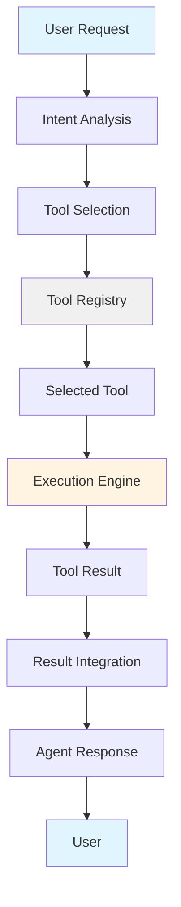

# Lesson 4: Tool Usage in Agentic AI - Extending Agent Capabilities

## 🎯 Learning Objectives

After completing this lesson, you will be able to:

- Understand the Tool Use design pattern and its critical role in agentic AI
- Differentiate between various tool usage patterns (ReAct, Planning, Reflection)
- Implement function calling and tool integration in production systems
- Recognize when and how to apply different tool orchestration strategies
- Design secure, scalable tool architectures for enterprise applications
- Evaluate trade-offs between different tool integration approaches

## 📚 Theoretical Foundation

### What is Tool Usage in Agentic AI?

**Tool usage** transforms Large Language Models from text generators into **autonomous systems capable of real-world action**. Tools are executable code—functions, APIs, or services—that agents invoke to extend their capabilities beyond their training data.

> 💡 **Real-World Analogy**: Like a chef using kitchen appliances (mixer, oven, thermometer) instead of just their hands, an agent uses tools (APIs, calculators, databases) to accomplish tasks it couldn't do alone.

#### The Paradigm Shift

Traditional LLMs are limited by:

- **Static knowledge**: Information frozen at training time
- **No real-world interaction**: Cannot execute code or query databases
- **Limited reasoning**: Purely text-based, no computational capabilities

Tool-enabled agents overcome these limitations through:

- **Dynamic information access**: Real-time data from APIs and databases
- **Computational capabilities**: Execute code, perform calculations, run simulations
- **Environmental interaction**: Modify state, trigger workflows, orchestrate systems

### Core Components of Tool-Enabled Systems

AI agents with tool capabilities operate through four interconnected components:

1. **Tool Registry**

   - Catalog of available tools with metadata
   - Function schemas defining inputs, outputs, and capabilities
   - Permission frameworks and access controls
   - Performance metrics and reliability scores

2. **Tool Selection Mechanism**

   - Intent recognition from user requests
   - Context-aware tool matching
   - Parameter extraction and validation
   - Confidence scoring for tool appropriateness

3. **Execution Engine**

   - Tool invocation with proper authentication
   - Parameter marshaling and validation
   - Error handling and retry logic
   - Result processing and formatting

4. **Integration Layer**
   - Communication protocols (REST, GraphQL, gRPC)
   - Authentication and authorization
   - Rate limiting and quota management
   - Monitoring and observability



## 🏗️ Core Tool Usage Patterns

### Pattern 1: ReAct (Reasoning and Acting)

**Definition**: ReAct creates a structured loop between reasoning and action, enabling agents to think, act, and learn iteratively.

> 💡 **Real-World Analogy**: Like a detective investigating a case—they think about what they know, gather new evidence (act), observe what they found, then think about next steps.

**The ReAct Cycle**:

```
┌─────────────────────────────────────┐
│  THOUGHT: Reasoning Phase           │
│  "I need current Bitcoin price"     │
└──────────────┬──────────────────────┘
               │
┌──────────────▼──────────────────────┐
│  ACTION: Tool Execution             │
│  search("Bitcoin price USD")        │
└──────────────┬──────────────────────┘
               │
┌──────────────▼──────────────────────┐
│  OBSERVATION: Process Results       │
│  "$42,500 per Bitcoin"              │
└──────────────┬──────────────────────┘
               │
         ┌─────▼──────┐
         │  Complete? │
         └──┬───────┬─┘
            │       │
         No │       │ Yes
            │       │
            └───┐   └──► Final Answer
                │
                └──► Loop Back to THOUGHT
```

#### Detailed Example: Research Assistant

**Scenario**: "How much Bitcoin could I buy with $1000?"

```
═══════════════════════════════════════════════════════════

Thought 1:
I need the current Bitcoin price to calculate this. Let me search
for the latest price information.

Action 1:
search_web("current Bitcoin price USD")

Observation 1:
Found: "Bitcoin trading at $42,500 USD (as of Oct 2025)"

═══════════════════════════════════════════════════════════

Thought 2:
Now I have the price. I need to calculate how many Bitcoin
$1000 can purchase. Let me use the calculator.

Action 2:
calculator("1000 / 42500")

Observation 2:
Result: 0.0235294117647

═══════════════════════════════════════════════════════════

Thought 3:
I have the calculation result. Let me format this appropriately
and provide context about what this means.

Final Answer:
With $1000, you could buy approximately 0.0235 Bitcoin at the
current price of $42,500 per BTC. This is about 2.35% of one
Bitcoin. Keep in mind that crypto prices are volatile and this
calculation is based on current market rates.

═══════════════════════════════════════════════════════════
```

#### When to Use ReAct

**Ideal Scenarios**:

- Multi-step research requiring information gathering
- Complex problem-solving with external data dependencies
- Situations requiring dynamic adaptation based on intermediate results
- Tasks where reasoning transparency is important

**Advantages**:

- **Reduced hallucination**: External tools provide factual grounding
- **Error correction**: Can observe results and adjust approach
- **Transparent reasoning**: Explicit thought traces enable debugging
- **Dynamic planning**: Adapts strategy based on observations

**Limitations**:

- **Higher LLM costs**: Multiple reasoning cycles increase token usage
- **Slower execution**: Sequential thinking-acting cycles take time
- **Termination challenges**: May loop indefinitely without proper stopping conditions

### Pattern 2: Planning-Based Tool Usage

**Definition**: Agents create comprehensive execution plans before invoking tools, optimizing for efficiency and coherence.

> 💡 **Real-World Analogy**: Like planning a vacation—you don't just show up at the airport. First you research destinations, book flights, reserve hotels, plan activities, THEN execute your plan step by step.

#### The Planning Process

```
┌─────────────────────────────────────────┐
│  PHASE 1: Goal Analysis                 │
│  Break down high-level objective        │
│  Identify constraints and requirements  │
└─────────────────┬───────────────────────┘
                  │
┌─────────────────▼───────────────────────┐
│  PHASE 2: Task Decomposition            │
│  Create ordered list of sub-tasks       │
│  Identify tool requirements per task    │
└─────────────────┬───────────────────────┘
                  │
┌─────────────────▼───────────────────────┐
│  PHASE 3: Sequential Execution          │
│  Execute each task with assigned tools  │
│  Validate outputs before proceeding     │
└─────────────────┬───────────────────────┘
                  │
┌─────────────────▼───────────────────────┐
│  PHASE 4: Result Synthesis              │
│  Combine outputs into final response    │
└─────────────────────────────────────────┘
```

#### Practical Example: Sales Data Analysis

**Scenario**: Analyze Q3 sales performance and generate executive report

```
══════════════════════════════════════════════════════════════

PLANNING PHASE
──────────────────────────────────────────────────────────────

Goal: Generate comprehensive Q3 sales analysis report

Plan Created:
1. Extract Q3 sales data from database
2. Calculate key metrics (total revenue, growth rate, top products)
3. Compare against Q2 and Q3 previous year
4. Generate visualizations (charts, graphs)
5. Identify trends and anomalies
6. Compile findings into formatted report
7. Generate executive summary

Tools Required:
- database_query (Steps 1-3)
- calculator (Step 2)
- chart_generator (Step 4)
- statistical_analysis (Step 5)
- document_formatter (Steps 6-7)

══════════════════════════════════════════════════════════════

EXECUTION PHASE
──────────────────────────────────────────────────────────────

Step 1: Extract Q3 sales data ✓
Tool: database_query("SELECT * FROM sales WHERE quarter = 'Q3' AND year = 2025")
Result: 15,487 records retrieved

Step 2: Calculate key metrics ✓
Tool: calculator("SUM(revenue) = $2.4M")
Tool: calculator("(2.4M - 2.1M) / 2.1M * 100 = 14.3% growth")
Result: Revenue $2.4M, Growth 14.3%

Step 3: Historical comparison ✓
Tool: database_query("Q2 2025 and Q3 2024 data")
Result: Q2 $2.1M, Q3 2024 $1.9M

Step 4: Generate visualizations ✓
Tool: chart_generator(revenue_by_month_data)
Tool: chart_generator(top_products_data)
Result: 5 charts generated

Step 5: Identify trends ✓
Tool: statistical_analysis(sales_patterns)
Result: "Strong upward trend, seasonal peak in September"

Step 6-7: Compile report ✓
Tool: document_formatter(all_data, template="executive_report")
Result: 12-page PDF generated

══════════════════════════════════════════════════════════════

FINAL OUTPUT: Executive Report delivered with all findings
══════════════════════════════════════════════════════════════
```

#### When to Use Planning

**Ideal Scenarios**:

- Complex multi-step workflows with clear dependencies
- Tasks requiring specific execution order
- Situations where upfront analysis improves efficiency
- Projects needing progress tracking and checkpoints

**Advantages**:

- **Efficiency**: Fewer LLM calls compared to ReAct
- **Predictability**: Clear execution path
- **Parallelization**: Independent tasks can run concurrently
- **Resumability**: Can recover from failures mid-execution

**Limitations**:

- **Rigidity**: Difficult to adapt if early steps fail
- **Upfront cost**: Planning phase requires computation
- **Unknown territories**: Less effective for exploratory tasks

### Pattern 3: Reflection with Tool Validation

**Definition**: Agents iteratively improve tool usage through self-critique and validation cycles.

> 💡 **Real-World Analogy**: Like a writer drafting an essay, then re-reading and revising it multiple times, checking facts and improving clarity before submitting.

#### The Reflection Cycle with Tools

```
┌──────────────────────────────────────┐
│  Generate Initial Output Using Tools │
└──────────────┬───────────────────────┘
               │
┌──────────────▼───────────────────────┐
│  Validate Results with Checking Tools│
│  - Run tests                         │
│  - Check facts against databases     │
│  - Verify calculations               │
└──────────────┬───────────────────────┘
               │
         ┌─────▼──────┐
         │  Quality   │
         │  Acceptable│
         └──┬───────┬─┘
            │       │
         No │       │ Yes
            │       │
┌───────────▼─┐     │
│  Identify   │     │
│  Issues &   │     │
│  Regenerate │     │
└───────┬─────┘     │
        │           │
        └───────────┴───► Final Output
```

#### Practical Example: Code Generation with Validation

**Scenario**: Generate Python function to process CSV data

```
═══════════════════════════════════════════════════════════

Iteration 1: Initial Generation
───────────────────────────────────────────────────────────

Tool: code_generator("Python function to read and process CSV")

Output:
def process_csv(filename):
    with open(filename) as f:
        for line in f:
            print(line)

═══════════════════════════════════════════════════════════

Self-Critique Tool: code_analyzer(generated_code)

Issues Found:
✗ No CSV parsing (just reading lines)
✗ No error handling
✗ No return value
✗ Not actually "processing" data
✗ Missing type hints

═══════════════════════════════════════════════════════════

Iteration 2: Improved Version
───────────────────────────────────────────────────────────

Tool: code_generator("Improve code based on critique")

Output:
import csv

def process_csv(filename: str) -> list:
    results = []
    with open(filename) as f:
        reader = csv.DictReader(f)
        for row in reader:
            results.append(row)
    return results

═══════════════════════════════════════════════════════════

Validation Tool: unit_test_generator(code)

Generated Tests:
test_valid_file() ✓
test_empty_file() ✗ (No handling)
test_invalid_file() ✗ (No handling)

═══════════════════════════════════════════════════════════

Iteration 3: Production-Ready Version
───────────────────────────────────────────────────────────

Tool: code_generator("Add error handling and validation")

Final Output:
import csv
from typing import List, Dict
from pathlib import Path

def process_csv(filename: str) -> List[Dict[str, str]]:
    """
    Process CSV file and return list of dictionaries.

    Args:
        filename: Path to CSV file

    Returns:
        List of dictionaries representing CSV rows

    Raises:
        FileNotFoundError: If file doesn't exist
        ValueError: If file is empty or invalid CSV
    """
    file_path = Path(filename)

    if not file_path.exists():
        raise FileNotFoundError(f"File not found: {filename}")

    if file_path.stat().st_size == 0:
        raise ValueError(f"File is empty: {filename}")

    results = []
    try:
        with open(file_path, 'r', encoding='utf-8') as f:
            reader = csv.DictReader(f)
            for row in reader:
                results.append(row)

        if not results:
            raise ValueError("No data found in CSV")

        return results

    except csv.Error as e:
        raise ValueError(f"Invalid CSV format: {e}")

═══════════════════════════════════════════════════════════

Final Validation:
Tool: unit_test_runner(complete_test_suite)

All tests passed ✓
Code quality score: 95/100 ✓
Ready for production ✓

═══════════════════════════════════════════════════════════
```

#### Tool-Augmented Reflection Strategies

**1. Test-Driven Validation**

- Generate code → Run unit tests → Fix failures → Repeat

**2. External Fact-Checking**

- Generate content → Verify against databases/APIs → Correct errors

**3. Performance Benchmarking**

- Generate solution → Benchmark performance → Optimize → Re-test

**4. Multi-Criteria Assessment**

- Evaluate across dimensions (correctness, security, performance)
- Weight criteria by importance
- Iterate on lowest-scoring aspects

#### When to Use Reflection with Tools

**Ideal Scenarios**:

- Code generation requiring correctness guarantees
- Content creation needing factual accuracy
- Solutions requiring performance optimization
- Tasks with clear quality metrics

**Advantages**:

- **Higher quality**: Iterative improvement catches errors
- **Objective validation**: Tools provide unbiased assessment
- **Learning**: Patterns emerge from successful iterations
- **Confidence**: Validated outputs increase reliability

**Limitations**:

- **Computational cost**: Multiple iterations increase resource usage
- **Diminishing returns**: Later iterations may provide minimal improvement
- **Termination complexity**: Defining "good enough" can be challenging

## 🔧 Function Calling: The Foundation of Tool Usage

### What is Function Calling?

**Function calling** is the mechanism that enables LLMs to interact with tools. The LLM doesn't execute tools directly; instead, it returns structured requests indicating which function to call and with what parameters.

#### The Function Calling Workflow

```
┌──────────────────────────────────────────────────────────┐
│ STEP 1: Tool Schema Registration                        │
│                                                          │
│  Developer provides function definitions to LLM:        │
│  - Function name                                        │
│  - Description of purpose                               │
│  - Parameter definitions with types                     │
│  - Required vs optional parameters                      │
└──────────────────────┬───────────────────────────────────┘
                       │
┌──────────────────────▼───────────────────────────────────┐
│ STEP 2: User Request Processing                         │
│                                                          │
│  User: "What's the current time in San Francisco?"     │
│                                                          │
│  LLM analyzes request against available tools           │
└──────────────────────┬───────────────────────────────────┘
                       │
┌──────────────────────▼───────────────────────────────────┐
│ STEP 3: Function Selection & Parameter Extraction       │
│                                                          │
│  LLM Returns:                                            │
│  {                                                       │
│    "function": "get_current_time",                       │
│    "arguments": {"location": "San Francisco"}           │
│  }                                                       │
└──────────────────────┬───────────────────────────────────┘
                       │
┌──────────────────────▼───────────────────────────────────┐
│ STEP 4: Function Execution (Developer's Code)           │
│                                                          │
│  def get_current_time(location):                        │
│      # Implementation                                    │
│      return current_time                                 │
│                                                          │
│  Result: "09:24 AM"                                      │
└──────────────────────┬───────────────────────────────────┘
                       │
┌──────────────────────▼───────────────────────────────────┐
│ STEP 5: Result Integration                              │
│                                                          │
│  Developer sends function result back to LLM            │
│  LLM generates natural language response:               │
│  "The current time in San Francisco is 09:24 AM."       │
└──────────────────────────────────────────────────────────┘
```

### Implementing Function Calling from Scratch

#### Prerequisites

1. **LLM that supports function calling**

   - Azure OpenAI (GPT-4, GPT-3.5-turbo with function calling)
   - Anthropic Claude (tool use)
   - Google Gemini (function calling)

2. **Function schema** defining available tools

3. **Implementation code** for each function

#### Step-by-Step Implementation

**Step 1: Initialize the LLM Client**

```python
from openai import AzureOpenAI
import os

# Initialize Azure OpenAI client
client = AzureOpenAI(
    azure_endpoint=os.getenv("AZURE_OPENAI_ENDPOINT"),
    api_key=os.getenv("AZURE_OPENAI_API_KEY"),
    api_version="2024-05-01-preview"
)
```

**Step 2: Define Function Schema**

```python
# Tool definitions in JSON schema format
tools = [
    {
        "type": "function",
        "function": {
            "name": "get_current_time",
            "description": "Get the current time in a given location",
            "parameters": {
                "type": "object",
                "properties": {
                    "location": {
                        "type": "string",
                        "description": "The city name, e.g. San Francisco",
                    },
                },
                "required": ["location"],
            }
        }
    },
    {
        "type": "function",
        "function": {
            "name": "get_weather",
            "description": "Get current weather for a location",
            "parameters": {
                "type": "object",
                "properties": {
                    "location": {
                        "type": "string",
                        "description": "City name",
                    },
                    "unit": {
                        "type": "string",
                        "enum": ["celsius", "fahrenheit"],
                        "description": "Temperature unit"
                    }
                },
                "required": ["location"],
            }
        }
    }
]
```

**Step 3: Call LLM with Tool Definitions**

```python
import json

# User request
messages = [
    {"role": "user", "content": "What's the current time in San Francisco?"}
]

# First API call: Ask model to select appropriate tool
response = client.chat.completions.create(
    model="gpt-4o",
    messages=messages,
    tools=tools,
    tool_choice="auto",  # Let model decide if/which tool to use
)

# Extract model's response
response_message = response.choices[0].message
messages.append(response_message)

print("Model's tool call:")
print(response_message)
```

**Output**:

```python
ChatCompletionMessage(
    content=None,
    role='assistant',
    tool_calls=[
        ChatCompletionMessageToolCall(
            id='call_abc123',
            function=Function(
                arguments='{"location":"San Francisco"}',
                name='get_current_time'
            ),
            type='function'
        )
    ]
)
```

**Step 4: Implement Function Code**

```python
from datetime import datetime
from zoneinfo import ZoneInfo

# Timezone mapping
TIMEZONE_DATA = {
    "san francisco": "America/Los_Angeles",
    "new york": "America/New_York",
    "london": "Europe/London",
    "tokyo": "Asia/Tokyo",
    "sydney": "Australia/Sydney",
}

def get_current_time(location: str) -> str:
    """Get the current time for a given location"""
    location_lower = location.lower()

    # Find matching timezone
    for key, timezone in TIMEZONE_DATA.items():
        if key in location_lower:
            current_time = datetime.now(ZoneInfo(timezone)).strftime("%I:%M %p")
            return json.dumps({
                "location": location,
                "current_time": current_time
            })

    # Location not found
    return json.dumps({
        "location": location,
        "current_time": "unknown",
        "error": "Timezone not found for this location"
    })

def get_weather(location: str, unit: str = "fahrenheit") -> str:
    """Get current weather (mock implementation)"""
    # In production, this would call a real weather API
    weather_data = {
        "san francisco": {"temp": 68, "condition": "Partly Cloudy"},
        "new york": {"temp": 72, "condition": "Sunny"},
        "london": {"temp": 55, "condition": "Rainy"},
    }

    location_lower = location.lower()
    if location_lower in weather_data:
        data = weather_data[location_lower]
        temp = data["temp"]

        if unit == "celsius":
            temp = round((temp - 32) * 5/9)

        return json.dumps({
            "location": location,
            "temperature": temp,
            "unit": unit,
            "condition": data["condition"]
        })

    return json.dumps({"error": "Weather data not available"})
```

**Step 5: Execute Tool and Return Result**

```python
# Map function names to actual functions
available_functions = {
    "get_current_time": get_current_time,
    "get_weather": get_weather,
}

# Process tool calls
if response_message.tool_calls:
    for tool_call in response_message.tool_calls:
        function_name = tool_call.function.name
        function_args = json.loads(tool_call.function.arguments)

        # Get the function from our mapping
        function_to_call = available_functions[function_name]

        # Call the function with extracted arguments
        function_response = function_to_call(**function_args)

        # Add function response to messages
        messages.append({
            "tool_call_id": tool_call.id,
            "role": "tool",
            "name": function_name,
            "content": function_response,
        })

# Second API call: Get final response with tool results
final_response = client.chat.completions.create(
    model="gpt-4o",
    messages=messages,
)

print("\nFinal Response:")
print(final_response.choices[0].message.content)
```

**Output**:

```
The current time in San Francisco is 09:24 AM.
```

### Multiple Tool Calls Example

Agents often need to call multiple tools to complete complex tasks:

```python
def handle_complex_query():
    """Example: 'What's the time and weather in San Francisco?'"""

    messages = [{
        "role": "user",
        "content": "What's the time and weather in San Francisco?"
    }]

    # First call - model may request multiple tools
    response = client.chat.completions.create(
        model="gpt-4o",
        messages=messages,
        tools=tools,
        tool_choice="auto"
    )

    response_message = response.choices[0].message
    messages.append(response_message)

    # Process ALL tool calls
    if response_message.tool_calls:
        for tool_call in response_message.tool_calls:
            function_name = tool_call.function.name
            function_args = json.loads(tool_call.function.arguments)
            function_to_call = available_functions[function_name]
            function_response = function_to_call(**function_args)

            messages.append({
                "tool_call_id": tool_call.id,
                "role": "tool",
                "name": function_name,
                "content": function_response,
            })

    # Get final synthesized response
    final_response = client.chat.completions.create(
        model="gpt-4o",
        messages=messages,
    )

    return final_response.choices[0].message.content

# Output: "In San Francisco, it's currently 09:24 AM and 68°F with partly cloudy skies."
```

## 🛠️ Framework-Specific Tool Implementation

### Semantic Kernel: Plugin-Based Architecture

<a href="https://learn.microsoft.com/semantic-kernel/overview/" target="_blank">Semantic Kernel</a> is Microsoft's open-source framework that simplifies tool integration through **plugins** and automatic function serialization.

#### Key Advantages

- **Automatic serialization**: Framework generates schemas from your code
- **Type safety**: Strong typing with decorators
- **Built-in tools**: File Search, Code Interpreter pre-integrated
- **Cross-platform**: .NET, Python, Java support

#### Implementation Pattern

**Step 1: Create Plugin Class**

```python
from semantic_kernel.functions import kernel_function
from datetime import datetime
from zoneinfo import ZoneInfo
import json

class TimeTool:
    """Plugin for time-related operations"""

    @kernel_function(
        name="get_current_time",
        description="Get the current time for a given location"
    )
    def get_current_time(self, location: str) -> str:
        """
        Returns current time for specified location.

        Args:
            location: City name (e.g., 'San Francisco')

        Returns:
            JSON string with location and current time
        """
        timezone_map = {
            "san francisco": "America/Los_Angeles",
            "new york": "America/New_York",
            "london": "Europe/London",
        }

        location_lower = location.lower()
        if location_lower in timezone_map:
            tz = ZoneInfo(timezone_map[location_lower])
            current_time = datetime.now(tz).strftime("%I:%M %p")
            return json.dumps({
                "location": location,
                "time": current_time
            })

        return json.dumps({"error": "Location not found"})

    @kernel_function(
        name="calculate_time_difference",
        description="Calculate time difference between two locations"
    )
    def calculate_time_difference(
        self,
        location1: str,
        location2: str
    ) -> str:
        """Calculate time difference between two cities"""
        # Implementation here
        pass
```

**Step 2: Register Plugin with Kernel**

```python
from semantic_kernel import Kernel

# Create kernel instance
kernel = Kernel()

# Add AI service
kernel.add_service(
    AzureChatCompletion(
        deployment_name="gpt-4o",
        api_key=os.getenv("AZURE_OPENAI_API_KEY"),
        endpoint=os.getenv("AZURE_OPENAI_ENDPOINT")
    )
)

# Create and add plugin
time_plugin = TimeTool()
kernel.add_plugin(
    time_plugin,
    plugin_name="TimeTool"
)

# Kernel automatically serializes functions and creates schemas
```

**Step 3: Enable Automatic Function Calling**

```python
from semantic_kernel.contents import ChatHistory

# Create chat history
chat = ChatHistory()
chat.add_user_message("What time is it in San Francisco?")

# Execute with automatic function calling
result = await kernel.invoke_prompt_async(
    function_name="chat",
    plugin_name="ChatPlugin",
    chat_history=chat,
    kernel=kernel
)

print(result)
# Output: "The current time in San Francisco is 09:24 AM."
```

#### Semantic Kernel Built-In Tools

```python
from semantic_kernel.core_plugins import (
    FileSearchPlugin,
    CodeInterpreterPlugin,
    TextMemoryPlugin
)

# Add pre-built plugins
kernel.add_plugin(FileSearchPlugin(), "FileSearch")
kernel.add_plugin(CodeInterpreterPlugin(), "CodeInterpreter")
kernel.add_plugin(TextMemoryPlugin(), "Memory")

# Now agent can search files, execute code, and access memory
```

### Azure AI Agent Service: Managed Tool Orchestration

<a href="https://learn.microsoft.com/azure/ai-services/agents/overview" target="_blank">Azure AI Agent Service</a> is a fully managed service providing enterprise-grade tool integration without infrastructure management.

#### Key Advantages

- **Server-side tool execution**: No need to parse tool calls manually
- **Managed state**: Threads automatically track conversation context
- **Built-in enterprise tools**: Bing Search, Azure AI Search, Azure Functions
- **Security**: Enterprise-grade authentication and authorization

#### Tool Categories

**1. Knowledge Tools** (Information Retrieval):

```python
from azure.ai.projects import AIProjectClient
from azure.ai.projects.models import (
    BingGroundingTool,
    FileSearchTool,
    AzureAISearchTool
)

# Bing grounding for web search
bing_tool = BingGroundingTool()

# File search for document Q&A
file_search_tool = FileSearchTool(
    file_ids=["file-abc123", "file-def456"]
)

# Azure AI Search for enterprise knowledge
search_tool = AzureAISearchTool(
    index_name="company_knowledge_base"
)
```

**2. Action Tools** (Task Execution):

```python
from azure.ai.projects.models import (
    FunctionTool,
    CodeInterpreterTool,
    AzureFunctionTool
)

# Custom function tool
def fetch_sales_data(query: str) -> str:
    """Fetch sales data from database"""
    # Implementation
    return results

function_tool = FunctionTool(fetch_sales_data)

# Code interpreter for data analysis
code_tool = CodeInterpreterTool()

# Azure Functions integration
azure_func_tool = AzureFunctionTool(
    function_name="ProcessOrder",
    function_app_name="order-processing-app"
)
```

#### Practical Implementation: Sales Analysis Agent

```python
import os
from azure.ai.projects import AIProjectClient
from azure.identity import DefaultAzureCredential
from azure.ai.projects.models import ToolSet, FunctionTool, CodeInterpreterTool

# Initialize client
project_client = AIProjectClient.from_connection_string(
    credential=DefaultAzureCredential(),
    conn_str=os.environ["PROJECT_CONNECTION_STRING"],
)

# Define custom sales data function
def fetch_sales_data(query: str) -> str:
    """
    Fetch sales data using SQL query.

    Args:
        query: SQL query to execute

    Returns:
        JSON string with query results
    """
    import sqlite3
    import json

    conn = sqlite3.connect('sales.db')
    cursor = conn.cursor()

    # Execute query (with safety checks in production!)
    cursor.execute(query)
    results = cursor.fetchall()

    conn.close()

    return json.dumps({
        "rows": results,
        "count": len(results)
    })

# Create toolset with multiple tools
toolset = ToolSet()

# Add custom function
toolset.add(FunctionTool(fetch_sales_data))

# Add code interpreter for analysis
toolset.add(CodeInterpreterTool())

# Create agent with toolset
agent = project_client.agents.create_agent(
    model="gpt-4o-mini",
    name="sales-analyst",
    instructions="""You are a sales data analyst. You can:
    1. Query the sales database using fetch_sales_data
    2. Analyze results using the code interpreter
    3. Generate visualizations and insights

    Always validate data before analysis.""",
    toolset=toolset
)

# Create thread for conversation
thread = project_client.agents.create_thread()

# Send message
message = project_client.agents.create_message(
    thread_id=thread.id,
    role="user",
    content="What were our top 5 products by revenue in Q3?"
)

# Run agent (automatic tool calling happens server-side)
run = project_client.agents.create_run(
    thread_id=thread.id,
    agent_id=agent.id
)

# Wait for completion
import time
while run.status in ["queued", "in_progress", "requires_action"]:
    time.sleep(1)
    run = project_client.agents.get_run(
        thread_id=thread.id,
        run_id=run.id
    )

# Get response
messages = project_client.agents.list_messages(thread_id=thread.id)
print(messages.data[0].content[0].text.value)
```

**Output**:

```
Based on Q3 sales data analysis:

Top 5 Products by Revenue:
1. Premium Widget Pro - $1.2M
2. Standard Widget - $890K
3. Widget Plus - $650K
4. Mini Widget - $420K
5. Widget Bundle - $310K

Total Q3 Revenue from Top 5: $3.47M (72% of total revenue)

Key Insight: Premium Widget Pro shows 45% growth compared to Q2,
suggesting strong market demand for premium features.
```

### Model Context Protocol (MCP): Standardized Tool Integration

The Model Context Protocol represents the future of tool connectivity, providing standardized interfaces for agent-tool communication.

#### MCP Benefits

- **Interoperability**: Tools work across different frameworks
- **Dynamic discovery**: Agents can discover and use new tools at runtime
- **Security**: Standardized authentication and authorization
- **Maintainability**: Update tools without changing agent code

#### MCP Architecture

```
┌─────────────────┐
│   Agent         │
│   (Any Framework│
└────────┬────────┘
         │
         │ MCP Protocol
         │
┌────────▼────────┐
│  MCP Server     │
│  - Tool Registry│
│  - Auth         │
│  - Routing      │
└────────┬────────┘
         │
    ┌────┴─────┬──────────┬─────────┐
    │          │          │         │
┌───▼───┐  ┌───▼───┐  ┌───▼───┐ ┌──▼──┐
│ CRM   │  │Database│  │Weather│ │ ... │
│ Tool  │  │ Tool   │  │ API   │ │     │
└───────┘  └────────┘  └───────┘ └─────┘
```

#### MCP Implementation Example

```python
from crewai import Agent, Tool
from crewai_tools import MCPTool

# Connect to MCP server
mcp_tool = MCPTool(
    server_url="http://mcp-server.company.com",
    auth_token=os.getenv("MCP_AUTH_TOKEN")
)

# Agent automatically discovers available tools
agent = Agent(
    role="Data Analyst",
    tools=[mcp_tool],
    verbose=True
)

# Agent can now use any tool exposed by MCP server
result = agent.execute("Analyze Q3 sales trends")
```

## 🏛️ Advanced Tool Orchestration Patterns

### Multi-Agent Tool Distribution

Complex systems distribute tool usage across specialized agents:

```python
from crewai import Agent, Task, Crew

# Research Agent with web search tools
researcher = Agent(
    role="Research Specialist",
    goal="Gather comprehensive information",
    tools=[web_search_tool, database_query_tool],
    verbose=True
)

# Analysis Agent with computation tools
analyst = Agent(
    role="Data Analyst",
    goal="Analyze and derive insights",
    tools=[calculator_tool, statistics_tool, chart_generator],
    verbose=True
)

# Writer Agent with content tools
writer = Agent(
    role="Technical Writer",
    goal="Create clear documentation",
    tools=[grammar_checker, formatter_tool, citation_tool],
    verbose=True
)

# Define workflow
research_task = Task(
    description="Research AI agent market trends",
    agent=researcher
)

analysis_task = Task(
    description="Analyze research data and identify patterns",
    agent=analyst,
    context=[research_task]  # Uses output from research
)

writing_task = Task(
    description="Create executive report from analysis",
    agent=writer,
    context=[analysis_task]
)

# Execute multi-agent workflow
crew = Crew(
    agents=[researcher, analyst, writer],
    tasks=[research_task, analysis_task, writing_task],
    verbose=True
)

result = crew.kickoff()
```

### Hierarchical Tool Access Control

Enterprise systems implement role-based tool access:

```python
class ToolAccessControl:
    """Manage tool permissions by agent role"""

    ROLE_PERMISSIONS = {
        "junior_analyst": [
            "read_sales_data",
            "generate_chart",
            "calculate_metrics"
        ],
        "senior_analyst": [
            "read_sales_data",
            "write_sales_data",
            "generate_chart",
            "calculate_metrics",
            "run_sql_query",
            "access_financial_data"
        ],
        "executive": [
            "read_all_data",
            "generate_reports",
            "approve_changes"
        ]
    }

    @staticmethod
    def filter_tools(agent_role: str, all_tools: list) -> list:
        """Return only tools agent is permitted to use"""
        permitted_tool_names = ToolAccessControl.ROLE_PERMISSIONS.get(
            agent_role, []
        )

        return [
            tool for tool in all_tools
            if tool.name in permitted_tool_names
        ]

# Usage
junior_agent = Agent(
    role="Junior Analyst",
    tools=ToolAccessControl.filter_tools("junior_analyst", all_tools)
)

senior_agent = Agent(
    role="Senior Analyst",
    tools=ToolAccessControl.filter_tools("senior_analyst", all_tools)
)
```

### Parallel Tool Execution

Execute independent tools concurrently for performance:

```python
import asyncio
from typing import List, Dict

async def execute_tools_parallel(tool_calls: List[Dict]) -> List[str]:
    """Execute multiple independent tool calls concurrently"""

    async def execute_single_tool(tool_call):
        function_name = tool_call["function"]
        args = tool_call["arguments"]

        # Simulate tool execution
        if function_name == "web_search":
            return await web_search_async(**args)
        elif function_name == "database_query":
            return await database_query_async(**args)
        elif function_name == "api_call":
            return await api_call_async(**args)

    # Execute all tools concurrently
    results = await asyncio.gather(*[
        execute_single_tool(call) for call in tool_calls
    ])

    return results

# Example usage
tool_calls = [
    {"function": "web_search", "arguments": {"query": "AI trends 2025"}},
    {"function": "database_query", "arguments": {"sql": "SELECT * FROM sales"}},
    {"function": "api_call", "arguments": {"endpoint": "/weather", "params": {"city": "SF"}}}
]

results = await execute_tools_parallel(tool_calls)
# All three tools execute simultaneously
```

## 🔒 Enterprise Tool Security & Governance

### Security Best Practices

#### 1. Database Tool Security

**Problem**: SQL injection and unauthorized data access

**Solution**: Read-only access with query validation

```python
import sqlite3
from typing import List

class SecureDatabaseTool:
    """Database tool with security controls"""

    ALLOWED_TABLES = ["sales", "products", "customers"]
    FORBIDDEN_KEYWORDS = ["DROP", "DELETE", "INSERT", "UPDATE", "ALTER"]

    def __init__(self, db_path: str):
        # Open in read-only mode
        self.conn = sqlite3.connect(f"file:{db_path}?mode=ro", uri=True)
        self.cursor = self.conn.cursor()

    def validate_query(self, query: str) -> bool:
        """Validate SQL query for security"""
        query_upper = query.upper()

        # Check for forbidden operations
        for keyword in self.FORBIDDEN_KEYWORDS:
            if keyword in query_upper:
                raise ValueError(f"Forbidden operation: {keyword}")

        # Ensure only allowed tables
        for table in self.get_referenced_tables(query):
            if table not in self.ALLOWED_TABLES:
                raise ValueError(f"Access denied to table: {table}")

        return True

    def execute_query(self, query: str) -> List[tuple]:
        """Execute validated query"""
        self.validate_query(query)

        try:
            self.cursor.execute(query)
            return self.cursor.fetchall()
        except sqlite3.Error as e:
            raise ValueError(f"Query execution failed: {e}")

    def get_referenced_tables(self, query: str) -> List[str]:
        """Extract table names from SQL query"""
        # Implementation to parse SQL and extract table names
        pass
```

#### 2. API Tool Security

```python
import hashlib
import time
from typing import Dict, Optional

class SecureAPITool:
    """API tool with authentication and rate limiting"""

    def __init__(self, api_key: str, rate_limit: int = 100):
        self.api_key = api_key
        self.rate_limit = rate_limit
        self.request_count = 0
        self.window_start = time.time()

    def check_rate_limit(self) -> bool:
        """Enforce rate limiting"""
        current_time = time.time()

        # Reset window if 60 seconds passed
        if current_time - self.window_start > 60:
            self.request_count = 0
            self.window_start = current_time

        if self.request_count >= self.rate_limit:
            raise Exception("Rate limit exceeded. Please try again later.")

        self.request_count += 1
        return True

    def call_api(
        self,
        endpoint: str,
        params: Dict,
        user_id: Optional[str] = None
    ) -> Dict:
        """Make authenticated API call with logging"""
        self.check_rate_limit()

        # Add authentication
        headers = {
            "Authorization": f"Bearer {self.api_key}",
            "User-Agent": "AI-Agent/1.0"
        }

        # Log request for audit trail
        self.log_request(user_id, endpoint, params)

        # Make request (pseudo-code)
        response = requests.get(endpoint, params=params, headers=headers)

        # Log response
        self.log_response(user_id, endpoint, response.status_code)

        return response.json()

    def log_request(self, user_id: str, endpoint: str, params: Dict):
        """Audit trail for compliance"""
        log_entry = {
            "timestamp": time.time(),
            "user_id": user_id,
            "endpoint": endpoint,
            "params": params
        }
        # Write to audit log
        pass

    def log_response(self, user_id: str, endpoint: str, status: int):
        """Log API response for monitoring"""
        pass
```

#### 3. Input Validation

```python
from typing import Any, Dict
import re

class ToolInputValidator:
    """Validate and sanitize tool inputs"""

    @staticmethod
    def validate_string(value: str, max_length: int = 1000) -> str:
        """Validate and sanitize string inputs"""
        if not isinstance(value, str):
            raise ValueError("Input must be a string")

        if len(value) > max_length:
            raise ValueError(f"Input exceeds max length of {max_length}")

        # Remove potentially dangerous characters
        sanitized = re.sub(r'[<>\"\'%;()&+]', '', value)

        return sanitized

    @staticmethod
    def validate_number(
        value: Any,
        min_val: float = None,
        max_val: float = None
    ) -> float:
        """Validate numeric inputs"""
        try:
            num = float(value)
        except (TypeError, ValueError):
            raise ValueError("Input must be a number")

        if min_val is not None and num < min_val:
            raise ValueError(f"Value must be >= {min_val}")

        if max_val is not None and num > max_val:
            raise ValueError(f"Value must be <= {max_val}")

        return num

    @staticmethod
    def validate_tool_input(
        tool_name: str,
        parameters: Dict
    ) -> Dict:
        """Validate all parameters for a tool"""
        # Tool-specific validation rules
        validation_rules = {
            "database_query": {
                "query": {"type": "string", "max_length": 5000}
            },
            "calculate": {
                "expression": {"type": "string", "max_length": 100}
            },
            "web_search": {
                "query": {"type": "string", "max_length": 500}
            }
        }

        if tool_name not in validation_rules:
            raise ValueError(f"Unknown tool: {tool_name}")

        rules = validation_rules[tool_name]
        validated_params = {}

        for param_name, param_value in parameters.items():
            if param_name not in rules:
                continue  # Skip unknown parameters

            rule = rules[param_name]

            if rule["type"] == "string":
                validated_params[param_name] = ToolInputValidator.validate_string(
                    param_value,
                    max_length=rule.get("max_length", 1000)
                )
            elif rule["type"] == "number":
                validated_params[param_name] = ToolInputValidator.validate_number(
                    param_value,
                    min_val=rule.get("min"),
                    max_val=rule.get("max")
                )

        return validated_params
```

### Monitoring and Observability

Production tool usage requires comprehensive monitoring:

```python
import time
from dataclasses import dataclass
from typing import Optional

@dataclass
class ToolMetrics:
    """Track tool performance metrics"""
    tool_name: str
    success_count: int = 0
    failure_count: int = 0
    total_latency: float = 0.0
    average_latency: float = 0.0
    last_error: Optional[str] = None

class ToolMonitor:
    """Monitor and track tool usage"""

    def __init__(self):
        self.metrics = {}

    def record_execution(
        self,
        tool_name: str,
        success: bool,
        latency: float,
        error: Optional[str] = None
    ):
        """Record tool execution metrics"""
        if tool_name not in self.metrics:
            self.metrics[tool_name] = ToolMetrics(tool_name=tool_name)

        metrics = self.metrics[tool_name]

        if success:
            metrics.success_count += 1
        else:
            metrics.failure_count += 1
            metrics.last_error = error

        metrics.total_latency += latency
        total_calls = metrics.success_count + metrics.failure_count
        metrics.average_latency = metrics.total_latency / total_calls

    def get_tool_health(self, tool_name: str) -> Dict:
        """Get health metrics for a tool"""
        if tool_name not in self.metrics:
            return {"status": "unknown"}

        metrics = self.metrics[tool_name]
        total_calls = metrics.success_count + metrics.failure_count
        success_rate = metrics.success_count / total_calls if total_calls > 0 else 0

        # Determine health status
        if success_rate >= 0.95 and metrics.average_latency < 1.0:
            status = "healthy"
        elif success_rate >= 0.80:
            status = "degraded"
        else:
            status = "unhealthy"

        return {
            "status": status,
            "success_rate": success_rate,
            "average_latency": metrics.average_latency,
            "total_calls": total_calls,
            "last_error": metrics.last_error
        }

# Usage in tool execution
monitor = ToolMonitor()

def execute_tool_with_monitoring(tool_name: str, **kwargs):
    """Execute tool with monitoring"""
    start_time = time.time()
    success = False
    error_msg = None

    try:
        result = execute_tool(tool_name, **kwargs)
        success = True
        return result
    except Exception as e:
        error_msg = str(e)
        raise
    finally:
        latency = time.time() - start_time
        monitor.record_execution(tool_name, success, latency, error_msg)

# Check tool health
health = monitor.get_tool_health("database_query")
if health["status"] == "unhealthy":
    # Alert or switch to backup tool
    send_alert(f"Tool {tool_name} is unhealthy")
```

## 📊 Real-World Use Cases

### Use Case 1: Customer Support Automation

**Scenario**: Automated customer service agent with multiple tools

```python
from crewai import Agent

# Define customer support tools
tools = [
    # Knowledge base search
    search_knowledge_base,

    # CRM integration
    get_customer_info,
    get_order_history,
    update_ticket_status,

    # Actions
    process_refund,
    reschedule_delivery,
    send_email
]

# Create support agent
support_agent = Agent(
    role="Customer Support Specialist",
    goal="Resolve customer issues efficiently and empathetically",
    backstory="""You are an experienced customer support agent with access
    to company systems. You can look up customer information, check order
    status, process refunds, and escalate complex issues.""",
    tools=tools,
    verbose=True
)

# Example interaction
result = support_agent.execute(
    "Customer John Doe (ID: 12345) is asking about refund for order #67890"
)
```

**Tool Execution Flow**:

1. `get_customer_info(customer_id=12345)` → Verify customer
2. `get_order_history(customer_id=12345)` → Find order #67890
3. `search_knowledge_base(query="refund policy")` → Check eligibility
4. `process_refund(order_id=67890, amount=99.99)` → Execute refund
5. `send_email(customer_id=12345, template="refund_confirmation")` → Notify customer

### Use Case 2: Data Analysis Pipeline

**Scenario**: Automated data analysis with multiple computational tools

```python
analyst_agent = Agent(
    role="Data Analyst",
    goal="Analyze data and generate insights",
    tools=[
        database_query_tool,
        statistical_analysis_tool,
        chart_generator_tool,
        report_generator_tool
    ]
)

# Complex analysis request
task = """Analyze Q3 2025 sales data:
1. Extract sales by region and product category
2. Calculate growth rates vs Q2 and Q3 2024
3. Identify top performers and underperformers
4. Generate visualizations
5. Create executive summary with recommendations"""

result = analyst_agent.execute(task)
```

**Tool Orchestration**:

```
ReAct Pattern Implementation:

Thought 1: Need Q3 sales data
Action 1: database_query("SELECT region, category, SUM(revenue)...")
Observation 1: Retrieved 15,487 records

Thought 2: Calculate growth rates
Action 2: statistical_analysis(current=Q3_2025, previous=[Q2_2025, Q3_2024])
Observation 2: Overall growth 14.3% vs Q2, 23.1% vs Q3 2024

Thought 3: Identify top performers
Action 3: statistical_analysis(rank_by="revenue_growth")
Observation 3: "West region and Electronics category leading"

Thought 4: Create visualizations
Action 4: chart_generator(data, chart_types=["bar", "line", "heat_map"])
Observation 4: 5 charts generated

Thought 5: Compile findings
Action 5: report_generator(data, charts, insights)
Final: Complete executive report with recommendations
```

### Use Case 3: Research and Content Creation

**Scenario**: Multi-agent content creation workflow

```python
# Research Agent
researcher = Agent(
    role="Research Specialist",
    tools=[web_search_tool, academic_search_tool, fact_checker_tool],
    goal="Gather accurate, comprehensive information"
)

# Writer Agent
writer = Agent(
    role="Content Writer",
    tools=[grammar_checker_tool, tone_analyzer_tool, seo_optimizer_tool],
    goal="Create engaging, well-structured content"
)

# Editor Agent
editor = Agent(
    role="Editor",
    tools=[plagiarism_checker_tool, citation_formatter_tool, quality_analyzer_tool],
    goal="Ensure content meets quality standards"
)

# Workflow
research_task = Task(
    description="Research latest AI agent trends and statistics",
    agent=researcher
)

writing_task = Task(
    description="Write 2000-word article on AI agents",
    agent=writer,
    context=[research_task]
)

editing_task = Task(
    description="Edit and polish article for publication",
    agent=editor,
    context=[writing_task]
)

crew = Crew(
    agents=[researcher, writer, editor],
    tasks=[research_task, writing_task, editing_task]
)

final_article = crew.kickoff()
```

## 🎯 Pattern Selection Guide

### Choosing the Right Tool Usage Pattern

| Use Case                   | Recommended Pattern | Reason                                                |
| -------------------------- | ------------------- | ----------------------------------------------------- |
| **Research & Exploration** | ReAct               | Dynamic information gathering with adaptive reasoning |
| **Complex Workflows**      | Planning            | Clear dependencies and structured execution           |
| **Quality-Critical Tasks** | Reflection          | Iterative improvement with validation                 |
| **Real-time Information**  | ReAct               | Immediate access to current data                      |
| **Multi-step Analysis**    | Planning + ReAct    | Structured approach with flexibility                  |
| **Code Generation**        | Reflection + Tools  | Generate, test, refine cycle                          |
| **Enterprise Integration** | Framework-managed   | Built-in security and governance                      |

### Decision Matrix

```
Start Here:
├─ Is the task exploratory? → ReAct
├─ Are dependencies clear upfront? → Planning
├─ Is quality validation critical? → Reflection
└─ Do you need multiple specialized tools? → Multi-Agent

Consider These Factors:
├─ Latency requirements → Fewer LLM calls (Planning)
├─ Cost constraints → Minimize iterations (Planning)
├─ Reliability needs → Validation cycles (Reflection)
├─ Security requirements → Framework-managed tools
└─ Complexity → Multi-agent distribution
```

## 🧠 Best Practices Summary

### 1. Tool Design Principles

**✅ DO:**

- Keep tools focused on single responsibilities
- Provide clear, detailed descriptions
- Include comprehensive error handling
- Return structured, parseable outputs
- Implement retry logic for transient failures
- Log all tool executions for debugging

**❌ DON'T:**

- Create overly complex multi-purpose tools
- Use vague or ambiguous descriptions
- Return unpredictable output formats
- Assume tools always succeed
- Ignore security implications
- Skip input validation

### 2. Performance Optimization

```python
# Good: Parallel execution of independent tools
results = await asyncio.gather(
    search_web("AI trends"),
    query_database("SELECT * FROM sales"),
    call_weather_api("San Francisco")
)

# Good: Cache expensive operations
@lru_cache(maxsize=100)
def expensive_tool_call(param):
    return execute_expensive_operation(param)

# Good: Stream results for long-running tools
async def stream_tool_results(tool_name, **kwargs):
    async for chunk in execute_tool_streaming(tool_name, **kwargs):
        yield chunk
```

### 3. Error Handling Strategy

```python
from tenacity import retry, stop_after_attempt, wait_exponential

@retry(
    stop=stop_after_attempt(3),
    wait=wait_exponential(multiplier=1, min=4, max=10)
)
def resilient_tool_call(tool_name, **kwargs):
    """Tool call with automatic retry on failure"""
    try:
        return execute_tool(tool_name, **kwargs)
    except TransientError:
        # Retry
        raise
    except PermanentError:
        # Don't retry, escalate
        return handle_permanent_failure(tool_name)
```

### 4. Testing Tools

```python
import pytest

def test_tool_with_valid_input():
    """Test tool with expected inputs"""
    result = get_current_time(location="San Francisco")
    assert "current_time" in result
    assert result["location"] == "San Francisco"

def test_tool_with_invalid_input():
    """Test tool error handling"""
    with pytest.raises(ValueError):
        get_current_time(location=None)

def test_tool_performance():
    """Test tool meets performance requirements"""
    import time
    start = time.time()
    result = get_current_time(location="New York")
    latency = time.time() - start
    assert latency < 1.0  # Must respond within 1 second
```

## 🎯 Conceptual Mastery Checkpoint

Before moving to practical implementation, verify your understanding:

### Core Tool Usage Concepts

- [ ] Understand what tool usage means in agentic AI context
- [ ] Can explain the difference between function calling and tool execution
- [ ] Recognize the three core tool usage patterns (ReAct, Planning, Reflection)
- [ ] Understand when to apply each pattern to real-world problems

### Function Calling Mastery

- [ ] Can implement function calling from scratch with OpenAI API
- [ ] Understand tool schema structure and parameter definitions
- [ ] Know how to handle multiple tool calls in sequence
- [ ] Can process tool results and integrate them into responses

### Framework Proficiency

- [ ] Understand Semantic Kernel's plugin architecture
- [ ] Can create and register tools in Azure AI Agent Service
- [ ] Recognize differences between framework approaches
- [ ] Know when to use framework-managed vs custom implementations

### Advanced Concepts

- [ ] Understand multi-agent tool distribution strategies
- [ ] Can implement parallel tool execution for performance
- [ ] Recognize security implications of tool usage
- [ ] Know how to implement monitoring and observability

### Production Readiness

- [ ] Can design secure tool architectures
- [ ] Understand input validation and error handling requirements
- [ ] Know how to implement rate limiting and access controls
- [ ] Can create comprehensive logging and audit trails

### Pattern Selection

- [ ] Can match appropriate pattern to use case requirements
- [ ] Understand trade-offs between different approaches
- [ ] Can design hybrid patterns combining multiple strategies
- [ ] Recognize when to escalate to human oversight

## 📚 Comprehensive Summary

### The Tool Usage Revolution

Tool usage transforms LLMs from text generators into **autonomous action-taking systems**. By integrating external tools—APIs, databases, calculators, and specialized services—agents extend their capabilities far beyond static training data.

### Three Core Patterns

1. **ReAct (Reasoning + Acting)**: Interleaved thinking and tool usage in iterative loops

   - Best for: Exploratory tasks, research, dynamic problem-solving
   - Strength: Adaptive, transparent, self-correcting
   - Limitation: Higher cost, slower execution

2. **Planning-Based**: Upfront strategy creation followed by structured execution

   - Best for: Complex workflows, clear dependencies, enterprise processes
   - Strength: Efficient, predictable, resumable
   - Limitation: Less flexible, struggles with uncertainty

3. **Reflection with Validation**: Iterative improvement through self-critique and tool validation
   - Best for: Quality-critical tasks, code generation, content creation
   - Strength: High quality outputs, objective validation
   - Limitation: Computational cost, diminishing returns

### Implementation Approaches

**From Scratch**: Full control but requires handling all complexity

- Function schema definition
- Tool selection logic
- Result processing
- Error handling

**Framework-Managed**: Simplified development with built-in capabilities

- Semantic Kernel: Plugin architecture, automatic serialization
- Azure AI Agent Service: Managed execution, enterprise tools
- Other frameworks: LangGraph, CrewAI, AutoGen

### Enterprise Considerations

Production tool usage requires:

- **Security**: Input validation, read-only access, audit trails
- **Performance**: Parallel execution, caching, streaming
- **Reliability**: Retry logic, circuit breakers, monitoring
- **Governance**: Access controls, rate limiting, compliance

### Success Factors

1. **Clear Tool Definitions**: Detailed schemas enable accurate selection
2. **Appropriate Pattern Selection**: Match pattern to use case characteristics
3. **Robust Error Handling**: Graceful degradation when tools fail
4. **Comprehensive Monitoring**: Track performance and health
5. **Security First**: Validate inputs, control access, log everything

## 🔗 Connections & Next Steps

### Previous Lessons

**Lesson 1: Introduction to AI Agents**

- Foundational concepts of agent architecture
- Tool usage as environmental interaction mechanism
- Actuators as the theoretical basis for tools

**Lesson 2: Understanding Agentic Frameworks**

- Framework capabilities for tool integration
- Comparison of tool support across platforms
- Selection criteria for framework choice

**Lesson 3: Agentic Design Patterns**

- Tool usage as core design pattern
- Integration with other patterns (Planning, Memory, Multi-Agent)
- Orchestration strategies for complex systems

### Building on This Lesson

This lesson provides the foundation for:

**Lesson 5: Agentic RAG (Retrieval-Augmented Generation)**

- Specialized tool usage for knowledge retrieval
- Combining search tools with reasoning
- Document-based tool integration

**Lesson 6: Building Trustworthy Agents**

- Security implications of tool usage
- Validation and safety mechanisms
- Audit trails and compliance

**Lesson 7: Planning and Design**

- Designing tool ecosystems for specific domains
- Tool selection strategies
- Architecture patterns for tool-heavy systems

### Practical Next Steps

**Immediate Actions**:

1. Implement basic function calling with your LLM of choice
2. Create 2-3 simple tools (calculator, web search, database query)
3. Test ReAct pattern with your tools
4. Experiment with Planning pattern for structured tasks

**Intermediate Goals**:

1. Build multi-tool agent for specific use case
2. Implement security and validation layers
3. Add monitoring and observability
4. Deploy to development environment

**Advanced Challenges**:

1. Design multi-agent system with distributed tools
2. Implement MCP-compliant tool server
3. Create production-grade tool ecosystem
4. Build human-in-the-loop approval workflows

## 📖 Additional Resources

### Documentation

- <a href="https://learn.microsoft.com/azure/ai-services/openai/how-to/function-calling" target="_blank">Azure OpenAI Function Calling Guide</a>
- <a href="https://learn.microsoft.com/semantic-kernel/concepts/ai-services/chat-completion/function-calling/" target="_blank">Semantic Kernel Function Calling</a>
- <a href="https://learn.microsoft.com/azure/ai-services/agents/overview" target="_blank">Azure AI Agent Service Documentation</a>
- <a href="https://docs.crewai.com/concepts/tools" target="_blank">CrewAI Tools Documentation</a>

### Workshops & Tutorials

- <a href="https://microsoft.github.io/build-your-first-agent-with-azure-ai-agent-service-workshop/" target="_blank">Azure AI Agents Service Workshop</a>
- <a href="https://github.com/Azure-Samples/contoso-creative-writer/tree/main/docs/workshop" target="_blank">Contoso Creative Writer Multi-Agent Workshop</a>
- <a href="https://microsoft.github.io/autogen/dev/user-guide/core-user-guide/components/tools.html" target="_blank">AutoGen Tools Guide</a>

### Research Papers

- **ReAct: Synergizing Reasoning and Acting in Language Models** (Yao et al., 2023)
- **Toolformer: Language Models Can Teach Themselves to Use Tools** (Schick et al., 2023)
- **Gorilla: Large Language Model Connected with Massive APIs** (Patil et al., 2023)

### Community & Support

**Get Help**:

- [Azure AI Foundry Discord](https://aka.ms/ai-agents/discord) - Office hours and community support
- [GitHub Discussions](https://github.com/microsoft/semantic-kernel/discussions) - Semantic Kernel community
- [Stack Overflow](https://stackoverflow.com/questions/tagged/azure-openai) - Technical Q&A

**Share Your Work**:

- Contribute tools to open-source frameworks
- Share case studies and lessons learned
- Help others in community forums

## 🎓 Key Takeaways

1. **Tool usage is the bridge** between LLM intelligence and real-world action
2. **Pattern selection matters**: ReAct, Planning, and Reflection serve different needs
3. **Security cannot be an afterthought**: Design with validation, access control, and auditing from the start
4. **Frameworks accelerate development**: But understand the fundamentals before relying on abstractions
5. **Monitoring is essential**: Track performance, errors, and usage patterns in production
6. **Start simple, scale gradually**: Begin with single tools, expand to complex multi-agent systems

---

**Congratulations!** You now have a comprehensive understanding of tool usage in agentic AI. You're ready to build powerful agents that can interact with databases, APIs, and external services to accomplish real-world tasks.

**Your journey continues with [Lesson 5: Agentic RAG](../lesson-5-agentic-rag/README.md), where you'll learn how to combine tool usage with advanced retrieval strategies.**

---

\_This lesson is part of the [Agent Fundamentals series](../README.md).
