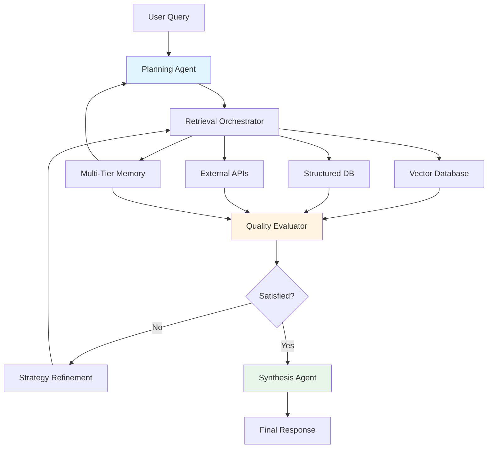

# Lesson 5: Agentic RAG - Autonomous Retrieval and Reasoning Systems

## 🎯 Learning Objectives

After completing this lesson, you will be able to:

- Understand Agentic RAG and how it differs from traditional RAG systems
- Recognize the core components: memory systems, retrieval orchestration, and agent coordination
- Implement iterative "maker-checker" loops for self-correction and refinement
- Design multi-agent systems for complex knowledge retrieval scenarios
- Apply advanced chunking strategies and context management techniques
- Evaluate trade-offs between single-agent and multi-agent architectures
- Implement Agentic RAG using LangGraph and other frameworks
- Design production-ready systems with proper monitoring and governance

## ⚡ Quick Start Guide

> **New to Agentic RAG?** Start here for a quick overview!

### Understanding Agentic RAG in 60 Seconds

**What**: Autonomous agents that retrieve, reason, and refine answers iteratively  
**Why**: Complex questions need multiple retrieval steps, quality validation, and adaptive strategies  
**How**: Agents plan → retrieve → evaluate → refine → repeat until satisfied

### Traditional RAG vs Agentic RAG

```
Traditional RAG                    Agentic RAG
─────────────────                  ─────────────────
Query → Retrieve → Generate        Query → Plan → Retrieve
                                          ↓
                                   Evaluate Quality
                                          ↓
                                   Refine Strategy ←┐
                                          ↓         │
                                   Retrieve More ───┘
                                          ↓
                                   Synthesize → Generate
```

### When to Use Agentic RAG

```
Your Scenario                              →  Use Agentic RAG?
──────────────────────────────────────────────────────────────
Simple FAQ lookup                          →  ❌ Overkill
Multi-step research question              →  ✅ Perfect
Complex analysis across sources           →  ✅ Ideal
Correctness-critical applications         →  ✅ Essential
Real-time data integration needed         →  ✅ Great fit
```

### Your Learning Path

- 🟢 **First Time?** Start with Core Concepts
- 🟡 **Ready for Implementation?** Jump to LangGraph Examples
- 🔴 **Building Production?** Focus on Architecture & Governance

---

## 📚 Theoretical Foundation

### What is Agentic RAG?

**Agentic Retrieval-Augmented Generation (Agentic RAG)** is an AI paradigm where **autonomous agents** actively manage their own retrieval and reasoning processes. Unlike traditional RAG systems that follow fixed retrieve-then-generate patterns, Agentic RAG systems **own their reasoning**, iteratively planning, retrieving, evaluating, and refining until achieving high-quality results.

> 💡 **Real-World Analogy**: Like a skilled researcher conducting literature review—they don't just search once and write. They search, read, evaluate quality, search for gaps, cross-reference sources, refine queries, and iterate until confident they have comprehensive understanding.

#### The Paradigm Shift: From Static to Autonomous

**Traditional RAG (Static Pipeline)**:

1. User asks question
2. System retrieves top-k documents
3. LLM generates answer from retrieved context
4. Done (no quality verification)

**Agentic RAG (Autonomous Loop)**:

1. User asks question
2. Agent **plans** retrieval strategy
3. Agent **executes** retrieval from appropriate sources
4. Agent **evaluates** result quality
5. If unsatisfied → Agent **refines** approach and retrieves again
6. Agent **synthesizes** findings from multiple iterations
7. Agent **validates** final answer against retrieved evidence
8. Done (with confidence)

### Key Characteristics of Agentic RAG

| Characteristic      | Description                        | Example                                                      |
| ------------------- | ---------------------------------- | ------------------------------------------------------------ |
| **Autonomy**        | Agents decide their own strategies | Agent chooses to search web vs. database based on query type |
| **Iterative**       | Multiple retrieve-evaluate cycles  | Searches academic papers → finds gaps → searches patents     |
| **Self-Correcting** | Detects and fixes poor results     | Realizes retrieved docs are off-topic → reformulates query   |
| **Multi-Source**    | Integrates heterogeneous data      | Combines SQL databases, vector stores, APIs, web search      |
| **Memory-Enabled**  | Learns from interaction history    | Remembers previous successful strategies for similar queries |
| **Goal-Oriented**   | Focuses on achieving user intent   | Prioritizes correctness over speed for medical queries       |

### Core Components Architecture



### The "Maker-Checker" Loop

At the heart of Agentic RAG is the **maker-checker pattern**—an iterative cycle where the agent creates outputs and critically evaluates them:

```
┌─────────────────────────────────────────────────────────┐
│ MAKER PHASE: Generate Hypothesis/Query                 │
│ Agent: "I'll search for 'AI agent frameworks 2025'"    │
└──────────────────┬──────────────────────────────────────┘
                   │
┌──────────────────▼──────────────────────────────────────┐
│ EXECUTION: Retrieve Information                        │
│ System: Returns 10 documents                           │
└──────────────────┬──────────────────────────────────────┘
                   │
┌──────────────────▼──────────────────────────────────────┐
│ CHECKER PHASE: Evaluate Quality                        │
│ Agent: "These docs are too general. I need              │
│        production case studies specifically."           │
└──────────────────┬──────────────────────────────────────┘
                   │
              ┌────▼─────┐
              │Quality   │
              │Acceptable│
              └────┬──┬──┘
                   │  │
                No │  │ Yes
                   │  │
┌──────────────────▼──┴──────────────────────────────────┐
│ REFINEMENT: Adjust Strategy                            │
│ Agent: "Let me search 'AI agent production deployment  │
│        case studies' instead"                          │
└──────────────────┬──────────────────────────────────────┘
                   │
                   └───► Loop Back to MAKER PHASE
```

## 🏗️ Core Components Deep Dive

### Component 1: Multi-Tier Memory Systems

Agentic RAG systems implement sophisticated memory architectures that enable learning and adaptation:

> 💡 **Real-World Analogy**: Like a professional researcher's notebook system—they have sticky notes for immediate thoughts (working memory), a research journal for their investigation history (episodic memory), a reference library for facts (semantic memory), and learned shortcuts for efficient research (procedural memory).

#### Memory Architecture Layers

**1. Working Memory (Immediate Context)**

```python
class WorkingMemory:
    """Maintains current conversation and task context"""

    def __init__(self):
        self.current_query = None
        self.active_retrieval_results = []
        self.intermediate_reasoning_steps = []
        self.temporary_variables = {}
        self.token_budget_remaining = 8000

    def add_retrieval_result(self, source: str, content: str, relevance: float):
        """Add retrieved content to working memory"""
        self.active_retrieval_results.append({
            "source": source,
            "content": content,
            "relevance": relevance,
            "timestamp": datetime.now()
        })

        # Implement memory pressure management
        if len(self.active_retrieval_results) > 10:
            self.prune_low_relevance_results()

    def prune_low_relevance_results(self):
        """Remove least relevant results when memory is full"""
        self.active_retrieval_results.sort(key=lambda x: x["relevance"], reverse=True)
        self.active_retrieval_results = self.active_retrieval_results[:10]
```

**2. Episodic Memory (Interaction History)**

```python
class EpisodicMemory:
    """Stores past interaction sequences with outcomes"""

    def __init__(self, vector_store):
        self.vector_store = vector_store
        self.episodes = []

    def record_episode(
        self,
        query: str,
        retrieval_strategy: dict,
        outcome: str,
        success: bool,
        duration: float
    ):
        """Record a complete interaction episode"""
        episode = {
            "query": query,
            "strategy": retrieval_strategy,
            "outcome": outcome,
            "success": success,
            "duration": duration,
            "timestamp": datetime.now(),
            "context": self.get_current_context()
        }

        # Store in vector database for similarity search
        episode_embedding = self.create_episode_embedding(episode)
        self.vector_store.add(episode_embedding, episode)
        self.episodes.append(episode)

    def find_similar_episodes(self, current_query: str, top_k: int = 3):
        """Retrieve similar past episodes to inform current strategy"""
        query_embedding = self.create_query_embedding(current_query)
        similar_episodes = self.vector_store.search(query_embedding, top_k)

        return [ep for ep in similar_episodes if ep["success"]]
```

**3. Semantic Memory (Knowledge Store)**

```python
class SemanticMemory:
    """Persistent knowledge and learned facts"""

    def __init__(self, knowledge_base):
        self.knowledge_base = knowledge_base
        self.learned_facts = {}
        self.confidence_scores = {}

    def store_fact(self, fact: str, source: str, confidence: float):
        """Store validated fact with confidence score"""
        fact_id = hashlib.sha256(fact.encode()).hexdigest()

        if fact_id in self.learned_facts:
            # Update confidence based on multiple sources
            self.confidence_scores[fact_id] = self.update_confidence(
                self.confidence_scores[fact_id],
                confidence
            )
        else:
            self.learned_facts[fact_id] = {
                "content": fact,
                "sources": [source],
                "first_learned": datetime.now()
            }
            self.confidence_scores[fact_id] = confidence

    def query_knowledge(self, query: str) -> List[Dict]:
        """Retrieve relevant facts from semantic memory"""
        relevant_facts = self.knowledge_base.search(query)

        return [
            {
                "fact": fact,
                "confidence": self.confidence_scores.get(fact["id"], 0.0),
                "sources": fact.get("sources", [])
            }
            for fact in relevant_facts
        ]
```

**4. Procedural Memory (Learned Strategies)**

```python
class ProceduralMemory:
    """Stores learned processes and successful strategies"""

    def __init__(self):
        self.strategies = {}
        self.success_rates = {}
        self.usage_counts = {}

    def learn_strategy(
        self,
        query_type: str,
        strategy: dict,
        success: bool
    ):
        """Learn from strategy execution outcomes"""
        strategy_key = self.get_strategy_key(query_type, strategy)

        if strategy_key not in self.strategies:
            self.strategies[strategy_key] = strategy
            self.success_rates[strategy_key] = []
            self.usage_counts[strategy_key] = 0

        self.success_rates[strategy_key].append(1 if success else 0)
        self.usage_counts[strategy_key] += 1

    def recommend_strategy(self, query_type: str) -> dict:
        """Recommend best strategy based on past success"""
        relevant_strategies = [
            (key, strat) for key, strat in self.strategies.items()
            if query_type in key
        ]

        if not relevant_strategies:
            return self.get_default_strategy()

        # Select strategy with highest success rate and sufficient usage
        best_strategy = max(
            relevant_strategies,
            key=lambda x: (
                sum(self.success_rates[x[0]]) / len(self.success_rates[x[0]])
                if len(self.success_rates[x[0]]) >= 3
                else 0
            )
        )

        return best_strategy[1]
```

#### Memory Coordination and Management

**Memory Integration Pattern**:

```python
class AgenticRAGMemorySystem:
    """Integrated memory system for Agentic RAG"""

    def __init__(self):
        self.working_memory = WorkingMemory()
        self.episodic_memory = EpisodicMemory(vector_store)
        self.semantic_memory = SemanticMemory(knowledge_base)
        self.procedural_memory = ProceduralMemory()

    def process_query(self, query: str) -> str:
        """Process query using all memory systems"""

        # 1. Check procedural memory for learned strategies
        recommended_strategy = self.procedural_memory.recommend_strategy(
            self.classify_query(query)
        )

        # 2. Check episodic memory for similar past queries
        similar_episodes = self.episodic_memory.find_similar_episodes(query)

        # 3. Initialize working memory with current context
        self.working_memory.current_query = query
        self.working_memory.add_context("strategy", recommended_strategy)
        self.working_memory.add_context("similar_episodes", similar_episodes)

        # 4. Execute retrieval with memory-informed strategy
        result = self.execute_with_memory(query, recommended_strategy)

        # 5. Record episode for future learning
        self.episodic_memory.record_episode(
            query=query,
            retrieval_strategy=recommended_strategy,
            outcome=result,
            success=self.evaluate_success(result),
            duration=self.get_duration()
        )

        return result
```

### Component 2: Intelligent Retrieval Orchestration

Agentic RAG implements sophisticated retrieval strategies that go far beyond simple vector similarity search.

> 💡 **Real-World Analogy**: Like a skilled librarian who doesn't just search the card catalog once—they use multiple search strategies, check different sections, consult reference materials, and piece together information from various sources to fully answer your question.

#### Advanced Chunking Strategies

Traditional RAG uses fixed-size chunking (e.g., 512 tokens per chunk). Agentic RAG implements **intelligent, content-aware chunking**:

**1. Semantic Boundary Detection**

```python
class SemanticChunker:
    """Intelligent chunking based on semantic boundaries"""

    def __init__(self, llm, max_chunk_size=1000):
        self.llm = llm
        self.max_chunk_size = max_chunk_size

    def chunk_document(self, document: str) -> List[str]:
        """Chunk document at natural semantic boundaries"""

        # First pass: Identify semantic boundaries
        boundaries = self.identify_boundaries(document)

        # Second pass: Create chunks respecting boundaries
        chunks = []
        current_chunk = ""

        for sentence in self.split_sentences(document):
            if len(current_chunk) + len(sentence) > self.max_chunk_size:
                # Check if we're at a semantic boundary
                if self.is_semantic_boundary(sentence, boundaries):
                    chunks.append(current_chunk)
                    current_chunk = sentence
                else:
                    # Continue chunk even if size exceeded
                    current_chunk += " " + sentence
            else:
                current_chunk += " " + sentence

        if current_chunk:
            chunks.append(current_chunk)

        return chunks

    def identify_boundaries(self, document: str) -> List[int]:
        """Use LLM to identify natural semantic boundaries"""
        prompt = f"""Analyze this document and identify semantic boundaries
        (topic shifts, section changes, etc.):

        {document}

        Return character positions where major topic shifts occur."""

        response = self.llm.generate(prompt)
        return self.parse_boundaries(response)
```

**2. Late Chunking (Context-Preserving)**

Late chunking processes entire documents through long-context embedding models first, then segments while preserving full-document context:

```python
class LateChunker:
    """Late chunking with full-document context preservation"""

    def __init__(self, embedding_model, chunk_size=512):
        self.embedding_model = embedding_model  # Long-context model
        self.chunk_size = chunk_size

    def process_document(self, document: str) -> List[Dict]:
        """Process document with late chunking"""

        # Step 1: Generate full-document embedding
        full_doc_embedding = self.embedding_model.embed(
            document,
            context="full_document"
        )

        # Step 2: Split into chunks
        chunks = self.split_into_chunks(document)

        # Step 3: Embed each chunk with full-document context
        chunk_embeddings = []
        for idx, chunk in enumerate(chunks):
            chunk_embedding = self.embedding_model.embed(
                chunk,
                context=document,  # Full document as context
                position=idx
            )

            chunk_embeddings.append({
                "text": chunk,
                "embedding": chunk_embedding,
                "document_embedding": full_doc_embedding,
                "position": idx,
                "document_id": self.get_doc_id(document)
            })

        return chunk_embeddings
```

**3. Adaptive Chunk Sizing**

```python
class AdaptiveChunker:
    """Dynamically adjust chunk size based on content density"""

    def __init__(self, min_size=256, max_size=1024):
        self.min_size = min_size
        self.max_size = max_size

    def chunk_with_adaptation(self, document: str) -> List[str]:
        """Adapt chunk size based on content characteristics"""

        sections = self.split_sections(document)
        chunks = []

        for section in sections:
            # Analyze content density
            density = self.calculate_density(section)

            if density > 0.8:  # High density (technical, dense)
                chunk_size = self.min_size  # Smaller chunks
            elif density < 0.3:  # Low density (narrative)
                chunk_size = self.max_size  # Larger chunks
            else:
                chunk_size = self.calculate_optimal_size(density)

            section_chunks = self.chunk_by_size(section, chunk_size)
            chunks.extend(section_chunks)

        return chunks

    def calculate_density(self, text: str) -> float:
        """Calculate information density of text"""
        # Factors: technical terms, numbers, equations, etc.
        technical_terms = len(self.find_technical_terms(text))
        equations = len(self.find_equations(text))
        references = len(self.find_references(text))

        # Normalize to 0-1 scale
        density_score = (technical_terms * 0.4 +
                        equations * 0.4 +
                        references * 0.2) / len(text.split())

        return min(density_score, 1.0)
```

**4. Multi-Vector Representations**

Advanced systems maintain multiple representations per chunk:

```python
class MultiVectorChunker:
    """Generate multiple vector representations per chunk"""

    def __init__(self, embedding_model):
        self.embedding_model = embedding_model

    def create_multi_vector_chunk(self, chunk: str, document: str) -> Dict:
        """Create multiple vector representations"""

        # Generate summary of chunk
        summary = self.generate_summary(chunk)

        # Extract key concepts
        concepts = self.extract_concepts(chunk)

        # Identify relationships to other chunks
        relationships = self.identify_relationships(chunk, document)

        return {
            "original_text": chunk,
            "summary": summary,
            "concepts": concepts,

            # Multiple embeddings
            "embeddings": {
                "full_text": self.embedding_model.embed(chunk),
                "summary": self.embedding_model.embed(summary),
                "concepts": self.embedding_model.embed(" ".join(concepts)),
                "questions": self.embedding_model.embed(
                    self.generate_hypothetical_questions(chunk)
                )
            },

            # Metadata
            "metadata": {
                "relationships": relationships,
                "chunk_type": self.classify_chunk(chunk),
                "importance_score": self.score_importance(chunk)
            }
        }
```

#### Query Decomposition and Refinement

Agentic RAG systems intelligently break down complex queries:

**Query Decomposition Pattern**:

```python
class QueryDecomposer:
    """Decompose complex queries into manageable sub-queries"""

    def __init__(self, llm):
        self.llm = llm

    def decompose_query(self, query: str) -> List[Dict]:
        """Break down complex query into sub-queries"""

        # Analyze query complexity
        complexity = self.analyze_complexity(query)

        if complexity < 0.5:
            # Simple query - no decomposition needed
            return [{"type": "direct", "query": query}]

        # Use LLM to decompose
        prompt = f"""Decompose this complex query into simpler sub-queries.
        Each sub-query should be independently answerable.

        Query: {query}

        Return a structured list of sub-queries with their types:
        - factual: Requires specific facts
        - analytical: Requires analysis or comparison
        - procedural: Requires step-by-step information
        """

        response = self.llm.generate(prompt)
        sub_queries = self.parse_sub_queries(response)

        # Identify dependencies between sub-queries
        sub_queries_with_deps = self.identify_dependencies(sub_queries)

        return sub_queries_with_deps

    def identify_dependencies(self, sub_queries: List[Dict]) -> List[Dict]:
        """Identify which sub-queries depend on others"""

        for i, query in enumerate(sub_queries):
            query["dependencies"] = []
            query["execution_order"] = i

            # Check if this query depends on previous queries
            for j, prev_query in enumerate(sub_queries[:i]):
                if self.has_dependency(query["query"], prev_query["query"]):
                    query["dependencies"].append(j)

        return sub_queries
```

**Query Refinement Based on Results**:

```python
class QueryRefiner:
    """Refine queries based on retrieval results"""

    def __init__(self, llm):
        self.llm = llm

    def refine_query(
        self,
        original_query: str,
        results: List[Dict],
        iteration: int
    ) -> str:
        """Refine query based on result quality"""

        # Evaluate result quality
        quality_score = self.evaluate_results(results)

        if quality_score > 0.8:
            # Results are good enough
            return None

        # Analyze what's missing or wrong
        analysis = self.analyze_gaps(original_query, results)

        # Generate refined query
        prompt = f"""The original query was: "{original_query}"

        Retrieved results have these issues:
        {analysis}

        Refine the query to address these issues. Consider:
        - Using more specific terminology
        - Adding context or constraints
        - Rephrasing to capture the core intent better

        Refined query:"""

        refined_query = self.llm.generate(prompt)

        return refined_query

    def evaluate_results(self, results: List[Dict]) -> float:
        """Evaluate quality of retrieval results"""

        if not results:
            return 0.0

        scores = []
        for result in results:
            # Multiple quality dimensions
            relevance = result.get("relevance_score", 0.0)
            completeness = self.check_completeness(result)
            freshness = self.check_freshness(result)
            authority = self.check_authority(result)

            # Weighted combination
            score = (relevance * 0.4 +
                    completeness * 0.3 +
                    freshness * 0.2 +
                    authority * 0.1)
            scores.append(score)

        return sum(scores) / len(scores)
```

#### Multi-Source Retrieval Integration

Agentic RAG coordinates retrieval across heterogeneous data sources:

```python
class MultiSourceRetriever:
    """Coordinate retrieval across multiple data sources"""

    def __init__(self):
        self.sources = {
            "vector_db": VectorDatabase(),
            "sql_db": SQLDatabase(),
            "web_search": WebSearchAPI(),
            "knowledge_graph": KnowledgeGraph(),
            "document_store": DocumentStore()
        }
        self.source_selector = SourceSelector()

    async def retrieve_multi_source(
        self,
        query: str,
        strategy: str = "adaptive"
    ) -> List[Dict]:
        """Retrieve from multiple sources intelligently"""

        # Step 1: Determine which sources to query
        selected_sources = self.source_selector.select_sources(
            query,
            available_sources=list(self.sources.keys())
        )

        # Step 2: Parallel retrieval from all selected sources
        retrieval_tasks = []
        for source_name in selected_sources:
            source = self.sources[source_name]
            task = source.retrieve_async(query)
            retrieval_tasks.append((source_name, task))

        # Execute retrievals in parallel
        results_by_source = await asyncio.gather(*[
            task for _, task in retrieval_tasks
        ])

        # Step 3: Aggregate and rank results
        all_results = []
        for (source_name, _), results in zip(retrieval_tasks, results_by_source):
            for result in results:
                result["source_type"] = source_name
                result["source_authority"] = self.get_source_authority(source_name)
                all_results.append(result)

        # Step 4: Re-rank based on relevance and source authority
        ranked_results = self.rerank_results(all_results, query)

        return ranked_results

    def rerank_results(self, results: List[Dict], query: str) -> List[Dict]:
        """Re-rank results considering multiple factors"""

        for result in results:
            # Calculate composite score
            relevance = result.get("relevance_score", 0.5)
            authority = result.get("source_authority", 0.5)
            freshness = self.calculate_freshness(result)
            completeness = self.calculate_completeness(result, query)

            result["final_score"] = (
                relevance * 0.4 +
                authority * 0.25 +
                freshness * 0.2 +
                completeness * 0.15
            )

        results.sort(key=lambda x: x["final_score"], reverse=True)
        return results
```

### Component 3: Agent Coordination Patterns

Agentic RAG can be implemented with single-agent or multi-agent architectures, each with different trade-offs.

> 💡 **Real-World Analogy**: Single-agent is like a solo researcher doing everything themselves. Multi-agent is like a research team where specialists handle different aspects—one person searches databases, another analyzes data, another writes the report, coordinated by a project manager.

#### Single-Agent Architecture (Router Pattern)

**When to Use**: Simple domains, straightforward retrieval, cost-sensitive applications

```python
class SingleAgentRAG:
    """Single agent handles all RAG responsibilities"""

    def __init__(self, llm, retriever):
        self.llm = llm
        self.retriever = retriever
        self.memory = AgenticRAGMemorySystem()
        self.max_iterations = 5

    async def answer_query(self, query: str) -> str:
        """Answer query with iterative refinement"""

        iteration = 0
        satisfied = False
        final_answer = None

        while not satisfied and iteration < self.max_iterations:
            iteration += 1

            # MAKER PHASE: Plan retrieval strategy
            strategy = self.plan_retrieval(query, iteration)

            # EXECUTION: Retrieve information
            results = await self.retriever.retrieve(query, strategy)

            # CHECKER PHASE: Evaluate quality
            quality_assessment = self.evaluate_quality(query, results)

            if quality_assessment["score"] > 0.8:
                # Good enough - generate final answer
                final_answer = self.generate_answer(query, results)
                satisfied = True
            else:
                # Refine strategy for next iteration
                query = self.refine_query(
                    query,
                    results,
                    quality_assessment["gaps"]
                )

                # Store this iteration in episodic memory
                self.memory.episodic_memory.record_episode(
                    query=query,
                    retrieval_strategy=strategy,
                    outcome=f"Iteration {iteration} - refinement needed",
                    success=False,
                    duration=0
                )

        if not satisfied:
            # Max iterations reached - return best effort
            final_answer = self.generate_answer(
                query,
                results,
                confidence="low"
            )

        return final_answer

    def plan_retrieval(self, query: str, iteration: int) -> Dict:
        """Plan retrieval strategy using LLM reasoning"""

        # Check procedural memory for learned strategies
        learned_strategy = self.memory.procedural_memory.recommend_strategy(
            self.classify_query(query)
        )

        if learned_strategy and iteration == 1:
            return learned_strategy

        # Use LLM to plan strategy
        prompt = f"""Plan a retrieval strategy for this query (iteration {iteration}):
        Query: {query}

        Consider:
        - Which data sources to query
        - What search terms to use
        - How many results to retrieve
        - What filters to apply

        Return a structured strategy."""

        strategy = self.llm.generate(prompt)
        return self.parse_strategy(strategy)
```

#### Multi-Agent Architecture (Collaborative Pattern)

**When to Use**: Complex domains, multiple data sources, need for specialization

```python
class MultiAgentRAG:
    """Multiple specialized agents collaborate on RAG tasks"""

    def __init__(self):
        # Initialize specialized agents
        self.query_analyzer = QueryAnalyzerAgent()
        self.retrieval_coordinator = RetrievalCoordinatorAgent()
        self.quality_assessor = QualityAssessorAgent()
        self.synthesizer = SynthesizerAgent()

        # Agent communication hub
        self.message_bus = AgentMessageBus()

        # Shared memory
        self.shared_memory = SharedMemoryStore()

    async def answer_query(self, query: str) -> str:
        """Collaborative multi-agent query answering"""

        # Stage 1: Query Analysis
        analysis = await self.query_analyzer.analyze(query)
        self.shared_memory.store("query_analysis", analysis)

        # Stage 2: Retrieval Coordination
        retrieval_plan = await self.retrieval_coordinator.create_plan(
            query,
            analysis
        )

        # Deploy specialist retrievers in parallel
        retrieval_results = await self.retrieval_coordinator.execute_plan(
            retrieval_plan
        )
        self.shared_memory.store("retrieval_results", retrieval_results)

        # Stage 3: Quality Assessment
        quality_report = await self.quality_assessor.assess(
            query,
            retrieval_results
        )

        if quality_report["needs_refinement"]:
            # Iterate with refined strategy
            refined_query = quality_report["refined_query"]
            additional_results = await self.retrieval_coordinator.retrieve(
                refined_query
            )
            retrieval_results.extend(additional_results)

        # Stage 4: Synthesis
        final_answer = await self.synthesizer.synthesize(
            query,
            retrieval_results,
            analysis
        )

        return final_answer


class RetrievalCoordinatorAgent:
    """Coordinates retrieval across multiple specialist agents"""

    def __init__(self):
        self.specialists = {
            "vector_search": VectorSearchSpecialist(),
            "sql_query": SQLQuerySpecialist(),
            "web_search": WebSearchSpecialist(),
            "knowledge_graph": KnowledgeGraphSpecialist()
        }

    async def create_plan(
        self,
        query: str,
        analysis: Dict
    ) -> Dict:
        """Create retrieval plan based on query analysis"""

        plan = {
            "query": query,
            "specialists_to_deploy": [],
            "execution_order": [],
            "parallel_groups": []
        }

        # Determine which specialists to deploy
        if analysis["requires_semantic_search"]:
            plan["specialists_to_deploy"].append("vector_search")

        if analysis["requires_structured_data"]:
            plan["specialists_to_deploy"].append("sql_query")

        if analysis["requires_current_info"]:
            plan["specialists_to_deploy"].append("web_search")

        if analysis["requires_relationships"]:
            plan["specialists_to_deploy"].append("knowledge_graph")

        # Determine execution strategy
        if len(plan["specialists_to_deploy"]) > 1:
            # Check for dependencies
            if self.has_dependencies(plan["specialists_to_deploy"]):
                plan["execution_order"] = self.order_by_dependencies(
                    plan["specialists_to_deploy"]
                )
            else:
                # Can execute all in parallel
                plan["parallel_groups"] = [plan["specialists_to_deploy"]]

        return plan

    async def execute_plan(self, plan: Dict) -> List[Dict]:
        """Execute retrieval plan"""

        all_results = []

        if plan["parallel_groups"]:
            # Parallel execution
            for group in plan["parallel_groups"]:
                tasks = [
                    self.specialists[spec_name].retrieve(plan["query"])
                    for spec_name in group
                ]
                group_results = await asyncio.gather(*tasks)
                all_results.extend(group_results)
        else:
            # Sequential execution
            for spec_name in plan["execution_order"]:
                specialist = self.specialists[spec_name]
                results = await specialist.retrieve(plan["query"])
                all_results.append(results)

        return all_results
```

## 🔧 LangGraph Implementation: Building Agentic RAG

LangGraph is particularly well-suited for Agentic RAG because it provides explicit state management, conditional routing, and graph-based workflow control.

### Prerequisites

```python
# Install required packages
# pip install langgraph langchain langchain-openai langchain-community chromadb

from langgraph.graph import StateGraph, END
from langchain_openai import ChatOpenAI, OpenAIEmbeddings
from langchain_community.vectorstores import Chroma
from langchain.text_splitter import RecursiveCharacterTextSplitter
from langchain.schema import Document
from typing import TypedDict, List, Annotated
import operator
```

### Example 1: Single-Agent Iterative RAG with LangGraph

This implementation shows a single agent that iteratively refines its retrieval until satisfied:

```python
from typing import TypedDict, List
from langgraph.graph import StateGraph, END

# Define the state structure
class RAGState(TypedDict):
    """State for iterative RAG system"""
    query: str
    retrieved_docs: List[str]
    generation: str
    iteration: int
    max_iterations: int
    quality_score: float
    satisfied: bool
    refinement_reason: str

# Initialize components
llm = ChatOpenAI(model="gpt-4", temperature=0)
embeddings = OpenAIEmbeddings()

# Create vector store (assume documents are already loaded)
vectorstore = Chroma(
    collection_name="knowledge_base",
    embedding_function=embeddings
)

def retrieve_documents(state: RAGState) -> RAGState:
    """Retrieve documents based on current query"""

    query = state["query"]
    iteration = state["iteration"]

    # Adjust retrieval strategy based on iteration
    if iteration == 1:
        # First attempt - standard retrieval
        k = 5
    else:
        # Later attempts - cast wider net
        k = 10

    # Retrieve documents
    docs = vectorstore.similarity_search(query, k=k)
    state["retrieved_docs"] = [doc.page_content for doc in docs]

    return state

def generate_answer(state: RAGState) -> RAGState:
    """Generate answer from retrieved documents"""

    query = state["query"]
    docs = state["retrieved_docs"]

    # Construct context
    context = "\n\n".join([f"Document {i+1}:\n{doc}"
                           for i, doc in enumerate(docs)])

    # Generate answer
    prompt = f"""Based on the following documents, answer the query.
    If the documents don't contain sufficient information, explicitly state what's missing.

    Query: {query}

    Documents:
    {context}

    Answer:"""

    response = llm.invoke(prompt)
    state["generation"] = response.content

    return state

def evaluate_quality(state: RAGState) -> RAGState:
    """Evaluate quality of generated answer"""

    query = state["query"]
    answer = state["generation"]
    docs = state["retrieved_docs"]

    # Use LLM to assess quality
    evaluation_prompt = f"""Evaluate this answer on a scale of 0-10:

    Query: {query}
    Answer: {answer}

    Consider:
    1. Relevance: Does it directly answer the query?
    2. Completeness: Are all aspects addressed?
    3. Grounding: Is it supported by the provided documents?
    4. Clarity: Is it clear and well-structured?

    Return:
    - Score: (0-10)
    - Reasoning: (brief explanation)
    - Missing: (what information is missing, if any)

    Format: SCORE: X | REASONING: ... | MISSING: ..."""

    eval_response = llm.invoke(evaluation_prompt)

    # Parse evaluation
    eval_text = eval_response.content
    score = float(eval_text.split("SCORE:")[1].split("|")[0].strip())
    reasoning = eval_text.split("REASONING:")[1].split("|")[0].strip()
    missing = eval_text.split("MISSING:")[1].strip() if "MISSING:" in eval_text else ""

    state["quality_score"] = score / 10.0  # Normalize to 0-1
    state["refinement_reason"] = missing
    state["satisfied"] = score >= 8.0  # Threshold for satisfaction

    return state

def refine_query(state: RAGState) -> RAGState:
    """Refine query based on what's missing"""

    original_query = state["query"]
    missing_info = state["refinement_reason"]
    iteration = state["iteration"]

    # Use LLM to refine query
    refinement_prompt = f"""The original query was: "{original_query}"

    The current answer is missing: {missing_info}

    Refine the query to specifically target the missing information.
    Make it more specific and targeted.

    Refined query:"""

    refined_response = llm.invoke(refinement_prompt)
    state["query"] = refined_response.content
    state["iteration"] = iteration + 1

    return state

def should_continue(state: RAGState) -> str:
    """Decision: continue refining or finish?"""

    if state["satisfied"]:
        return "finish"
    elif state["iteration"] >= state["max_iterations"]:
        return "finish"
    else:
        return "refine"

# Build the graph
workflow = StateGraph(RAGState)

# Add nodes
workflow.add_node("retrieve", retrieve_documents)
workflow.add_node("generate", generate_answer)
workflow.add_node("evaluate", evaluate_quality)
workflow.add_node("refine", refine_query)

# Define edges
workflow.set_entry_point("retrieve")
workflow.add_edge("retrieve", "generate")
workflow.add_edge("generate", "evaluate")

# Conditional routing based on quality
workflow.add_conditional_edges(
    "evaluate",
    should_continue,
    {
        "refine": "refine",
        "finish": END
    }
)

# After refinement, go back to retrieval
workflow.add_edge("refine", "retrieve")

# Compile the graph
app = workflow.compile()

# Example usage
initial_state = {
    "query": "What are the key benefits of using LangGraph for agentic systems?",
    "retrieved_docs": [],
    "generation": "",
    "iteration": 1,
    "max_iterations": 3,
    "quality_score": 0.0,
    "satisfied": False,
    "refinement_reason": ""
}

# Run the graph
final_state = app.invoke(initial_state)

print("Final Answer:", final_state["generation"])
print("Iterations:", final_state["iteration"])
print("Quality Score:", final_state["quality_score"])
```

### Example 2: Multi-Agent RAG with Specialized Retrievers

This implementation uses multiple specialized agents coordinated through LangGraph:

```python
from typing import TypedDict, List, Dict, Annotated
import operator

class MultiAgentRAGState(TypedDict):
    """State for multi-agent RAG system"""
    original_query: str
    decomposed_queries: List[str]
    vector_results: Annotated[List[str], operator.add]
    sql_results: Annotated[List[str], operator.add]
    web_results: Annotated[List[str], operator.add]
    synthesis: str
    current_subquery_idx: int
    total_subqueries: int

def decompose_query(state: MultiAgentRAGState) -> MultiAgentRAGState:
    """Decompose complex query into sub-queries"""

    query = state["original_query"]

    decompose_prompt = f"""Decompose this complex query into 2-4 simpler sub-queries.
    Each sub-query should be independently answerable.

    Query: {query}

    Return sub-queries as a numbered list."""

    response = llm.invoke(decompose_prompt)

    # Parse sub-queries
    sub_queries = []
    for line in response.content.split("\n"):
        if line.strip() and line[0].isdigit():
            sub_query = line.split(".", 1)[1].strip()
            sub_queries.append(sub_query)

    state["decomposed_queries"] = sub_queries
    state["total_subqueries"] = len(sub_queries)
    state["current_subquery_idx"] = 0

    return state

def route_query(state: MultiAgentRAGState) -> str:
    """Determine which retriever to use"""

    idx = state["current_subquery_idx"]

    if idx >= state["total_subqueries"]:
        return "synthesize"

    query = state["decomposed_queries"][idx]

    # Use LLM to classify query type
    routing_prompt = f"""Classify this query into ONE category:
    - vector: For semantic/conceptual questions
    - sql: For structured data queries
    - web: For current events/recent information

    Query: {query}

    Return only the category name."""

    response = llm.invoke(routing_prompt)
    category = response.content.strip().lower()

    return category

def retrieve_vector(state: MultiAgentRAGState) -> MultiAgentRAGState:
    """Retrieve from vector database"""

    idx = state["current_subquery_idx"]
    query = state["decomposed_queries"][idx]

    # Vector search
    docs = vectorstore.similarity_search(query, k=3)
    results = [doc.page_content for doc in docs]

    state["vector_results"] = results
    state["current_subquery_idx"] = idx + 1

    return state

def retrieve_sql(state: MultiAgentRAGState) -> MultiAgentRAGState:
    """Retrieve from SQL database"""

    idx = state["current_subquery_idx"]
    query = state["decomposed_queries"][idx]

    # Convert natural language to SQL (simplified)
    sql_prompt = f"""Convert this question to a SQL query:

    Question: {query}

    Available tables: products, customers, orders

    SQL:"""

    sql_response = llm.invoke(sql_prompt)
    sql_query = sql_response.content

    # Execute SQL (mock implementation)
    results = [f"SQL result for: {sql_query}"]

    state["sql_results"] = results
    state["current_subquery_idx"] = idx + 1

    return state

def retrieve_web(state: MultiAgentRAGState) -> MultiAgentRAGState:
    """Retrieve from web search"""

    idx = state["current_subquery_idx"]
    query = state["decomposed_queries"][idx]

    # Web search (mock implementation)
    results = [f"Web search result for: {query}"]

    state["web_results"] = results
    state["current_subquery_idx"] = idx + 1

    return state

def synthesize_results(state: MultiAgentRAGState) -> MultiAgentRAGState:
    """Synthesize all results into final answer"""

    original_query = state["original_query"]

    # Combine all results
    all_results = {
        "Vector Search": state.get("vector_results", []),
        "SQL Database": state.get("sql_results", []),
        "Web Search": state.get("web_results", [])
    }

    # Create context
    context_parts = []
    for source, results in all_results.items():
        if results:
            context_parts.append(f"{source}:\n" + "\n".join(results))

    context = "\n\n".join(context_parts)

    # Synthesize final answer
    synthesis_prompt = f"""Based on information from multiple sources,
    provide a comprehensive answer to the original query.

    Query: {original_query}

    Information:
    {context}

    Comprehensive Answer:"""

    response = llm.invoke(synthesis_prompt)
    state["synthesis"] = response.content

    return state

# Build multi-agent graph
multi_agent_workflow = StateGraph(MultiAgentRAGState)

# Add nodes
multi_agent_workflow.add_node("decompose", decompose_query)
multi_agent_workflow.add_node("retrieve_vector", retrieve_vector)
multi_agent_workflow.add_node("retrieve_sql", retrieve_sql)
multi_agent_workflow.add_node("retrieve_web", retrieve_web)
multi_agent_workflow.add_node("synthesize", synthesize_results)

# Define flow
multi_agent_workflow.set_entry_point("decompose")

# Conditional routing to appropriate retriever
multi_agent_workflow.add_conditional_edges(
    "decompose",
    route_query,
    {
        "vector": "retrieve_vector",
        "sql": "retrieve_sql",
        "web": "retrieve_web",
        "synthesize": "synthesize"
    }
)

# After each retrieval, route to next sub-query or synthesize
for retriever in ["retrieve_vector", "retrieve_sql", "retrieve_web"]:
    multi_agent_workflow.add_conditional_edges(
        retriever,
        route_query,
        {
            "vector": "retrieve_vector",
            "sql": "retrieve_sql",
            "web": "retrieve_web",
            "synthesize": "synthesize"
        }
    )

# Synthesis is the end
multi_agent_workflow.add_edge("synthesize", END)

# Compile
multi_agent_app = multi_agent_workflow.compile()

# Example usage
initial_state = {
    "original_query": "What are the latest trends in AI agents and how do they compare to traditional automation systems in terms of cost and efficiency?",
    "decomposed_queries": [],
    "vector_results": [],
    "sql_results": [],
    "web_results": [],
    "synthesis": "",
    "current_subquery_idx": 0,
    "total_subqueries": 0
}

final_state = multi_agent_app.invoke(initial_state)
print("Final Synthesis:", final_state["synthesis"])
```

### Example 3: Self-Correcting RAG with Validation

This implementation adds explicit validation and self-correction:

```python
from typing import TypedDict, List, Literal

class SelfCorrectingRAGState(TypedDict):
    """State for self-correcting RAG"""
    query: str
    documents: List[str]
    generation: str
    validation_results: Dict
    correction_attempts: int
    max_corrections: int
    is_valid: bool

def retrieve(state: SelfCorrectingRAGState) -> SelfCorrectingRAGState:
    """Retrieve documents"""
    docs = vectorstore.similarity_search(state["query"], k=5)
    state["documents"] = [doc.page_content for doc in docs]
    return state

def generate(state: SelfCorrectingRAGState) -> SelfCorrectingRAGState:
    """Generate answer"""
    context = "\n\n".join(state["documents"])
    prompt = f"Context:\n{context}\n\nQuery: {state['query']}\n\nAnswer:"
    response = llm.invoke(prompt)
    state["generation"] = response.content
    return state

def validate(state: SelfCorrectingRAGState) -> SelfCorrectingRAGState:
    """Validate answer quality"""

    validation_prompt = f"""Validate this answer:

    Query: {state['query']}
    Answer: {state['generation']}

    Check for:
    1. Factual accuracy (grounded in documents)
    2. Completeness (answers all aspects)
    3. Consistency (no contradictions)
    4. Hallucinations (invented information)

    Return validation in format:
    VALID: yes/no
    ISSUES: (list any problems)
    CONFIDENCE: (0-100)
    """

    validation_response = llm.invoke(validation_prompt)
    result = validation_response.content

    is_valid = "VALID: yes" in result.lower()
    state["is_valid"] = is_valid
    state["validation_results"] = {"raw": result}

    return state

def correct(state: SelfCorrectingRAGState) -> SelfCorrectingRAGState:
    """Attempt to correct the answer"""

    issues = state["validation_results"]["raw"]

    correction_prompt = f"""The previous answer had issues:
    {issues}

    Original Query: {state['query']}
    Previous Answer: {state['generation']}

    Provide a corrected answer that addresses these issues."""

    corrected_response = llm.invoke(correction_prompt)
    state["generation"] = corrected_response.content
    state["correction_attempts"] += 1

    return state

def should_correct(state: SelfCorrectingRAGState) -> Literal["correct", "finish"]:
    """Decide whether to correct or finish"""
    if state["is_valid"]:
        return "finish"
    elif state["correction_attempts"] >= state["max_corrections"]:
        return "finish"
    else:
        return "correct"

# Build graph
correcting_workflow = StateGraph(SelfCorrectingRAGState)

correcting_workflow.add_node("retrieve", retrieve)
correcting_workflow.add_node("generate", generate)
correcting_workflow.add_node("validate", validate)
correcting_workflow.add_node("correct", correct)

correcting_workflow.set_entry_point("retrieve")
correcting_workflow.add_edge("retrieve", "generate")
correcting_workflow.add_edge("generate", "validate")

correcting_workflow.add_conditional_edges(
    "validate",
    should_correct,
    {
        "correct": "correct",
        "finish": END
    }
)

correcting_workflow.add_edge("correct", "validate")

correcting_app = correcting_workflow.compile()
```

## 🏛️ Advanced Agentic RAG Patterns

### Pattern 1: ReAct for RAG (Reasoning + Acting)

ReAct pattern applied to RAG creates powerful iterative retrieval loops:

**Implementation Strategy**:

```python
class ReActRAG:
    """ReAct pattern for agentic RAG"""

    def __init__(self, llm, retriever):
        self.llm = llm
        self.retriever = retriever

    def run(self, query: str) -> str:
        """Execute ReAct loop for RAG"""

        thought_history = []
        action_history = []
        observation_history = []

        max_iterations = 5

        for iteration in range(max_iterations):
            # THOUGHT: Reason about what to do next
            thought = self.think(
                query,
                thought_history,
                observation_history
            )
            thought_history.append(thought)

            # ACTION: Decide on action
            action = self.extract_action(thought)
            action_history.append(action)

            if action["type"] == "FINISH":
                return action["answer"]

            # OBSERVATION: Execute action and observe result
            observation = self.execute_action(action)
            observation_history.append(observation)

        # Max iterations reached
        final_answer = self.synthesize_answer(
            query,
            observation_history
        )
        return final_answer

    def think(
        self,
        query: str,
        thoughts: List[str],
        observations: List[Dict]
    ) -> str:
        """Generate reasoning about next step"""

        context = self.build_context(thoughts, observations)

        prompt = f"""You are solving this query: {query}

        Previous reasoning and observations:
        {context}

        Think about what to do next. Your options:
        - SEARCH[query]: Search for information
        - FINISH[answer]: Provide final answer

        Thought:"""

        response = self.llm.invoke(prompt)
        return response.content

    def extract_action(self, thought: str) -> Dict:
        """Extract action from thought"""

        if "SEARCH[" in thought:
            query = thought.split("SEARCH[")[1].split("]")[0]
            return {"type": "SEARCH", "query": query}
        elif "FINISH[" in thought:
            answer = thought.split("FINISH[")[1].split("]")[0]
            return {"type": "FINISH", "answer": answer}
        else:
            # Default to search if unclear
            return {"type": "SEARCH", "query": thought}

    def execute_action(self, action: Dict) -> Dict:
        """Execute action and return observation"""

        if action["type"] == "SEARCH":
            results = self.retriever.search(action["query"])
            return {
                "type": "SEARCH_RESULTS",
                "query": action["query"],
                "results": results[:3]  # Top 3 results
            }

        return {"type": "UNKNOWN"}
```

**Example Execution Trace**:

```
Query: "What are the performance characteristics of GPT-4 compared to GPT-3.5?"

Thought 1: I need to find technical specifications for GPT-4 first
Action 1: SEARCH[GPT-4 performance benchmarks specifications]
Observation 1: Found 3 documents about GPT-4 capabilities

Thought 2: Now I need comparable information about GPT-3.5
Action 2: SEARCH[GPT-3.5 performance benchmarks specifications]
Observation 2: Found 3 documents about GPT-3.5 capabilities

Thought 3: I have information about both models. Let me compare them.
Action 3: FINISH[GPT-4 shows significant improvements over GPT-3.5 in reasoning
tasks (40% better on complex problems), reduced hallucination rates (60%
improvement), and better multilingual capabilities. However, GPT-4 is slower
(~2x inference time) and more expensive (~20x cost per token).]
```

### Pattern 2: Hierarchical Query Decomposition

Break complex queries into hierarchical sub-queries:

```python
class HierarchicalRAG:
    """Hierarchical query decomposition for complex RAG"""

    def __init__(self, llm, retriever):
        self.llm = llm
        self.retriever = retriever

    def decompose_hierarchically(self, query: str) -> Dict:
        """Decompose query into hierarchical structure"""

        decompose_prompt = f"""Decompose this complex query hierarchically:

        Query: {query}

        Create a tree structure where:
        - Root: Main question
        - Level 1: Major sub-questions
        - Level 2: Supporting questions for each major sub-question

        Return as JSON:
        {{
            "root": "main question",
            "level1": [
                {{
                    "question": "sub-question 1",
                    "level2": ["supporting q1", "supporting q2"]
                }}
            ]
        }}
        """

        response = self.llm.invoke(decompose_prompt)
        hierarchy = json.loads(response.content)

        return hierarchy

    def answer_hierarchically(self, hierarchy: Dict) -> str:
        """Answer questions from bottom-up"""

        # Answer Level 2 questions first
        level2_answers = {}
        for level1_item in hierarchy["level1"]:
            answers = []
            for level2_q in level1_item["level2"]:
                answer = self.answer_single_question(level2_q)
                answers.append(answer)
            level2_answers[level1_item["question"]] = answers

        # Answer Level 1 questions using Level 2 answers
        level1_answers = {}
        for level1_item in hierarchy["level1"]:
            l2_context = "\n".join(level2_answers[level1_item["question"]])
            answer = self.answer_with_context(
                level1_item["question"],
                l2_context
            )
            level1_answers[level1_item["question"]] = answer

        # Answer root question using Level 1 answers
        l1_context = "\n".join(level1_answers.values())
        final_answer = self.answer_with_context(
            hierarchy["root"],
            l1_context
        )

        return final_answer
```

### Pattern 3: Confidence-Scored Retrieval

Implement confidence scoring and selective re-retrieval:

```python
class ConfidenceScoredRAG:
    """RAG with confidence-based adaptive retrieval"""

    def __init__(self, llm, retriever):
        self.llm = llm
        self.retriever = retriever
        self.confidence_threshold = 0.7

    def answer_with_confidence(self, query: str) -> Dict:
        """Generate answer with confidence score"""

        # Initial retrieval
        docs = self.retriever.search(query, k=5)

        # Generate answer
        answer = self.generate_answer(query, docs)

        # Calculate confidence
        confidence = self.calculate_confidence(query, answer, docs)

        if confidence < self.confidence_threshold:
            # Low confidence - retrieve more
            additional_docs = self.retriever.search(
                self.expand_query(query),
                k=10
            )

            # Regenerate with more context
            all_docs = docs + additional_docs
            answer = self.generate_answer(query, all_docs)
            confidence = self.calculate_confidence(query, answer, all_docs)

        return {
            "answer": answer,
            "confidence": confidence,
            "sources": [doc.metadata for doc in docs]
        }

    def calculate_confidence(
        self,
        query: str,
        answer: str,
        docs: List
    ) -> float:
        """Calculate confidence score for answer"""

        confidence_prompt = f"""Rate confidence in this answer (0-100):

        Query: {query}
        Answer: {answer}
        Available documents: {len(docs)}

        Consider:
        - How well do documents support the answer?
        - Are there gaps in information?
        - Are there contradictions?

        Confidence score (0-100):"""

        response = self.llm.invoke(confidence_prompt)
        score = float(response.content.strip())

        return score / 100.0
```

## 📊 Real-World Use Cases and Applications

### Use Case 1: Enterprise Knowledge Management

**Scenario**: Large corporation with 100,000+ documents across multiple departments

**Challenge**: Employees spend hours searching for information across SharePoint, Confluence, internal wikis, and email archives.

**Agentic RAG Solution**:

```python
class EnterpriseKnowledgeAgent:
    """Agentic RAG for enterprise knowledge management"""

    def __init__(self):
        self.sources = {
            "sharepoint": SharePointRetriever(),
            "confluence": ConfluenceRetriever(),
            "wiki": WikiRetriever(),
            "email": EmailArchiveRetriever()
        }
        self.llm = ChatOpenAI(model="gpt-4")
        self.memory = AgenticRAGMemorySystem()

    def answer_employee_question(self, question: str, employee_context: Dict) -> Dict:
        """Answer question with full context awareness"""

        # Personalize based on employee department/role
        relevant_sources = self.select_sources_for_employee(
            employee_context["department"],
            employee_context["role"]
        )

        # Multi-source retrieval with access control
        results = []
        for source_name in relevant_sources:
            if self.has_access(employee_context["id"], source_name):
                source_results = self.sources[source_name].retrieve(
                    question,
                    filters={"department": employee_context["department"]}
                )
                results.extend(source_results)

        # Synthesize with confidence scoring
        answer = self.synthesize_with_confidence(question, results)

        # Log for compliance
        self.log_access(employee_context["id"], question, answer)

        return {
            "answer": answer["text"],
            "confidence": answer["confidence"],
            "sources": [r["source"] for r in results],
            "access_compliant": True
        }
```

**Impact**:

- 70% reduction in time spent searching for information
- Consistent answers across departments
- Automatic compliance tracking

### Use Case 2: Medical Diagnosis Support

**Scenario**: Radiologists need evidence-based support for complex cases

**Challenge**: Must cross-reference symptoms, imaging results, research papers, and treatment guidelines

**Agentic RAG Solution**:

```python
class MedicalDiagnosisAgent:
    """Agentic RAG for medical diagnosis support"""

    def __init__(self):
        self.knowledge_bases = {
            "pubmed": PubMedRetriever(),
            "radiopedia": RadiopaediaRetriever(),
            "clinical_guidelines": GuidelineRetriever(),
            "case_database": CaseHistoryRetriever()
        }
        self.llm = ChatOpenAI(model="gpt-4")

    def analyze_case(self, case_data: Dict) -> Dict:
        """Analyze medical case with evidence gathering"""

        # Extract key features
        symptoms = case_data["symptoms"]
        imaging_findings = case_data["imaging"]
        patient_history = case_data["history"]

        # Iterative evidence gathering
        evidence_chain = []

        # Step 1: Find similar cases
        similar_cases = self.knowledge_bases["case_database"].find_similar(
            symptoms=symptoms,
            imaging=imaging_findings
        )
        evidence_chain.append(("similar_cases", similar_cases))

        # Step 2: Research specific findings
        for finding in imaging_findings:
            research = self.knowledge_bases["pubmed"].search(
                f"{finding} diagnosis differential"
            )
            evidence_chain.append((f"research_{finding}", research[:5]))

        # Step 3: Get treatment guidelines
        possible_diagnoses = self.extract_diagnoses(similar_cases, research)
        for diagnosis in possible_diagnoses:
            guidelines = self.knowledge_bases["clinical_guidelines"].search(
                f"{diagnosis} treatment guidelines"
            )
            evidence_chain.append((f"guidelines_{diagnosis}", guidelines))

        # Synthesize with differential diagnosis
        analysis = self.synthesize_diagnosis(
            case_data,
            evidence_chain
        )

        return {
            "differential_diagnoses": analysis["diagnoses"],
            "recommended_tests": analysis["tests"],
            "treatment_options": analysis["treatments"],
            "evidence_citations": analysis["citations"],
            "confidence_scores": analysis["confidence"]
        }
```

**Impact**:

- 15% improvement in diagnostic accuracy
- 40% reduction in time to diagnosis
- Comprehensive evidence trails for medical-legal purposes

### Use Case 3: Legal Contract Analysis

**Scenario**: Law firm analyzing complex multi-party contracts

**Challenge**: Must cross-reference clauses, precedents, regulations, and case law

**Agentic RAG Solution**:

```python
class LegalContractAgent:
    """Agentic RAG for legal contract analysis"""

    def __init__(self):
        self.sources = {
            "case_law": CaseLawRetriever(),
            "regulations": RegulatoryRetriever(),
            "precedents": PrecedentRetriever(),
            "templates": TemplateRetriever()
        }
        self.llm = ChatOpenAI(model="gpt-4")

    def analyze_contract(self, contract_text: str, jurisdiction: str) -> Dict:
        """Comprehensive contract analysis"""

        # Extract clauses
        clauses = self.extract_clauses(contract_text)

        analysis_results = []

        for clause in clauses:
            # Check against precedents
            precedents = self.sources["precedents"].find_similar(
                clause_text=clause["text"],
                jurisdiction=jurisdiction
            )

            # Check regulatory compliance
            relevant_regs = self.sources["regulations"].search(
                f"{clause['type']} {jurisdiction} requirements"
            )

            # Find relevant case law
            case_law = self.sources["case_law"].search(
                f"{clause['type']} interpretation {jurisdiction}"
            )

            # Analyze risks
            risk_analysis = self.analyze_clause_risks(
                clause,
                precedents,
                relevant_regs,
                case_law
            )

            analysis_results.append({
                "clause": clause,
                "risk_level": risk_analysis["level"],
                "issues": risk_analysis["issues"],
                "recommendations": risk_analysis["recommendations"],
                "precedents": precedents,
                "regulations": relevant_regs
            })

        return {
            "overall_risk_assessment": self.aggregate_risks(analysis_results),
            "clause_analysis": analysis_results,
            "suggested_modifications": self.suggest_modifications(analysis_results)
        }
```

**Impact**:

- 60% reduction in contract review time
- 95% accuracy in risk identification
- Comprehensive audit trails for compliance

### Use Case 4: Customer Support Automation

**Scenario**: SaaS company with 50,000+ support tickets/month

**Challenge**: Need accurate, context-aware responses from product docs, FAQs, and past tickets

**Agentic RAG Solution**:

```python
class CustomerSupportAgent:
    """Agentic RAG for customer support"""

    def __init__(self):
        self.knowledge = {
            "documentation": DocumentationRetriever(),
            "faq": FAQRetriever(),
            "past_tickets": TicketHistoryRetriever(),
            "known_issues": KnownIssuesRetriever()
        }
        self.llm = ChatOpenAI(model="gpt-4")
        self.escalation_threshold = 0.6

    def handle_ticket(self, ticket: Dict) -> Dict:
        """Handle support ticket with context awareness"""

        customer_id = ticket["customer_id"]
        question = ticket["question"]

        # Get customer context
        customer_history = self.get_customer_history(customer_id)
        product_version = customer_history["product_version"]
        past_issues = customer_history["past_issues"]

        # Check for known issues first
        known_issues = self.knowledge["known_issues"].search(
            question,
            filters={"version": product_version}
        )

        if known_issues:
            return self.format_known_issue_response(known_issues[0])

        # Check similar past tickets
        similar_tickets = self.knowledge["past_tickets"].find_similar(
            question,
            filters={"resolved": True, "customer_satisfaction": ">4"}
        )

        # Search documentation
        relevant_docs = self.knowledge["documentation"].search(
            question,
            filters={"version": product_version}
        )

        # Generate response with confidence
        response = self.generate_response_with_confidence(
            question,
            similar_tickets,
            relevant_docs,
            customer_history
        )

        if response["confidence"] < self.escalation_threshold:
            return {
                "action": "escalate_to_human",
                "reason": "low_confidence",
                "draft_response": response["text"],
                "confidence": response["confidence"]
            }

        return {
            "action": "auto_respond",
            "response": response["text"],
            "confidence": response["confidence"],
            "sources": response["sources"]
        }
```

**Impact**:

- 66% of tickets resolved automatically
- 45% reduction in average resolution time
- 85% customer satisfaction with automated responses

## 🔒 Security, Governance, and Trust

### Access Control and Data Privacy

```python
class SecureAgenticRAG:
    """Agentic RAG with enterprise security"""

    def __init__(self):
        self.access_controller = AccessController()
        self.audit_logger = AuditLogger()
        self.pii_detector = PIIDetector()

    def secure_retrieve(
        self,
        query: str,
        user_context: Dict
    ) -> List[Dict]:
        """Retrieve with access control"""

        # Check user permissions
        if not self.access_controller.has_permission(
            user_context["user_id"],
            "knowledge_base_access"
        ):
            raise PermissionError("User lacks access to knowledge base")

        # Log access attempt
        self.audit_logger.log_access(
            user_id=user_context["user_id"],
            query=query,
            timestamp=datetime.now()
        )

        # Filter query for sensitive information
        sanitized_query = self.pii_detector.remove_pii(query)

        # Retrieve with user's permission scope
        results = self.retriever.search(
            sanitized_query,
            filters={
                "access_level": user_context["access_level"],
                "departments": user_context["departments"]
            }
        )

        # Redact sensitive information from results
        filtered_results = []
        for result in results:
            if self.access_controller.can_access(
                user_context["user_id"],
                result["document_id"]
            ):
                # Redact PII before returning
                result["content"] = self.pii_detector.redact_pii(
                    result["content"]
                )
                filtered_results.append(result)

        # Log successful access
        self.audit_logger.log_retrieval(
            user_id=user_context["user_id"],
            documents_accessed=[r["document_id"] for r in filtered_results]
        )

        return filtered_results
```

### Bias Detection and Mitigation

```python
class FairAgenticRAG:
    """Agentic RAG with bias detection and mitigation"""

    def __init__(self, llm, retriever):
        self.llm = llm
        self.retriever = retriever
        self.bias_detector = BiasDetector()

    def generate_fair_answer(self, query: str) -> Dict:
        """Generate answer with bias checking"""

        # Retrieve diverse sources
        results = self.retriever.search_diverse(query)

        # Generate initial answer
        answer = self.generate_answer(query, results)

        # Check for bias
        bias_analysis = self.bias_detector.analyze(
            query=query,
            answer=answer,
            sources=results
        )

        if bias_analysis["has_bias"]:
            # Retrieve counterbalancing sources
            additional_sources = self.retriever.search_counterbalance(
                query,
                existing_bias=bias_analysis["bias_type"]
            )

            # Regenerate with balanced sources
            all_sources = results + additional_sources
            answer = self.generate_balanced_answer(query, all_sources)

            # Verify bias reduction
            new_bias_analysis = self.bias_detector.analyze(
                query=query,
                answer=answer,
                sources=all_sources
            )

            return {
                "answer": answer,
                "bias_detected": True,
                "bias_mitigated": new_bias_analysis["bias_score"] < bias_analysis["bias_score"],
                "sources": all_sources
            }

        return {
            "answer": answer,
            "bias_detected": False,
            "sources": results
        }
```

## 📈 Evaluation and Monitoring

### Multi-Dimensional Evaluation Framework

Agentic RAG requires comprehensive evaluation across multiple dimensions:

```python
class AgenticRAGEvaluator:
    """Comprehensive evaluation for Agentic RAG"""

    def __init__(self, llm):
        self.llm = llm
        self.metrics = {
            "retrieval": RetrievalMetrics(),
            "generation": GenerationMetrics(),
            "system": SystemMetrics()
        }

    def evaluate_comprehensive(
        self,
        query: str,
        retrieved_docs: List[Dict],
        generated_answer: str,
        ground_truth: str = None
    ) -> Dict:
        """Comprehensive multi-dimensional evaluation"""

        evaluation_results = {}

        # 1. Retrieval Quality Metrics
        evaluation_results["retrieval"] = {
            "contextual_relevancy": self.evaluate_contextual_relevancy(
                query, retrieved_docs
            ),
            "contextual_recall": self.evaluate_contextual_recall(
                query, retrieved_docs, ground_truth
            ),
            "contextual_precision": self.evaluate_contextual_precision(
                query, retrieved_docs
            )
        }

        # 2. Generation Quality Metrics
        evaluation_results["generation"] = {
            "answer_relevancy": self.evaluate_answer_relevancy(
                query, generated_answer
            ),
            "faithfulness": self.evaluate_faithfulness(
                retrieved_docs, generated_answer
            ),
            "groundedness": self.evaluate_groundedness(
                retrieved_docs, generated_answer
            )
        }

        # 3. System Performance Metrics
        evaluation_results["system"] = {
            "agent_coordination": self.evaluate_coordination_efficiency(),
            "latency": self.measure_latency(),
            "cost": self.calculate_cost(),
            "iteration_efficiency": self.evaluate_iteration_count()
        }

        # 4. Aggregate Score
        evaluation_results["aggregate_score"] = self.calculate_aggregate(
            evaluation_results
        )

        return evaluation_results

    def evaluate_contextual_relevancy(
        self,
        query: str,
        docs: List[Dict]
    ) -> float:
        """Evaluate relevance of retrieved context"""

        relevancy_scores = []
        for doc in docs:
            prompt = f"""Rate relevance of this document to the query (0-10):

            Query: {query}
            Document: {doc['content'][:500]}

            Score (0-10):"""

            response = self.llm.invoke(prompt)
            score = float(response.content.strip())
            relevancy_scores.append(score / 10.0)

        return sum(relevancy_scores) / len(relevancy_scores) if relevancy_scores else 0.0

    def evaluate_faithfulness(
        self,
        docs: List[Dict],
        answer: str
    ) -> float:
        """Check if answer is faithful to retrieved documents"""

        context = "\n\n".join([d["content"] for d in docs])

        prompt = f"""Check if the answer is faithful to the context (no hallucinations).

        Context:
        {context}

        Answer:
        {answer}

        For each claim in the answer, verify if it's supported by the context.

        Return:
        - Total claims: X
        - Supported claims: Y
        - Faithfulness score: (Y/X)

        Format: CLAIMS: X | SUPPORTED: Y | SCORE: Z"""

        response = self.llm.invoke(prompt)
        content = response.content

        try:
            score = float(content.split("SCORE:")[1].strip())
            return score
        except:
            return 0.5  # Default if parsing fails
```

### Monitoring Production Systems

```python
class AgenticRAGMonitor:
    """Real-time monitoring for production Agentic RAG"""

    def __init__(self):
        self.metrics_store = MetricsStore()
        self.alert_manager = AlertManager()
        self.dashboard = Dashboard()

    def monitor_execution(self, execution_trace: Dict):
        """Monitor a single execution"""

        # Track latency
        self.metrics_store.record_metric(
            "latency",
            execution_trace["total_time"],
            tags={"query_type": execution_trace["query_type"]}
        )

        # Track iterations
        self.metrics_store.record_metric(
            "iterations",
            execution_trace["iteration_count"],
            tags={"success": execution_trace["success"]}
        )

        # Track costs
        self.metrics_store.record_metric(
            "cost",
            execution_trace["total_tokens"] * COST_PER_TOKEN,
            tags={"model": execution_trace["model"]}
        )

        # Track quality
        self.metrics_store.record_metric(
            "quality_score",
            execution_trace["quality_score"],
            tags={"query_type": execution_trace["query_type"]}
        )

        # Check for anomalies
        if execution_trace["iteration_count"] > 5:
            self.alert_manager.send_alert(
                severity="warning",
                message=f"High iteration count: {execution_trace['iteration_count']}",
                query=execution_trace["query"]
            )

        if execution_trace["quality_score"] < 0.6:
            self.alert_manager.send_alert(
                severity="error",
                message=f"Low quality score: {execution_trace['quality_score']}",
                query=execution_trace["query"]
            )

    def generate_daily_report(self) -> Dict:
        """Generate daily performance report"""

        return {
            "total_queries": self.metrics_store.count("queries", period="1d"),
            "avg_latency": self.metrics_store.avg("latency", period="1d"),
            "avg_iterations": self.metrics_store.avg("iterations", period="1d"),
            "avg_quality": self.metrics_store.avg("quality_score", period="1d"),
            "total_cost": self.metrics_store.sum("cost", period="1d"),
            "success_rate": self.calculate_success_rate(period="1d"),
            "top_failures": self.get_top_failures(limit=10)
        }
```

## 🧠 Best Practices and Design Principles

### Comparison: Traditional RAG vs Agentic RAG

| Aspect                 | Traditional RAG       | Agentic RAG                            | Winner         |
| ---------------------- | --------------------- | -------------------------------------- | -------------- |
| **Retrieval Strategy** | Fixed, one-shot       | Adaptive, iterative                    | 🟢 Agentic     |
| **Query Handling**     | As-is from user       | Decomposition & refinement             | 🟢 Agentic     |
| **Quality Control**    | None                  | Built-in validation loops              | 🟢 Agentic     |
| **Multi-Source**       | Single source typical | Intelligent multi-source orchestration | 🟢 Agentic     |
| **Complexity**         | Simple pipeline       | Complex state management               | 🟢 Traditional |
| **Latency**            | Fast (~1-2s)          | Slower (~5-15s)                        | 🟢 Traditional |
| **Cost**               | Low (1-2 LLM calls)   | High (5-15 LLM calls)                  | 🟢 Traditional |
| **Accuracy**           | Moderate (65-75%)     | High (80-95%)                          | 🟢 Agentic     |
| **Hallucination Rate** | Higher (~20%)         | Lower (~5%)                            | 🟢 Agentic     |
| **Use Case Fit**       | Simple Q&A            | Complex research/analysis              | Depends        |

### When to Use Which Approach

**Use Traditional RAG When**:

- ✅ Simple factual questions
- ✅ Low latency requirements (<2s)
- ✅ Cost-sensitive applications
- ✅ High query volume (>1000/sec)
- ✅ Well-defined knowledge domain

**Use Agentic RAG When**:

- ✅ Complex multi-step questions
- ✅ Accuracy is critical (medical, legal, financial)
- ✅ Multiple data sources must be integrated
- ✅ Self-correction is valuable
- ✅ Research or analysis tasks

### Design Principles

**1. Start Simple, Add Complexity Gradually**

```python
# Level 1: Basic Iterative RAG
def basic_agentic_rag(query):
    for _ in range(3):
        docs = retrieve(query)
        answer = generate(query, docs)
        if is_good_enough(answer):
            return answer
        query = refine_query(query, answer)
    return answer

# Level 2: Add Multi-Source
def multi_source_rag(query):
    sources = select_sources(query)
    all_docs = retrieve_from_all(query, sources)
    return synthesize(query, all_docs)

# Level 3: Add Full Agent Coordination
def full_agentic_rag(query):
    # Complex multi-agent system
    plan = decompose_query(query)
    results = execute_multi_agent_plan(plan)
    return synthesize_with_validation(query, results)
```

**2. Implement Proper Termination Conditions**

```python
def safe_iterative_rag(query, max_iterations=5, quality_threshold=0.8):
    """Always terminate - don't loop forever"""

    for iteration in range(max_iterations):
        docs = retrieve(query)
        answer = generate(query, docs)
        quality = evaluate_quality(query, answer, docs)

        if quality > quality_threshold:
            return answer  # Good enough

        if iteration == max_iterations - 1:
            # Last iteration - return best effort
            return {
                "answer": answer,
                "confidence": "low",
                "warning": "Maximum iterations reached"
            }

        query = refine_query(query, answer, quality)

    return answer
```

**3. Cache Aggressively**

```python
class CachedAgenticRAG:
    """Agentic RAG with intelligent caching"""

    def __init__(self):
        self.query_cache = TTLCache(maxsize=1000, ttl=3600)
        self.doc_cache = TTLCache(maxsize=5000, ttl=7200)
        self.strategy_cache = TTLCache(maxsize=500, ttl=1800)

    def answer_with_cache(self, query: str) -> str:
        # Check semantic cache
        cache_key = self.get_semantic_cache_key(query)
        if cache_key in self.query_cache:
            return self.query_cache[cache_key]

        # Execute with document caching
        answer = self.execute_with_caching(query)

        # Store in cache
        self.query_cache[cache_key] = answer

        return answer
```

**4. Monitor and Alert**

```python
# Set up comprehensive monitoring
@monitor_execution
@alert_on_failure
@log_performance
def production_agentic_rag(query: str) -> Dict:
    """Production-grade agentic RAG with monitoring"""

    start_time = time.time()

    try:
        result = execute_agentic_rag(query)

        # Log success metrics
        log_metrics({
            "latency": time.time() - start_time,
            "iterations": result["iterations"],
            "quality": result["quality_score"],
            "success": True
        })

        return result

    except Exception as e:
        # Log failure
        log_error(e, query=query)
        send_alert("agentic_rag_failure", error=str(e))
        raise
```

### Common Pitfalls and Solutions

| Pitfall              | Problem                             | Solution                                        |
| -------------------- | ----------------------------------- | ----------------------------------------------- |
| **Infinite Loops**   | Agent never satisfied with results  | Implement max_iterations and quality thresholds |
| **High Costs**       | Too many LLM calls                  | Cache aggressively, set iteration limits        |
| **Slow Responses**   | Sequential operations take too long | Parallelize independent retrievals              |
| **Poor Quality**     | Wrong retrieval strategy            | Implement strategy learning from past successes |
| **Context Overflow** | Too many documents retrieved        | Implement intelligent summarization             |
| **Hallucinations**   | Answer not grounded in docs         | Add validation layer checking faithfulness      |

### Performance Optimization Checklist

**✅ DO:**

- ✅ Implement semantic caching for similar queries
- ✅ Use async/parallel retrieval for multi-source queries
- ✅ Set reasonable iteration limits (3-5 typically sufficient)
- ✅ Monitor and alert on anomalies
- ✅ Use smaller models for validation steps
- ✅ Implement early termination on high confidence
- ✅ Cache document embeddings
- ✅ Log all executions for analysis

**❌ DON'T:**

- ❌ Allow unlimited iterations
- ❌ Retrieve all documents at once without filtering
- ❌ Skip result validation
- ❌ Ignore latency/cost monitoring
- ❌ Use same large model for all steps
- ❌ Retrieve from all sources for every query
- ❌ Skip caching "because it's complex"
- ❌ Forget to implement timeout mechanisms

## 🎯 Pattern Selection Guide

### Decision Matrix

```
Your Requirements                      →  Recommended Pattern
──────────────────────────────────────────────────────────────
Simple Q&A, single source             →  Traditional RAG
Multi-step research question          →  Single-Agent Iterative
Complex analysis, multiple sources    →  Multi-Agent Collaborative
Medical/Legal (high accuracy)         →  Self-Correcting RAG
Real-time + historical data           →  Multi-Source RAG
Learning from past queries            →  Memory-Augmented RAG
```

### Architecture Selection Framework

| Factor                     | Single-Agent    | Multi-Agent   | Recommendation                        |
| -------------------------- | --------------- | ------------- | ------------------------------------- |
| **Query Complexity**       | Simple-Moderate | Complex       | Use multi-agent for >3 sub-queries    |
| **Data Sources**           | 1-2             | 3+            | Multi-agent for heterogeneous sources |
| **Latency Tolerance**      | Medium (5-10s)  | High (10-30s) | Single-agent for <10s requirement     |
| **Accuracy Requirement**   | 80-85%          | 85-95%        | Multi-agent for critical applications |
| **Development Complexity** | Low             | High          | Start single-agent, evolve to multi   |
| **Maintenance**            | Easy            | Complex       | Consider team capabilities            |
| **Cost**                   | $$              | $$$$          | Multi-agent costs 3-5x more           |

## 🎯 Conceptual Mastery Checkpoint

Before moving to implementation, verify your understanding:

### Core Agentic RAG Concepts

- [ ] Understand what makes RAG "agentic" (autonomy, iteration, self-correction)
- [ ] Can explain the "maker-checker" loop and why it's important
- [ ] Recognize differences between traditional RAG and Agentic RAG
- [ ] Understand multi-tier memory systems (working, episodic, semantic, procedural)

### Advanced Retrieval Techniques

- [ ] Can implement intelligent chunking strategies (semantic, late, adaptive)
- [ ] Understand query decomposition and refinement processes
- [ ] Know how to coordinate multi-source retrieval
- [ ] Can design confidence-scored retrieval systems

### Agent Coordination

- [ ] Understand single-agent vs multi-agent architectures
- [ ] Can design hierarchical query decomposition
- [ ] Recognize when to use which coordination pattern
- [ ] Know how to implement agent communication protocols

### LangGraph Implementation

- [ ] Can build iterative RAG loops with state management
- [ ] Understand conditional routing based on quality assessment
- [ ] Can implement multi-agent workflows with specialized retrievers
- [ ] Know how to add validation and self-correction

### Production Readiness

- [ ] Can implement proper access control and security
- [ ] Understand evaluation metrics (retrieval quality, faithfulness, groundedness)
- [ ] Know how to monitor production systems
- [ ] Can implement caching and performance optimization

### Pattern Selection

- [ ] Can match appropriate architecture to use case requirements
- [ ] Understand trade-offs between patterns (cost, latency, accuracy)
- [ ] Recognize when traditional RAG is sufficient vs when agentic is needed
- [ ] Can design hybrid approaches combining multiple patterns

## 📚 Comprehensive Summary

### The Agentic RAG Revolution

Agentic RAG represents a fundamental evolution from static retrieval-then-generate pipelines to **autonomous systems that own their reasoning process**. By implementing iterative maker-checker loops, multi-tier memory systems, and intelligent agent coordination, these systems achieve significantly higher accuracy while maintaining the flexibility to adapt strategies based on result quality.

### Key Architectural Components

**1. Multi-Tier Memory Systems**:

- Working Memory: Immediate context and active state
- Episodic Memory: Past interaction sequences and outcomes
- Semantic Memory: Learned facts and knowledge
- Procedural Memory: Successful strategies and processes

**2. Intelligent Retrieval Orchestration**:

- Semantic boundary detection for context-aware chunking
- Late chunking preserving full-document context
- Multi-vector representations for comprehensive search
- Query decomposition and iterative refinement

**3. Agent Coordination**:

- Single-agent for simple domains with iterative refinement
- Multi-agent for complex scenarios requiring specialization
- Hierarchical decomposition for multi-level queries
- Adaptive routing based on query characteristics

### Implementation Approaches

**LangGraph Advantages**:

- Explicit state management with TypedDict
- Conditional routing based on quality metrics
- Built-in checkpointing for fault tolerance
- Visual workflow representation

**Three Core Patterns**:

1. **Iterative Refinement**: Single agent refines until satisfied
2. **Multi-Agent Collaboration**: Specialists handle different aspects
3. **Self-Correcting Validation**: Explicit validation and correction loops

### Real-World Applications

- **Enterprise Knowledge Management**: 70% reduction in search time
- **Medical Diagnosis Support**: 15% improvement in accuracy
- **Legal Contract Analysis**: 60% faster review times
- **Customer Support**: 66% automation rate with high satisfaction

### Critical Success Factors

1. **Proper Termination**: Always implement max_iterations
2. **Quality Thresholds**: Define "good enough" explicitly
3. **Caching Strategy**: Semantic caching saves 40-60% of costs
4. **Monitoring**: Comprehensive metrics and alerting essential
5. **Security**: Access control and audit trails non-negotiable

## 🔗 Connections & Next Steps

### Previous Lessons

**Lesson 1: Introduction to AI Agents**

- Foundational agent concepts (perception, reasoning, action)
- Agentic RAG applies these principles to knowledge retrieval
- Memory systems as semantic memory implementation

**Lesson 2: Understanding Agentic Frameworks**

- LangGraph as framework for Agentic RAG implementation
- Framework capabilities for state management and orchestration
- Selection criteria applied to RAG architectures

**Lesson 3: Agentic Design Patterns**

- ReAct pattern as core to Agentic RAG
- Planning pattern for query decomposition
- Reflection pattern for self-correction
- Multi-agent pattern for specialist coordination

**Lesson 4: Tool Usage in Agentic AI**

- Retrieval tools as specialized capabilities
- Tool selection and orchestration principles
- Memory-augmented tool usage patterns
- Security considerations for tool access

### Building on This Lesson

This lesson provides foundation for:

**Lesson 6: Building Trustworthy Agents**

- Security implications of RAG systems
- Bias detection and mitigation in retrieval
- Compliance and governance frameworks
- Explainability and audit trails

**Lesson 7: Planning and Design**

- Designing end-to-end RAG architectures
- Capacity planning and scaling strategies
- Cost optimization techniques
- Migration strategies from traditional to agentic RAG

### Practical Next Steps

**Immediate Actions** (Week 1):

1. Implement basic iterative RAG with LangGraph
2. Add quality evaluation loop
3. Test with 10-20 diverse queries
4. Measure latency, cost, and accuracy

**Intermediate Goals** (Weeks 2-4):

1. Add multi-source retrieval capability
2. Implement intelligent chunking strategy
3. Build monitoring dashboard
4. Deploy to development environment

**Advanced Challenges** (Months 2-3):

1. Design multi-agent system for your domain
2. Implement full memory systems
3. Build production monitoring and alerting
4. Create comprehensive evaluation framework

## 📖 Additional Resources

### Documentation

- <a href="https://learn.microsoft.com/training/modules/use-own-data-azure-openai" target="_blank">Implement RAG with Azure OpenAI Service</a>
- <a href="https://learn.microsoft.com/azure/ai-studio/concepts/evaluation-approach-gen-ai" target="_blank">Evaluation of Generative AI Applications</a>
- <a href="https://python.langchain.com/docs/tutorials/rag/" target="_blank">LangChain RAG Tutorial</a>
- <a href="https://langchain-ai.github.io/langgraph/" target="_blank">LangGraph Documentation</a>

### Research Papers

- <a href="https://arxiv.org/abs/2501.09136" target="_blank">Agentic Retrieval-Augmented Generation: A Survey (2025)</a>
- <a href="https://arxiv.org/abs/2303.17651" target="_blank">Self-Refine: Iterative Refinement with Self-Feedback</a>
- <a href="https://arxiv.org/abs/2303.11366" target="_blank">Reflexion: Language Agents with Verbal Reinforcement Learning</a>
- <a href="https://arxiv.org/abs/2305.11738" target="_blank">CRITIC: Large Language Models Can Self-Correct</a>
- <a href="https://arxiv.org/abs/2005.11401" target="_blank">ReAct: Synergizing Reasoning and Acting in Language Models</a>

### Video Tutorials

- <a href="https://youtu.be/WcjAARvdL7I" target="_blank">Agentic RAG Deep Dive (AI Agents for Beginners)</a>
- <a href="https://youtu.be/aQ4yQXeB1Ss" target="_blank">Adding Agentic Layers to RAG</a>
- <a href="https://youtu.be/zeAyuLc_f3Q" target="_blank">The Future of Knowledge Assistants - Jerry Liu</a>
- <a href="https://youtu.be/AOSjiXP1jmQ" target="_blank">How to Build Agentic RAG Systems</a>

### Articles and Guides

- <a href="https://weaviate.io/blog/what-is-agentic-rag" target="_blank">What is Agentic RAG | Weaviate</a>
- <a href="https://ragaboutit.com/agentic-rag-a-complete-guide-to-agent-based-retrieval-augmented-generation/" target="_blank">Complete Guide to Agent-Based RAG</a>
- <a href="https://huggingface.co/learn/cookbook/agent_rag" target="_blank">Agentic RAG Cookbook - Hugging Face</a>

### Workshops & Hands-On

- <a href="https://microsoft.github.io/build-your-first-agent-with-azure-ai-agent-service-workshop/" target="_blank">Azure AI Agents Service Workshop</a>
- <a href="https://github.com/Azure-Samples/contoso-creative-writer/tree/main/docs/workshop" target="_blank">Contoso Creative Writer Multi-Agent Workshop</a>

### Community & Support

**Get Help**:

- [Azure AI Foundry Discord](https://aka.ms/ai-agents/discord) - Office hours and Q&A
- [LangChain Discord](https://discord.gg/langchain) - Community support
- [Stack Overflow](https://stackoverflow.com/questions/tagged/langchain+rag) - Technical Q&A

**Share Your Work**:

- Contribute examples to open-source frameworks
- Share your Agentic RAG implementations
- Write about lessons learned and best practices

## 🎓 Key Takeaways

1. **Agentic RAG is fundamentally different**: It's not just "better RAG" - it's autonomous agents that own their reasoning process through iterative refinement.

2. **Memory systems are crucial**: Multi-tier memory (working, episodic, semantic, procedural) enables learning and adaptation that traditional RAG cannot achieve.

3. **Quality over speed**: Agentic RAG trades latency for accuracy. Use it when correctness matters more than sub-second responses.

4. **Start simple, scale gradually**: Begin with single-agent iterative loops. Add multi-agent coordination only when complexity demands it.

5. **Evaluation is multi-dimensional**: Track retrieval quality, generation faithfulness, AND system performance. All three matter.

6. **Security cannot be an afterthought**: Access control, audit trails, and PII detection must be built in from the start.

7. **Caching is essential**: Semantic caching can reduce costs by 40-60% without sacrificing quality.

8. **Monitor everything**: Production Agentic RAG requires comprehensive monitoring, alerting, and continuous evaluation.

---

**Congratulations!** You now have a comprehensive understanding of Agentic RAG systems. You're equipped to build sophisticated retrieval systems that can autonomously plan, retrieve, refine, and validate their answers across multiple data sources while learning from experience.

**Your journey continues with [Lesson 6: Building Trustworthy Agents](../lesson-6-building-trustworthy-agents/README.md), where you'll learn to ensure your agents operate safely, ethically, and reliably in production environments.**

---

\_This lesson is part of the [Agent Fundamentals series](../README.md).
